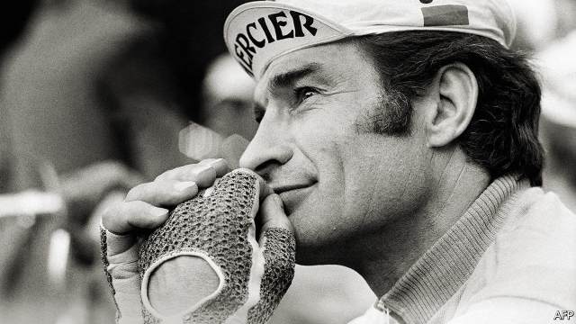

###### Gloriously second

# Obituary: Raymond Poulidor died on November 13th 

 

> print-edition iconPrint edition | Obituary | Nov 30th 2019 

EIGHT TIMES Raymond Poulidor stood on the podium at the end of the Tour de France, soaked in sweat, exhausted and smiling his big gap-toothed smile. He was just never on the top step. In 14 Tours someone else always pipped him or, to be honest, passed him by quite a lot. He came second three times, third five times (including in his last tour, not bad for a 40-year-old), but never put on the treasured yellow jersey, the greatest prize in cycling. The closest he came to that was when winners offered to let him wear it at dinner parties, and he would shrug his big frame into it with no bitterness at all. Because, with or without it, “L’Eternel Second” was by far the most popular racing cyclist ever known in France. 

His catalogue of mishaps in the Tour was long. In 1962, when he came third, he had a broken finger. In 1964, when he came second, he lost time at Monaco and had a puncture in the Pyrenees. In 1965, Italian riders ganged up on him. In 1967 he fell badly in the Vosges, and in 1968 he was hit by a motorbike. The race in 1973 began with his nearest chance, when he was behind by a mere 0.8 seconds in the Prologue, but he later fell down a ravine. In 1975, his worst Tour, when he came 19th, he had bronchitis. Something always came between him and the glory of the maillot jaune. And all Frenchmen and women who had ever repeatedly tried, and failed, to achieve some goal took him to their hearts accordingly. He was “Pouli” and “Poupou” (a stupid name, but he put up with it), carried aloft on a sea of poupoularité. 

They called him unlucky. He did not agree. He thought he had had a lot of luck, in fact. Over a 18-year career he had chalked up 189 victories in other races, including the Vuelta a España, his only Grand Tour, La Flèche Wallonne, the French national championship and the Paris-Nice (twice) against the great Belgian Eddy Merckx. He also won the Milan-San Remo, though true to form it almost slipped away when he got a puncture 125km from the finish and, on the final corner, was sent the wrong way by a policeman. Yet he held off the chasing field and won, by three seconds. 

He was also lucky, to his mind, to be cycling at all. The alternative was to be labouring, like his parents, on the rocky hills of Creuse, trying to make the bad soil yield enough to get bread for the table and rent in the landlord’s wallet. He had left school at 14, like his three brothers, prepared to toil, but also aware that his best times were when he was racing his bike between the villages on fair-days or speeding round the hills with his brothers, for all the world like one of the grim sleek riders in Miroir-Sprint magazine. He could never be called sleek, more cuddly, and after his service militaire in Algeria pretty fat, but he shook off the weight and became a professional cyclist in 1960, when he was 24. 

What he did not shake off, but made much of, were his peasant roots. Between races he went back to help on the farm, and his style of cycling—dogged and determined on hills, a bit too leisurely on the time trials—owed something to farm work, too. With his lined, wind-burned face and slow Limousin drawl, he reminded his followers of the old ways, la France profonde and all kinds of comforting verities that had been pushed aside by modern life. He kept a peasant’s innocence, and in 1966 got into deep merde with his colleagues for agreeing to a newfangled drugs test which they were all refusing. But he also kept a shrewd business head on his shoulders. He knew the value of a franc, ever since he and his brothers had broken their bedroom window and been told, by their father, that there would be no money to mend it until the spring. 

It was therefore oddly satisfying that his great rival, Jacques Anquetil, was everything he was not: a well-off, pale-faced, blond-quiffed, almost ghostly Norman, withdrawn and unflamboyant. Anquetil won the Tour five times, yet to his fury the French still loved Poupou more. The depth of their duelling was witnessed by half a million spectators when, in 1964, they battled up the Puy de Dôme in Auvergne side by side, Anquetil on the mountain side and Poupou on the precipice edge, so close that their elbows knocked and Poupou could feel the hot breath of “Maître Jacques” on his arms. He gained 42 seconds over him; it was not enough to win the Tour. But he did not mind too much, as he never did. 

One reason to be relaxed was that he was making a lot of money—more even than Anquetil, some said. From the start he had been astonished at what cyclists earned. His first prize, 80,000 old francs for coming second, would have taken him six years to get by farming (or substantially less time at the poker table, where he was a skilled bluffer). The more Tours he lost, the more the crowds liked him and the more he earned. At the height of his celebrity, in the mid-1970s, almost half of respondents to one poll made him their first choice as a dinner guest. In 1974 alone more than 4,000 articles were written about him, besides university theses and sociological studies. He lent his name to sports bikes, and given half a chance would stand in supermarkets shouting “Just the right bike for you, sir!” Later, as a national treasure, he had a rose named after him, and appeared along the route of the Tour in yellow outfits and with trinkets in his hands, cheered by all who saw him. 

This adulation came not simply because he failed, but because of the manner of his failing. He did not get up each morning with the thought of winning. He did not think of winning at all. His manager complained that he was always in a daydream, and it was true. Everything that was happening to him was marvellous enough. His memoir was called “La gloire sans maillot jaune”, glory without the jersey, which in the end he didn’t need. Eight times he had got within touching distance, and lost them all. But he could still say, as he often did, “Look how close I came!”■ 

