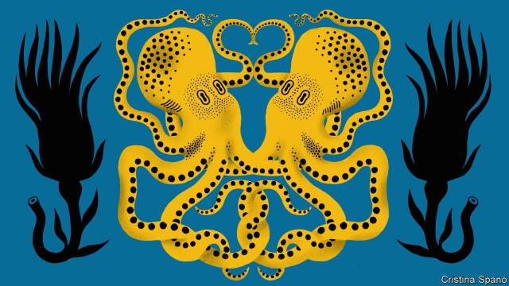
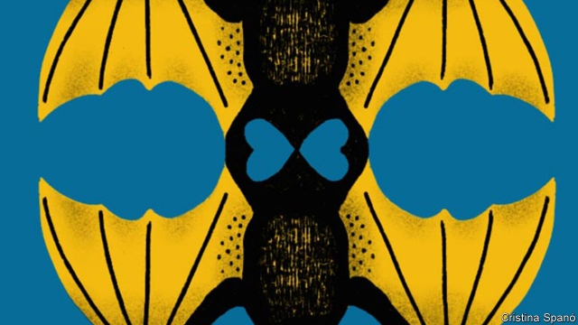

###### Mating strategies

# A new theory argues same-sex sexual behaviour is an evolutionary norm 

 

> print-edition iconPrint edition | Science and technology | Nov 28th 2019 

WHEN IT COMES to sexual behaviour, the animal kingdom is a broad church. Its members indulge in a wide variety of activities, including with creatures of the same sex. Flying foxes gather in all-male clusters to lick each other’s erect penises. Male Humboldt squid have been found with sperm-containing sacs implanted in and around their sexual organs in similar quantities to female squid. Female snow macaques often pair off to form temporary sexual relationships that includes mounting and pelvic thrusting. Same-sex sexual behaviour has been recorded in some 1,500 animal species. 

The mainstream explanations in evolutionary biology for these behaviours are many and varied. Yet they all contain a common assumption: that sexual behaviours involving members of the same sex are a paradox that does indeed need explaining. Reproduction requires mating with a creature of the opposite sex, so why does same-sex mating happen at all? 

A paper just published in Nature Ecology and Evolution offers a different approach. Instead of regarding same-sex behaviour as an evolutionary oddity emerging from a normal baseline of different-sex behaviour, the authors suggest that it has been a norm since the first animals came into being. The common ancestor of all animals alive today, humans included, did not, they posit, have the biological equipment needed to discern the sex of others of its species. Rather, it would have exhibited indiscriminate sexual behaviour—and this would have been good enough to transmit its genes to the next generation. 

The group of young researchers from institutions across America who wrote the paper, led by Julia Monk, a graduate student at Yale, argue that conventional models of sexual behaviour’s evolution take two things for granted that they should not. The first is that the cost of same-sex behaviour is high because energy and time spent engaged in it do not contribute to reproductive success. If that were true it would indeed mean that maintenance of same-sex behaviour over the generations requires some exotic explanation whereby such activity confers benefits that outweigh the disadvantage. The second assumption is that same-sex activity evolved separately in every species that exhibits it, from an ancestral population that engaged exclusively in different-sex behaviour. 

Ms Monk and her co-authors question the first assumption by pointing out that many animals seem to mate at a frequency far higher than looks necessary merely to reproduce—meaning that the proportional costs of any instance of sexual activity which does not produce offspring must be low. If this is true, it reverses the burden of proof. The cost of the sensory and neurological mechanisms needed to identify another’s sex, and thus permit sex-discriminating mating behaviour, is high. Sometimes, that will be a price worth paying, especially if a long-term relationship is involved in reproduction, as it is in most birds and some mammals. But it is the evolution of sex-discrimination for which special-case exemptions must be sought, not the evolution of same-sex behaviour. 

The second assumption is even easier to challenge. Typically, evolutionary biologists assume that traits shared widely across a related group are likely to have evolved in an ancestral population, not repeatedly and separately in each lineage. Ms Monk and her colleagues argue that cognitive biases in the subject’s practitioners have pushed them to look for fantastic explanations for the evolution of same-sex behaviours in a range of animals, rather than considering the perhaps more reasonable explanation for its persistence, that it is a low-cost ancestral trait that has little evolutionary reason to disappear. 

 

Although the idea that same-sex behaviour has always been a norm is scientifically intriguing, the paper’s authors are also making a broader point about human beings’ pursuit of knowledge. Ms Monk says that the paper’s authors met through a Twitter account which promotes the work of LGBT scientists. This was a serendipitous encounter which gave them space to explore an idea that might have been dismissed at first sight in a more conventional setting. The group includes people with a range of sexual orientations, so naturally they had an incentive to ask whether mainstream evolutionary biology’s view of sexual orientation is correct. 

Their hypothesis still needs testing. That will mean zoologists gathering more observational data on sexual behaviour of animals in the wild—and doing so with an open mind. The authors themselves are also mulling approaches involving computer modelling, which might show that a group of organisms behaving according to their theory is capable of reaching the distribution of sexual behaviours seen in the wild today. If their hypothesis is confirmed, it raises the question of which other facets of scientific knowledge might be being obscured because the backgrounds of practitioners in those fields do not lead them to ask unconventional questions. Ms Monk’s and her colleagues’ theory may yet turn notions of the evolution of animal sexual behaviour on their head. With a broader array of minds focused on other problems, other fields might follow, too. ■ 

