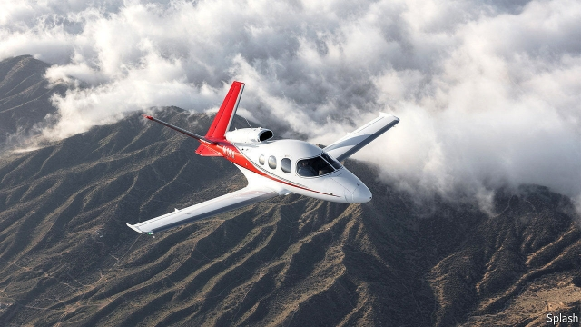

###### Aviation

# An emergency landing system that passengers can activate 

 

> print-edition iconPrint edition | Science and technology | Nov 30th 2019 

ON NOVEMBER 9TH 2018 a Piper Dakota light aircraft flying over Iowa broadcast a distress call. The pilot seemed to have suffered a heart attack. One of the other three people on board, a student aviator, had taken over the controls, but to no avail. The plane crashed shortly afterwards, killing all four. 

How often such things happen is not well recorded. But an Australian report published in 2016 listed 15 cases in the five years from 2010 to 2014 of the pilots of small aircraft being incapacitated. In three of these the aircraft suffered what is known euphemistically in aviation circles as a “collision with terrain”. Occasionally, an instructor on the ground, perhaps assisted by a pilot flying alongside in another aircraft, has been able to provide an instant flying lesson to someone on board a plane that has lost its pilot, and talk them down successfully. But not often. It is tricky enough for a neophyte to keep an aircraft flying straight, level and on an appropriate bearing to arrive at a suitable airfield. Landing the thing safely takes a miracle. What small aircraft need in these circumstances is a panic button. And a firm called Garmin has now created one. 

Garmin, a Swiss-registered, American-operated technology company, is best know for its GPS satellite-based navigation systems. But the firm also makes electronic control systems for aircraft. Autoland, as they dub the kit attached to their panic button, is a result of putting the two together. 

Pressing the button switches control of the plane to its flight computers, in a manner similar to engaging an autopilot. Garmin’s system, however, goes far beyond being a standard autopilot. It transmits an emergency radio code to alert air-traffic control and other planes in the area. It analyses weather conditions, winds and the amount of fuel available before selecting a suitable airfield to divert to. It then flies to that airport, descends, lines up on the runway, sets the flaps and lowers the landing gear. As it approaches touchdown, it crabs the plane slightly sideways to cope with any crosswinds and aligns the nose with the centre of the runway, just as a human pilot would. Once landed, it applies the brakes to bring the plane to a halt. It then turns the engine off. 

Passengers are kept informed about what is happening via messages on a screen and voice announcements. They are advised not to touch the controls, but to sit back and fasten their seat belts. Simplified buttons that appear on a touchscreen let them operate the radio and talk to air-traffic controllers directly. 

After around 1,000 successful test landings, Autoland is now going into service. It is about to become a standard feature on the Piper M600/SLS, a six-seater single-engined turboprop, and the Cirrus Vision Jet, a single-engined personal jet. Other aircraft are expected to follow. And Garmin is also looking at making a version which could be employed in smaller planes, such as those used at flying clubs. 

Eventually, a beefier variant might also be developed for jet airliners. Though these operate with a co-pilot to backup the captain, there have been instances of both pilots being taken ill—for instance with hypoxia caused by insufficient oxygen. In such a case a member of the cabin crew or a passenger might be able to switch the system on. Alternatively, it could be activated automatically or remotely. 

If an unsupervised system like this can fly and land an aircraft in an emergency, it does raise the question of why it should not do so routinely. Bailey Scheel, the manager of the project is firm that, for the moment, Autoland is purely an emergency system. Nevertheless, it does look like another step on the road to dropping the co-pilot—and eventually the pilot, too.■ 

