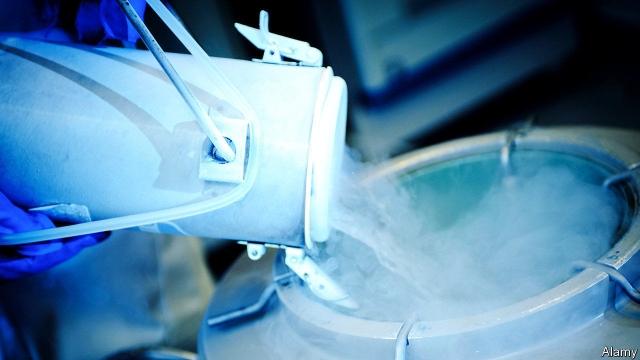

###### Powering the future

# Electrical energy can be captured as liquid air 

 

> print-edition iconPrint edition | Science and technology | Nov 30th 2019 

IN THE PAST few decades wind and solar power have gone from being exotic technologies to quotidian pieces of engineering that are competitive, joule for joule, with fossil fuels. Those fuels retain what edge they have only because of their reliability. The wind may not blow, or the sun may not shine, but—short of a blockade or strike—a coal or gas power station will always have something to burn. 

To overcome the reliability problem requires cheap grid-scale energy storage that can be scaled up indefinitely. At the moment, the market leader is the lithium-ion battery (see article). Such batteries—already the workhorse of applications from mobile phones to electric cars—are reliable, scalable and well understood. Most proposed alternatives are clumsy, poorly understood, unscalable or all three. But there is one that, because it relies on putting together pieces of engineering used routinely elsewhere, and thus proven to work, might give lithium-ion batteries a run for their money: liquid air. 

At a temperature of -196°C, all of air’s component gases will liquefy. Doing this is a routine, electrically driven industrial procedure. Storing liquefied gases in bulk is also a routine piece of engineering. The result occupies a 700th of the volume of those gases at room temperature—so, when liquid air is warmed and allowed to expand, it does so forcefully. Using a device called a Dearman engine (after its inventor, a Briton named Peter Dearman), that forceful expansion can be employed to spin turbines, and thus generators, thereby recovering part of the electricity used to liquefy the air in the first place. 

Such cryogenic energy storage’s main proponent, a firm in London called Highview Power, has been running a pilot grid-scale plant in Bury, near Manchester, since April 2018. This can store 15 megawatt-hours (MW-hr) of energy, which is enough to power about 5,000 homes for three hours. 

At the moment, the plant in Bury recovers as electricity just over half of the power used to liquefy the air in the first place. With design tweaks, that could probably be increased to 60%. Moreover, the technology’s inventor, Ding Yulong, sees a path to yet greater efficiency. As head of an energy-storage group at the University of Birmingham, Dr Ding has spent years experimenting with a small test plant. The trick, he says, is to capture, probably in oil or salt, the heat generated as the air is compressed prior to its liquefaction. Some of this heat can then be used to boost the warming of the liquid air as it enters the Dearman engine. This adds oomph to the expansion, thereby increasing the power output. 

The rest of the heat from the compression can be used to power a piece of refrigeration kit called an absorption chiller. The cold this chiller creates would reduce the amount of electricity needed to liquefy the air in the first place. Dr Ding reckons that recycling waste heat in this way will increase the efficiency of biggish cryogenic-energy-storage plants to at least 69%. That is close to the figure obtained by banks of lithium-ion batteries. 

Having proved the technology, and raised the money to do so, the firm now plans to build a commercial-scale British plant. According to Highview’s boss, Javier Cavada, this will have almost twice the storage capacity of the world’s largest existing lithium-ion battery, the Hornsdale Power Reserve in South Australia, which can squirrel away a mere 129MW-hr (though Hornsdale has a maximum power output of 100MW, which is twice that of Highview’s proposal). Construction should begin early next year at an as-yet-undisclosed site in northern England. 

Over the next two years Highview also hopes to announce additional 250MW-hr plants, including two it plans to build in America for Tenaska, an energy company in Nebraska. And Enel Group, Italy’s largest electricity firm, is interested as well. According to Gianluca Gigliucci, who is leading Enel’s study of the technology, the company will soon build a grid-scale plant if the business case for doing so appears at least reasonable. 

To take on lithium-ion batteries in a serious way cryo-batteries—as Highview dubs the technology—will have to show that they are able to respond rapidly to fluctuating demand in the way lithium-ion cells can. They will also have to be able to match, in future, the fall in price over the years that such cells show every sign of continuing to demonstrate. If they can do these things, though, they could well emerge as competitors in the grid-scale-storage stakes.■ 

