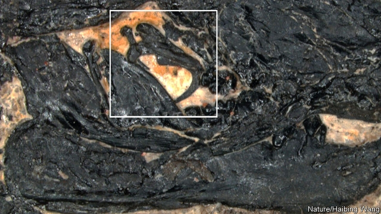

###### Evolution

# How ear bones evolved 

 

> print-edition iconPrint edition | Science and technology | Nov 30th 2019 

EVOLUTION HAS NO foresight. But occasionally it flukes something ideally suited to develop into something else. Biologists call this preadaptation, and it seems to explain the existence of three small bones, known as ossicles, that are found in the ears of mammals. Ossicles evolved from jaw bones, and the fossil evidence indicates this happened three times. That suggests the bones in question were indeed preadapted. And a newly discovered Cretaceous mammal called Jeholbaatar kielanae may help explain why. An analysis of the creature’s jaw (pictured, with the ossicles enclosed in the white square) has just been published in Nature by Wang Yuanqing of the Chinese Academy of Sciences and his colleagues. It suggests that the ossicles’ precursors became detached from the other jaw bones as a result of the way, indicated by the shape of those other bones, that Jeholbaatar kielanae chewed its food. Thus liberated, they were then absorbed into the ear and repurposed to enhance the animal’s hearing. 

