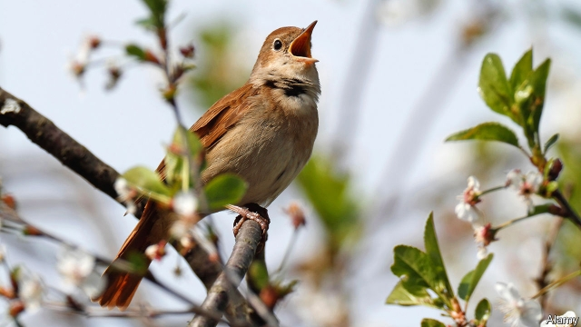

###### Birdsong

# Male nightingales spend the winter practising 

 

> print-edition iconPrint edition | Science and technology | Nov 30th 2019 

DESPITE THE ideas of Julia Monk and her colleagues on the frequency and normality of same-sex mating behaviour among animals (see article), some species do work hard to attract the opposite sex. That is why birdsong fills the air during the spring and summer breeding season. What has proved vexing to ornithologists is understanding why birds that migrate to warmer climes in winter often carry on singing even though there is no breeding to be done and no need to defend a territory. But a study just published in Behavioral Ecology and Sociobiology by Abel Souriau of Charles University in Prague and Nicole Geberzahn of the University of Paris, Nanterre, casts light on the matter. Mr Souriau and Dr Geberzahn suggest that winter is a period of practice for the summer performance to come. 

Thrush nightingales are close kin to the common nightingale familiar in western Europe, but have a more easterly summer range. Males are innovative songsters, frequently plagiarising phrases from rivals and integrating them into their own tunes. They are also among the birds that carry on singing after they have migrated to Africa for the winter. So Mr Souriau and Dr Geberzahn decided to study the nature of their African songs. 

First, they themselves flew south, to a part of Tanzania that previous work had shown to be a place where populations from two summer nesting grounds—one in Poland, the other near Moscow—spent their winters. They recorded thrush nightingales there and then, later, recorded them in those summer grounds as well, to provide a baseline for comparison. With both sets of recordings in the bag, they ran an analysis of what they had collected. 

Bird song is divided by ornithologists into a hierarchy of notes, syllables (composites of notes), phrases (composites of syllables) and songs (composites of phrases). Mr Souriau and Dr Geberzahn were interested, in particular, in the syllabic and phraseological structure of songs. 

In Europe the males sing according to a particular template. The first part of a song lets them show off their virtuosity. This cadenza varies from male to male and, for a given male, from song to song. Nevertheless, males’ propensity to pinch snatches from their neighbours means the songs sung in one locality are distinguishable from those in another. The second and third parts are two stereotypical phrases, known as “castanet” and “rattling”, that mark the end of a particular song. 

As the researchers expected, the recordings they collected in Europe followed these patterns. But those from Africa did not. Around 90% of them were abnormal in one way or another. Their structures were extremely variable—chaotic, almost, with castanet and rattling often absent. And they often included syllables not found in summer songs. 

That the birds are singing at all in Africa needs explanation, for singing consumes energy which might be deployed for other purposes. The explanation Mr Souriau and Dr Geberzahn propose is that male thrush nightingales employ the winter months as a period of experimentation and rehearsal for the summer. They can try out new singing techniques with little consequence, and perhaps gain an edge early in the next breeding season, before their neighbours can plagiarise them. 

Whether these winter rehearsals really do result in songs that are better at repelling rivals and luring mates remains to be discovered. To find out would mean tracking a fair number of individuals over their entire lives, to monitor both the evolution of their songs and how their mating success varies accordingly. But apparently effortless superiority is usually the result of a lot of hidden hard work. In the case of thrush nightingales, it seems quite plausible that the European former is a consequence of the African latter.■ 

