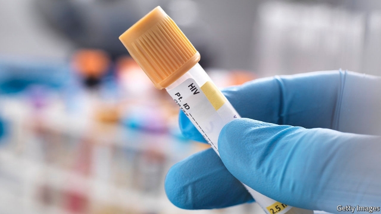
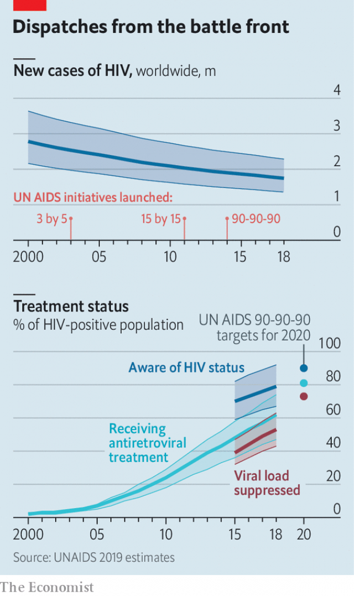

###### AIDS

# Slowly, HIV is being beaten 

 

> print-edition iconPrint edition | Science and technology | Nov 30th 2019 

ON THE PRINCIPLE that no news is good news, the fact that AIDS has dropped out of the headlines is surely a good thing. Nevertheless, it does no harm for the world to be reminded from time to time that the illness has not gone away. To that end, UNAIDS and the World Health Organisation, the international agencies charged with dealing with the epidemic, promote December 1st as World AIDS Day. 

This year is the last before the target date for the success of the latest of the agencies’ campaigns to roll out the antiretroviral drugs that both keep those already infected with HIV alive and stop them passing the virus on. This particular campaign is called 90-90-90. Its aims are that, by the end of 2020, 90% of all those around the world who are infected will know they are infected; 90% of that group will be receiving sustained antiretroviral therapy; and 90% of those receiving therapy will have had the virus effectively suppressed. 

 

The 90-90-90 campaign follows the 3 by 5 initiative, begun in 2003, to put 3m people on the drugs by 2005, and the subsequent target of 15 by 15. The latest estimate is that 38m people are infected with HIV, so 90-90-90 implies 28m being treated successfully. As the chart shows, doing this by 2020 is unlikely. Whether that is seen as a failure, though, depends on your point of view. Had the target been reached easily is would surely have been criticised as unambitious. 

Regardless of when 90-90-90 is achieved the next aim, 95-95-95, is already pencilled in for 2030. This is also the year set by the UN’s Sustainable Development Goals for the end of AIDS as a public health threat. 

The exact meaning of that phrase is unclear. But in principle eliminating HIV is possible with existing technology. As has happened with smallpox and polio, the identification and treatment of all who are infected would stop new cases arising. The slogans for this are “zero new HIV infections”, “zero AIDS-related deaths” and (AIDS being an illness that has always been surrounded by prejudice) “zero discrimination”. 

Unlike smallpox and polio, however, there is no vaccine against HIV. If this state of affairs continues, eliminating the virus will mean giving drugs to all those infected until they have died of other causes. It will also mean someone paying for those drugs. And, in the case of those living in the poorest parts of the world, that “someone” is often going to be taxpayers in rich countries, who already contribute about $8bn a year to the anti-AIDS effort. Exterminating HIV, then, will be a huge undertaking and an expensive one. But not, with luck, an impossible one. 

