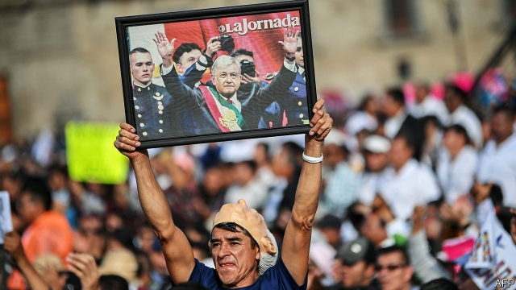

###### It’s all about him

# AMLO uses his anti-corruption drive to gain power and scare critics 

 

> print-edition iconPrint edition | The Americas | Nov 30th 2019 

SINCE 2003 the boringly named Asset Administration and Disposal Service, or SAE, has sold off cars and houses seized by Mexico’s government mainly from smugglers and tax-dodgers. The SAE used to split the proceeds among the police, the judiciary and the health service. Andrés Manuel López Obrador, Mexico’s president since December 1st last year, has jazzed things up. He now refers to the SAE as the “Institute for the Return of Stolen Goods to the People”. In June he promised 25.7m pesos ($1.3m) from an auction of ill-gotten goods to two poor indigenous villages in the southern state of Oaxaca. At a televised news conference, the president gave giant cheques to their mayors. 

The episode sums up much about the presidency of Mr López Obrador, who is often known as AMLO. It shows his dedication to fighting graft, his flair for political theatre, his indifference to institutions and his belief in the virtue of ordinary people, among whom he counts himself. “To look like they were fighting corruption,” past governments “created so many rules,” he said at the cheque handover. The two lucky villages will be able to spend the cash as they like, without oversight. Mexicans “are an honest people,” says the president. “Corruption occurs from above, not from the bottom up.” His folksy way of fighting corruption is working for him. At a time when citizens across Latin America are rebelling against their leaders (see Bello), AMLO has an approval rating of nearly 60%. 

He is right to be preoccupied with corruption. In Transparency International’s Corruption Perceptions Index of 180 countries, Mexico shares 138th place with Russia. AMLO’s fulminations against sleaze in the previous government of Enrique Peña Nieto helped him win a landslide victory in the presidential election in 2018. For AMLO, corruption is not just one of Mexico’s biggest problems but practically its only problem. Eradicate it, and poverty and crime would cease. Honest tax officials would raise so much money that painful fiscal reforms would be unnecessary. Anger at corruption binds AMLO’s motley coalition, which ranges from left-wing activists to evangelicals. All believe in his incorruptibility. He cut his salary in half, puts in 16-hour days and flies commercial. 

But the stolen-goods institute reveals the flaws in AMLO’s anti-corruption policy. Rather than building institutions to fight graft, he offers himself as the main bulwark against it. Worse, contend AMLO’s critics, he uses the campaign to weaken institutions and opponents. He pounces on his critics’ misdeeds and ignores those of his allies. Though untempted by wealth, AMLO is greedy for power. The government’s approach to fighting corruption is like setting off fireworks to provide illumination rather than building an electricity grid, says Denise Dresser, a columnist. 

Corruption-fighters during Mr Peña’s scandal-plagued presidency faced reprisals, but they also made headway. Journalists and NGOs, some financed by rich businessmen, uncovered the biggest scandals, including the first lady’s acquisition of a house from a construction firm with government contracts. They capitalised on the uproar to form a movement to create “a system to catch the scandals”, says Max Kaiser, a campaigner. Some 600,000 citizens signed a petition to oblige politicians to declare their assets and conflicts of interest. It became law. Congress established an “anti-corruption system”, which created new agencies and was meant to strengthen existing ones. Another law bolstered the independence of the attorney-general’s office. The Peña government did its best to avoid implementing most reforms. 

The NGOs that championed these changes had hoped that AMLO would bring them to fruition. But he has proved a foe, not an ally. The leftist president regards groups financed by business as agents of “neoliberalism”. He refers to Mexicans Against Corruption and Impunity (MCCI), a business-backed NGO, as “Mexicans in favour of corruption”. In part, this is just AMLO hogging the limelight. But it also reflects his rejection of the NGOs’ thesis that the key to reducing corruption is to bolster institutions and change incentives. “The morale in the movement is very pessimistic,” says one campaigner. 

Under AMLO, the anti-corruption system has made no progress, say its architects. NGOs have filed a court challenge against his appointment of the anti-corruption prosecutor on the grounds that she is too close to him. The revamped attorney-general’s office has kept its old staff and organisational structure. 

AMLO prefers discretion to rules. As president-elect he promised not to follow his predecessors in prosecuting a few high-profile wrongdoers from the previous administration. Yet he apparently changed his mind. His government has, for example, arrested Rosario Robles, a minister under Mr Peña who is accused of stealing a quarter of a billion dollars. AMLO proposes, bizarrely, to hold a referendum on whether to investigate Mr Peña and other past presidents for corruption. 

The government’s critics are being treated less gently. In February Guillermo García Alcocer, boss of the energy regulator, complained that the government had appointed unqualified officials to his agency. Days later prosecutors opened an investigation into suspected conflicts of interest. Mr García resigned. 

Even more worrying is the case of Eduardo Medina Mora, a supreme-court judge against whom AMLO has long held a grudge. The judge resigned in October this year after the chief of the government’s financial-intelligence unit accused him of money-laundering. Reports soon emerged that bank accounts belonging to the judge and his brothers were frozen hours before his resignation, only to be unfrozen days later. Such cases create a climate of fear and chill dissent. A new law lets the government jail suspected tax-dodgers before they are tried, giving it another tool to intimidate critics. 

AMLO’s friends seem to fare better. Take Manuel Bartlett, an ally who heads the Federal Electricity Commission. MCCI claimed that he failed to declare an interest in two dozen properties worth 800m pesos registered in the names of people close to him. AMLO called the allegation “journalism at the service of conservatives”. 

Four-fifths of government contracts are not awarded through transparent procurement procedures. Many contracts to build AMLO’s pet projects are being awarded without a bidding process. The government invokes national-security grounds. 

AMLO’s administration, like most young governments, has so far produced few corruption scandals. As rivalries flare, tales of malfeasance tend to come out. A report by the federal auditor into government spending next year will either burnish or batter its reputation for rectitude. The handling of the investigation of Mr Bartlett may show whether it will take seriously allegations made against AMLO loyalists. None of this is likely to alter the president’s approach to corruption. He would rather hand out big cheques than strengthen checks and balances.■ 

