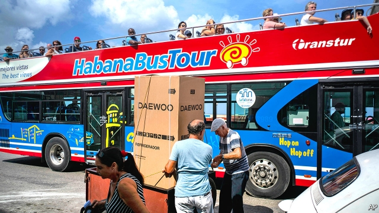

###### Bringing back the greenback

# Cuba reintroduces the dollar 

 

> print-edition iconPrint edition | The Americas | Nov 30th 2019 

AMERICAN SALOONS from the 1950s and Chinese-brand cars still fill Havana’s streets. Lately, though, they have shared the road with brand-new electric scooters. Once rarities—sourced in Panama, Mexico or the Dominican Republic and sold at a big mark-up in the black market—scooters can now be purchased at home, and far more cheaply than before. The catch: Cubans must pay in American dollars or another rich-country currency. 

In October Cuba’s communist government said citizens could open bank accounts that receive dollars, yen, euros and other European currencies. They will be able to use the money to buy imported goods from new state-owned shops, called Tiendas Moneda Libremente Convertible (or convertible-currency shops), where prices are given in dollars. More than 70 are planned. This ends a ban on dollar transactions introduced in 2004. 

The Tiendas MLC are proving popular. Shoppers queue to buy refrigerators, air-conditioners, car parts and television sets. Some items, including freezers and scooters, cannot be restocked quickly enough. 

By reintroducing the greenback, Cuba has in effect added a third leg to its dual-currency system. The state pays its employees (ie, most workers) in Cuban pesos, the currency for buying necessities like electricity, water and bus tickets. In 1994, during the “special period” that followed the collapse of the Soviet Union, the government introduced convertible pesos (CUC), which could be exchanged for dollars at a rate of one to one. This was an attempt to hoover up dollars from remittances and curb inflation by offering Cubans an alternative to dollars. CUC are now the main way to pay for things like petrol, internet access, hotel stays, appliances and restaurant meals. 

The reintroduction of the dollar is a response to hardship. Sources of foreign currency needed to sustain the import-dependent economy are running dry. A drop in deliveries of subsidised oil from Venezuela, caused by a slump in production and by American sanctions on firms that ship Venezuelan oil, led to fuel shortages in September. In response, the government cut bus services, suspended manufacturing and urged farmers to use oxen instead of tractors. Images of Fred Flintstone’s foot-powered car circulated on social media. 

Tourism, which had helped offset the drop in aid from Venezuela, has been squeezed by American sanctions. The Trump administration has banned cruises and “people-to-people” (ie, non-group) visits. The government expects the number of tourists to drop by 8.5% this year. 

The scarcity of dollars has put the CUC under pressure. Currency dealers listed on Revolico, a shopping portal, demand up to 1.2 per dollar. Transactions are settled offline, perhaps at a slightly higher valuation of the CUC. 

The government hopes that the Tiendas MLCwill keep dollars in the country. It may funnel them into state enterprises, which would help them boost production and alleviate shortages of consumer goods. 

More broadly, the government seems to realise that it needs to take bolder steps to modernise the economy. It is encouraging state-owned enterprises to behave more like private ones, though turning bureaucrats into professional managers is proving difficult. It is loosening restrictions on private enterprise. In early November Marta Elena Feitó Cabrera, the vice-minister of work and social security, announced that private firms would be able to provide goods and services to foreign firms. The government is also trying to attract more foreign investment, including by setting up a “one-stop shop” for permits. 

But the state has a hard time letting go. Although Cuba’s new constitution, enacted in April, recognises private enterprise, the law that allows firms to incorporate has yet to pass. They still cannot legally import supplies. Wholesale markets, vital to distributing goods efficiently, have yet to appear. The dual-currency system continues to distort prices across the economy. But at least scooters are cheaper.■ 

