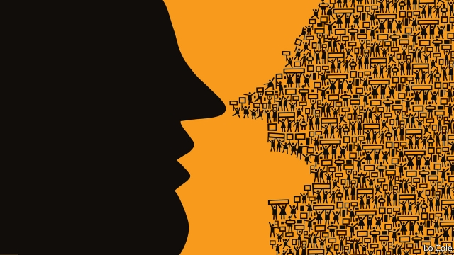

###### Bello

# The street challenges Latin America’s politicians 

 

> print-edition iconPrint edition | The Americas | Nov 30th 2019 

ANOTHER WEEK, and another Latin American country is out on the street. Now it is Colombia, where large protests have been taking place since November 21st. In other places, demonstrations have been triggered by specific things, even if the protesters’ demands went beyond them—increases in metro fares in Chile and fuel prices in Haiti and Ecuador, and electoral fraud in Bolivia. But in Colombia there is just a pervasive feeling of discontent with an unpopular government. It has brought disparate groups onto the streets, from students, trade unionists and indigenous and gay activists to archaeologists against mining. A similar mood prevails in much of the region. The longer this goes on, the more it may paralyse governments. 

The protests are not without precedent, nor are they confined to Latin America. In the early 2000s, elected governments were toppled in Argentina, Ecuador and Bolivia (twice, in disorders led by Evo Morales, who has just suffered the same fate). Huge protests erupted out of almost nothing in Brazil in 2013. 

As in 1968, this is a time of global discontent, but it is particularly intense in Latin America. The protests are not its only manifestation. Popular anger showed up last year in electoral victories for contrasting populists, Jair Bolsonaro in Brazil and Andrés Manuel López Obrador in Mexico. The overarching trend of recent Latin American elections has been defeat for incumbents, confirmed in the return of Peronism in Argentina in October. In Uruguay Luis Lacalle Pou of the centre-right appears to have ended 15 years of rule by the centre-left in a presidential election on November 24th. 

The causes of this ill humour include economic stagnation or slowdown, the diminishing of opportunity and the fear of falling back into poverty amid persistently deep inequality. The gap between rich and poor has not widened in Latin America, but it has become more visible. Take Chile, where the Costanera Centre, a shopping mall built around a priapic 64-storey office tower in Santiago, has been the target of anger. “A person who earns 300,000 pesos [$375] a month sees a handbag that costs 4m pesos,” says Marta Lagos of MORI Chile, a pollster. Ferraris and Maseratis have arrived, their owners seemingly oblivious to poor housing, overcrowded buses and patchy health care. 

Latin America’s political class has been discredited by corruption and campaign-finance scandals. These, too, are more visible than in the past, thanks to more combative prosecutors, investigative journalists, whistleblowers and freedom-of-information laws. In other words, the growth of transparency has outpaced that of good governance. Political parties, many of which are weakened and fragmented, have largely ceased to do their fundamental job of channelling discontent. The politicians have, in short, been overtaken by the street. 

Diagnosis is easy but finding a cure will be much harder, as governments are discovering. Many of the problems are deep-rooted and their solutions long-term. Higher growth, more progressive tax, higher minimum wages and better social provision would assuage discontent. The problem is that growth depends on raising productivity, which requires unpopular reforms. And conservative elites resist paying more tax. The left in Chile and Colombia is staying on the street to win more concessions. In 1968 prolonged global disorder ended in a conservative reaction. That risk is especially high in Chile, where looting and vandalism continue. 

The immediate official response has been to run for cover. In Ecuador Lenín Moreno’s government cancelled the fuel-price rise and is struggling to get congress’s assent to modest tax increases. Chile’s government is fighting a rearguard action against demands for much higher public spending. In Colombia President Iván Duque may back away from mooted labour and pension reforms. In Brazil Mr Bolsonaro postponed a bill that would trim salaries and jobs in the bloated public sector because of fears it might trigger protests. 

Reform has rarely been easy in Latin America. More presidents may imitate Martín Vizcarra in Peru. In 20 months in office he has ducked unpopular decisions, such as approving a big mine. Riding an anti-politician wave of anger, he shut down an obstructive congress. Along with Mr López Obrador, he is one of only four Latin American presidents with an approval rating of over 50%. Crowd-pleasing gestures can quiet the streets. They postpone discontent, but they will not diminish it. 

