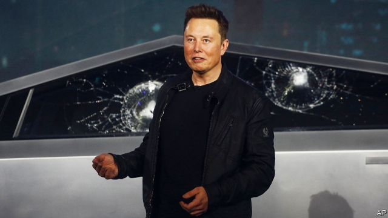

###### Egalitarianism

# Business this week 

> Nov 30th 2019 

In the biggest-ever takeover in the luxury-goods industry, LVMH, a French global conglomerate, announced its acquisition of Tiffany, an American jeweller founded in 1837 and known for its flagship store on Fifth Avenue in New York. LVMH is paying $16.9bn, more than the roughly $14.5bn that was suggested when the transaction was first mooted in late October. The deal represents a success for Bernard Arnault, LVMH’s boss and controlling shareholder, who had courted Tiffany for some time. See article. 

The flotation of Alibaba’s shares on the Hong Kong stockmarket raised $11.2bn, making it the most valuable share offering this year, ahead of the $8.1bn that Uber raked in at its IPO in May. The stock rose by 6.6% on the first day of trading in what is a secondary listing in Alibaba. Its shares are also listed in New York. See article. 

Uber lost its licence to operate in London, again. The ride-hailing company has 45,000 drivers in the city, one of its biggest markets. London’s transport regulator raised more concerns about safety, including 14,000 fraudulent trips by unauthorised drivers. Uber is appealing against the decision and can continue to operate while it does so. See article. 

The chief executive of Westpac resigned and the chairman said he would step down next year, as Australia’s second-largest bank faced mounting criticism about its response to a money-laundering scandal. A regulator has accused Westpac of failing to monitor more than 23m suspect transactions, some of which enabled child exploitation in the Philippines. The bank has found itself in politicians’ cross-hairs. Australia’s treasurer said it had been indifferent to the scandal; the attorney-general noted that it was an “unbelievably serious” matter. Westpac has reportedly cancelled its Christmas party. 

Charles Schwab, America’s biggest discount broker, struck a $26bn deal to acquire  td Ameritrade, a rival. The pair had recently been engaged in a price war, both ditching the transaction fees they charged customers. The combined group will have around $5trn in client assets. See article. 

The Brazilian real fell to a new low against the dollar, after Brazil’s finance minister said he was “not worried” about a strong greenback. The slide prompted a brief intervention by the central bank to prop up the currency. The country’s current-account deficit has risen sharply this year, and interest rates have tumbled. 

Google reportedly fired four employees who had been active in organising protests at the company and had apparently tried to gain access to private internal documents. The tech giant pioneered an office culture that mixes politics with work, which it may now regret. Vociferous staff have pressed management to drop an AI contract for the Pentagon and have walked out over sexual harassment and a search-engine project for the Chinese government. Their latest gripe is Google’s work for immigration enforcement. Google has told employees to tone it down and reduced staff meetings to one a month. 

In an effort to boost profits and its feeble share price, Telefónica announced a plan to hive off its operations in Spanish-speaking Latin America and focus on its core markets in Spain, Brazil, Germany and Britain, where it brands itself as O2. The telecoms group also wants to expand its business in the internet of things and cloud computing. 

On the lookout for new superdrugs that will replenish its portfolio, Novartis offered to buy The Medicines Company for $9.7bn. TMC’s crown jewel is inclisiran, a treatment that has been found to be highly effective in drug trials at reducing “bad” cholesterol, and which a patient needs to inject only twice a year. See article. 

America’s Federal Aviation Administration said it alone would inspect the 737 MAX before it is returned to service, relieving Boeing of the exercise and signalling that it will sign off each jet individually. That could potentially extend the time frame that Boeing has in mind for resuming deliveries of the grounded aircraft to airlines. 

 

Tesla’s share price struggled to recover from the drubbing it took after an unforeseen event at the launch of its new Cybertruck, which has been described as a cross between a futuristic car from “Blade Runner” and a SpongeBob SquarePants character. The vehicle’s supposedly armoured-glass windows shattered when a steel ball was hurled at them during a demonstration. “Maybe that was a little too hard,” said a startled Elon Musk, Tesla’s boss. 

Lee Sedol, a Go champion, who in 2016 lost a celebrated match against AlphaGo, an artificial-intelligence program, announced his retirement. AI programs now compete in tournaments. Mr Lee reflected: “Even if I become number one, there is an entity that cannot be defeated.” 

