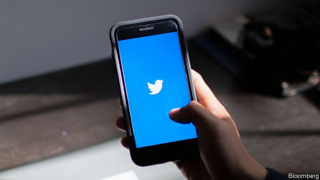

###### Platforms shoo

# Big tech changes the rules for political adverts 

 

> print-edition iconPrint edition | United States | Nov 30th 2019 

“WE’VE MADE the decision to stop all political advertising on Twitter globally. We believe political message reach should be earned, not bought.” Thus spake Jack Dorsey, Twitter’s boss, on October 30th. Ever since Robert Mueller’s report revealed that Russian intelligence agents used social media to spread disinformation in 2016, Big Tech has been under pressure to do something to stave off a repeat performance in 2020. And this is something. Google has followed, changing its political-advertising policy on November 20th. Facebook is so far standing pat, but it is considering changes to its policies on targeting and transparency. 

To the extent that these moves make it harder for politicians to say contradictory things to different groups of voters without anybody noticing, they are welcome. But they will not do much to prevent the spread of disinformation, and may not amount to much in practice. 

Twitter makes vanishingly little money from political ads. Most politicians use the platform to speak directly to voters, not to advertise. In America, as one Republican consultant explains, Twitter “skews young, skews left, and it skews toward people who are already passionate.” These are not the sort of voters who need to be mobilised, or are particularly amenable to persuasion. 

Donald Trump’s campaign manager, Brad Parscale, called the move “yet another attempt by the left to silence Trump and conservatives”. Many Republicans feel the mainstream media are essentially allies of the Democrats—not overtly, but because, the Republican consultant says, “the sentiments and sensibilities of the legacy media closely mirror those of Democrats.” Republicans see social media as a way to bypass a hostile intermediary. 

Dave Karpf, of the School of Media and Public Affairs at George Washington University, calls such comments “a performance. Republicans have seen the success of 30-odd years of shouting that the media has a liberal bias…They now see an opportunity to demonise platforms.” But Twitter’s move may hurt Democrats more. After all, next year one of them will go up against a man with 67m Twitter followers. 

The more consequential of Twitter’s changes was to restrict microtargeting—the use of consumer data to show small groups of people ads that are specifically tailored for them. Google has made a similar move, announcing that from January 6th in America (and earlier in Britain, in light of the upcoming general election), it will restrict how political campaigns can target voters for advertisements. 

Google will no longer allow campaigns to use its granular Customer Match tool, but campaigns can still target voters by age, gender, zipcode and what Google calls “contextual content”, meaning, in essence, interests as expressed through web-browsing history. Those attributes are often a good proxy for political leanings: a young single woman in Oakland who likes kombucha and Tibetan Buddhism is probably a Democrat, just as an older man from rural Wyoming who likes guns and antelope-hunting is probably conservative. 

But Google’s Customer Match tool “was never very good,” says another Republican strategist. “You could potentially still get the same targeting effect by using a third-party data broker.” Google itself may restrict campaigns from using the Customer Match tool, and hence sending a tailored ad to, say, middle-aged women without college degrees who are sceptical about immigration in the upper Midwest; but they could send the request through a third party that permits such microtargeting. He also considers Facebook’s matching tool superior—and Facebook allows the sharing of viral content, which can help a targeted message spread further without any effort or expense from the campaign. That, rather than dodgy political adverts, is what allowed made-up stories to gain widespread credence in 2016.■ 

