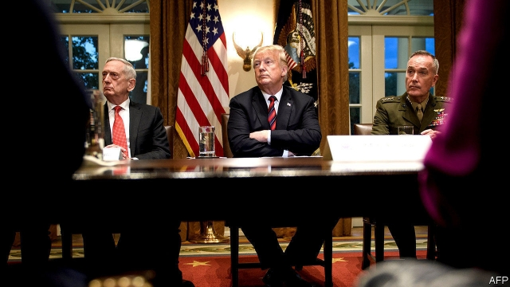

###### Brassed off

# Donald Trump falls out with the military establishment he once wooed 

 

> print-edition iconPrint edition | United States | Nov 28th 2019 

THE 45TH PRESIDENT began his term by packing his administration with military officers. Since then he has broken with the men he once called “my generals”. On November 15th Donald Trump pardoned two soldiers accused of war crimes and reversed the demotion of Eddie Gallagher, a Navy SEAL convicted in a military court of posing with a dead captive. When the navy sought to remove Mr Gallagher’s Trident pin, which marks out SEALs, Mr Trump ordered that he be allowed to keep it. Richard Spencer, the secretary of the navy, balked at this micromanagement of military justice and was soon fired (he was also accused of trying to cut a deal with the White House behind the back of his boss, Mark Esper). All this adds to the cocktail of civil-military dysfunction that has swirled since Mr Trump took office. 

Mr Trump’s initial reliance on retired and serving officers to fill senior posts reflected a paucity of qualified civilians willing to serve him. But it was also an effort to cast a coveted military halo over his political agenda. Since Lyndon Johnson every administration has had at least one active or retired flag-rank officer (ie, a general or admiral) at cabinet or senior level, says Peter White of Auburn University. At his martial peak, Mr Trump had three—no more than Barack Obama. But that does not tell the whole story, says Mr White, because Mr Trump’s officers took roles almost always held by civilians. 

His first defence secretary, James Mattis, was the first retired general to hold the post in nearly seven decades and required a congressional waiver to take the job. Mr Mattis was flaunted at Mr Trump’s side in the Pentagon’s Hall of Heroes when the president signed the so-called Muslim ban in January 2017. Michael Flynn, a retired general, and H.R. McMaster, an active one, also served as Mr Trump’s first two national security advisers, lending a veneer of normalcy to his anarchic foreign policy. And John Kelly, another retired general, cheered on Mr Trump’s border wall as secretary of homeland security, later becoming the president’s chief of staff. 

Mr Trump’s enchantment with generals eventually soured. Mr Flynn left in disgrace in February 2017 and Mr McMaster departed in April 2018. Mr Mattis and Mr Kelly both resigned. In October this year Mr Trump belittled Mr Mattis as “the world’s most overrated general”. But his use of military top brass for political ends went beyond his enlistment of senior officers. 

“Populism laps at the edges of military professionalism,” notes Eliot Cohen of Johns Hopkins University. And so it has proved, with the president’s involvement in Mr Gallagher’s case being merely the latest example. Mr Trump’s request for a grand military parade in Washington was widely viewed as a political stunt. In December 2018 he delivered a brazenly partisan speech to American troops in Iraq. “You’re fighting for borders in other countries,” he told the gathered soldiers, “and they don’t want to fight, the Democrats, for the border of our country.” 

During Mr Trump’s visit to Iraq, several soldiers brought their own “Make America Great Again” caps, which the president duly signed. A few months later, before a presidential trip to Japan, the White House demanded that the USS John McCain—a warship named after the late senator, whom Mr Trump had attacked in life and death—be kept “out of sight”. A tarpaulin was thrown over the ship’s name. Mr Trump later praised the “well meaning” officials who had anticipated his wishes. 

Mr Trump’s assault on civil-military norms has also provoked a backlash that may compound the problem. On October 17th William McRaven, a retired admiral who oversaw the raid against Osama bin Laden in 2011, wrote an op-ed that contrasted military virtues with Mr Trump’s fecklessness, and urged Democrats and Republicans to replace the president. He quoted a retired four-star general as telling him: “I don’t like the Democrats, but Trump is destroying the Republic!” 

Mr McRaven’s willingness to do what Mr Mattis and Mr McMaster would not—mount an attack on the moral fitness of the president using the authority of their former uniforms—was cheered by the president’s critics. But it reflects a trend that many experts in civil-military relations find troubling: an increasing role for senior retired officers in electoral politics. 

Military endorsements of presidential candidates were rare before the 1980s. But in 1988 P.X. Kelley, a former head of the marine corps, endorsed President George H.W. Bush. In 1992 William Crowe, a former chairman of the joint chiefs of staff, endorsed Bill Clinton. There followed an arms race of military endorsements that reached its grubby pinnacle in 2016, when Mr Flynn sided with Mr Trump, urging crowds to “lock up” Hillary Clinton, and John Allen, a general who headed the fight against Islamic State, backed Mrs Clinton. 

Retired flag officers like Mr McRaven are largely free to do as they please, although they technically keep their commissions and remain subject to the Uniform Code of Military Justice, which restricts criticism of the president, notes Alice Hunt Friend of the Centre for Strategic and International Studies, a think-tank. But recent surveys conducted by Jim Golby, an active-duty army officer, and Peter Feaver, a professor at Duke University, suggest that the public cannot usually distinguish between serving and retired officers, so interventions by the latter colour perceptions of the former. 

“It’s been rare in US history that politicisation of veterans and retired military hasn’t been quickly followed by the politicisation of serving officers,” says Mr Golby. “It’s really hard to hold the line. We’ve seen this at the founding, the Civil War era and during the Gilded Age.” Infighting among veterans over the share of battlefield commands during a war with Mexico in 1846-48 culminated in Winfield Scott, an active-duty general, running for the presidency in 1852, for instance. Such politicisation is worrying. Not only does it undermine trust between political leaders and their military advisers, resulting in poorer decision-making, but the very perception of military disgruntlement or resistance is likely to erode confidence in the supremacy of elected civilian leaders. 

What connects these threads is the unique popularity of the American armed forces. A Pew survey published in July showed that they were one of the most trusted groups in the country, second only to scientists: 83% of people expressed confidence in the armed forces, above public schools (80%), police officers (78%) or dastardly journalists (55%). But a forthcoming paper by Mr Golby and Mr Feaver shows that, if Republican and Democratic respondents are told that the military establishment favours the rival party, their confidence in it plummets. 

In truth, the armed forces reflect broader attitudes: the highly educated officer corps dislikes Mr Trump, while 47% of the enlisted ranks, largely without college degrees, back him. But as the military services draw from an ever-narrower demographic pool—southern recruitment has soared over the past 40 years, while that from the north-east has plummeted—its attitudes could grow more unrepresentative. On top of that, Mr Trump’s enthusiasm for pardoning convicted war criminals and the broader weaponisation of veterans by the president and his opponents risks bringing about a loss of confidence. 

Since the end of the draft, public understanding of how the armed forces work has declined, with men in uniform sitting increasingly apart from society. The risk of politicising them has become poorly understood, says Kori Schake, a former Pentagon official who, together with Mr Mattis, wrote a well-regarded book on civil-military relations. A small consolation is that the republic has weathered worse. Leonard Wood, a serving army general, ran for president in uniform in 1920. Bill Clinton was openly jeered on his first visit to an aircraft carrier because of his perceived draft-dodging and effort to allow gays to serve openly. In 2007 left-wing groups ran ads attacking David Petraeus, a general who oversaw a successful surge of forces into Iraq, as “General Betray Us”. 

And whereas no-one doubted that Mr Trump could sack Messrs Flynn, Mattis, McMaster and Kelly at will, or that he has a right to make ill-advised decisions like the reinstatement of Mr Gallagher, this has not always been so clear. When Harry Truman decided to sack Douglas MacArthur, the top general in Korea, for insubordination in 1951, he worried about his ability to pull it off. Mr Truman would later convey a sentiment shared by many presidents: “I fired him because he wouldn’t respect the authority of the president. I didn’t fire him because he was a dumb son of a bitch, although he was, but that’s not against the law for generals. If it was, half to three-quarters of them would be in jail.”■ 

