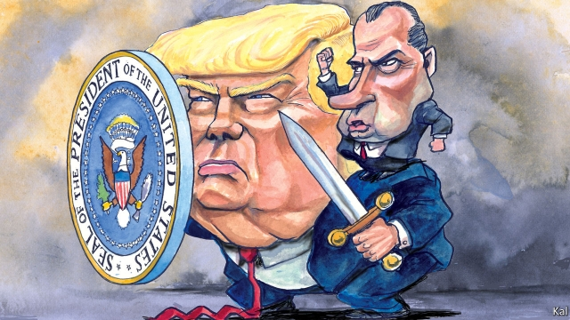

###### Lexington

# Is it better to impeach and lose or never to impeach at all? 

 

> print-edition iconPrint edition | United States | Nov 30th 2019 

AFTER A COUPLE of false alarms, Donald Trump’s “Watergate” moment has arrived. On December 4th the House Judiciary Committee will begin a process of deliberation that will probably lead to it drafting articles of impeachment against the president by the end of the year. Whether a hot-button charge of bribery—the most specific ground for presidential dismissal described in the constitution—will make the list is unclear: Democratic leaders say it might. Yet the case against Mr Trump, that he sought to shake down a foreign leader for political favours using military aid and other state resources as leverage, is essentially already proven. 

The White House record of Mr Trump’s “Do us a favour” call to President Volodymyr Zelensky was the smoking gun. The public hearings House Democrats conducted in November mostly underlined that. They also revealed how many of those around Mr Trump—including Mike Pence, Mick Mulvaney and Mike Pompeo—knew of or facilitated his scheme. Having conceded their original defence (that there was no shakedown), Mr Trump and his supporters have therefore fallen back on a line that takes less account of the Ukrainian matter in hand: the president is the victim of a vast left-wing conspiracy. This is nothing less, writes a columnist in American Greatness, a pro-Trump publication, than a “de facto, three-year-long singular effort to delegitimise and ultimately remove Trump from office before the 2020 election.” Mr Trump calls the congressional probe into his behaviour a “coup”. 

Although the liberal backlash against Mr Trump has been overboard and self-defeating at times (starting with the handful of Democrats who talked about impeaching him from the very beginning), this is not a credible defence. It is plainly designed to distract from and minimise the specific charges the president faces, which he and his advisers are at the same time striving to discredit. (Mr Pompeo’s statement this week that he had a “duty” to investigate the president’s damaging and untrue claim that Ukraine, not Russia, was behind the 2016 election hack was especially dismal.) 

Tellingly, their partisan attack-line was also used by Richard Nixon and his supporters as the evidence against him mounted. “Watergate was a coup d’état that…destroyed a president who had humiliated the liberal establishment,” fumed “Pitchfork Pat” Buchanan, a Nixon aide and sometime Republican presidential candidate, fully 40 years later. Though Watergate is known for the bipartisan moment when Republican support crumbled before the proof of Nixon’s crookedness, the grievance his investigation and removal stirred on the right lasted long after that moment passed. 

Mr Trump’s accusers can take three, somewhat contradictory, lessons from this historical echo. First, tough political outcomes always look easier in retrospect than they did at the time. Partisanship, an older blight than many recall, has made most things worth fighting for highly uncertain at times. If the impeachment experts that the Judiciary Committee will convene at its first hearing make a strong case that Mr Trump warrants the ultimate constitutional check, history might therefore seem to recommend it. 

Yet the Watergate comparison also shows how much harder dislodging Mr Trump would be than removing Nixon was. He is far more popular with Republicans. Having governed as a centrist, Nixon endeared himself to conservatives only when his progressive accusers started to seem more threatening than his support for civil rights and detente with China had. And today’s Republicans are more ideologically aligned, and thus tribal, than they were then. That is largely a product of the grievance-powered conservative media bubble, currently thrumming with anti-Ukraine and anti-left conspiracy theories—which is in turn partly a response to Nixon’s removal. The genius behind Fox News, Roger Ailes, was a former Nixon aide driven by a determination to create a counterweight to the liberal establishment that did him in. 

Fox and its peers were designed, in other words, to go to war for a conservative champion at such a time as this. And in Mr Trump they have a champion to die for. This is his biggest advantage in an impeachment knife-fight. Where fulminating against the libs was something Nixon mostly did alone with his Scotch bottle, until it became his last-ditch defence, it is Mr Trump’s main method. In his policies and rhetoric he governs like a wartime president, as the Atlantic’s Ron Brownstein puts it—forever rallying his supporters against the enemy that is the other half of America. Whether an impeachment trial could actually strengthen him, as he claims, is hard to predict. A small majority already wants to see the back of him. But Mr Trump is uniquely well prepared to survive it. 

That might argue for abandoning the effort, whatever the experts advise. Some nervous Democrats want this. Yet the comparison with Watergate also points to the rising possible cost of such a retreat. Although Nixon and then Bill Clinton considered their accusers malevolent and tried to block them, illegally at times, neither disputed that a president can be subject to investigation. Mr Trump, who has ordered his administration not to comply with the congressional probe and says the constitution lets him do “whatever I want as president”, disputes this every day. 

A growing number of conservatives agree with him. Indeed Mr Trump’s argument is a logical extension of the post-Watergate view on the right that checks on the presidency are illegitimate when wielded by the other side. That was the essence of Mr Buchanan’s rhetoric and also of a recent speech by William Barr, the attorney-general, in which he asserted that the president’s accusers were subverting the constitution and undermining the rule of law. Mr Barr is known for taking an expansive view of executive power—but only, it seems, when a Republican is in charge. 

If Democrats want to leave him the field they know what to do. They have only to refrain from impeaching Mr Trump, not because it would be unwarranted, but because it would be too hard.■ 

