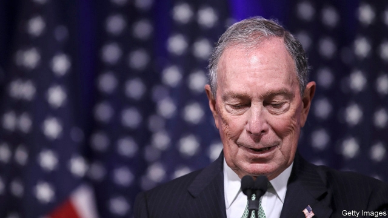

###### For Bloom the polls toll

# Michael Bloomberg’s unlikely presidential candidacy 

 

> print-edition iconPrint edition | United States | Nov 28th 2019 

MICHAEL BLOOMBERG announced his candidacy for the Democratic presidential nomination on November 24th, scoring a rare triple. Mr Bloomberg has run for office as a Republican, as an independent and now as a Democrat. In a country where voters often claim to want bipartisanship but usually vote as if the other lot are rogues, this is risky. Mr Bloomberg has pitched himself as a counter-weight to left-wingers such as Elizabeth Warren and Bernie Sanders, who he says are “not well-positioned” to defeat President Donald Trump. He has outlined an ambitious, leftish policy agenda while disavowing Medicare for All, the signature health-care proposal on the left of the party. Mr Bloomberg might yet become the Democrats’ pick for the White House, but the odds are slim, and his campaign will first have to overcome a problem: currently voters dislike him more than any of the other serious candidates running for president. He is a lot more unpopular than Mr Trump (see chart). 

 

There is much to like about the idea of Mr Bloomberg in the White House. He has executive experience and, unlike the president, is a self-made entrepreneur. He won the mayorship of New York City as a Republican in 2001. Mr Bloomberg’s tenure is perhaps best remembered for his support of a policy known as “stop-and-frisk”, in which New York police liberally stopped residents to search for weapons and contraband. This was ruled unconstitutional by a federal court because, as practised, it was a form of racial profiling. But his mayorship was otherwise a success. Since leaving office he has launched campaigns on gun control and climate change. 

Getting to the White House is another matter, though. Mr Bloomberg used to joke that a short, divorced Jewish billionaire could not win the presidency. But winning a general election against Mr Trump looks relatively straightforward compared with the challenge of getting through a Democratic primary. According to The Economist’s analysis of data from YouGov, which does our polling, he is the second-most-unpopular candidate for president (only Marianne Williamson, a spiritual guru moonlighting as a Democratic candidate, polls worse). Over the past two months, 47% of registered voters told YouGov they had a “very” or “somewhat” unfavourable view of the mayor, compared with 25% who rated him positively. The gap of 22 percentage points represents the largest deficit of any Democratic candidate. 

Mr Bloomberg ranks lower than Mr Trump, whom voters rate as more unfavourable than favourable by 11 percentage points. In fact, of 32 politicians YouGov has asked about since September, voters rated only Mitch McConnell, the Senate majority leader, and Ms Williamson lower than Mr Bloomberg. This alone, however, does not rule out a Bloomberg victory in the Democrats’ nominating contest. After all, Mr Trump won the presidency despite having an approval rating a year before the 2016 election of minus 18 points. 

It will be tough for Mr Bloomberg to repeat Mr Trump’s success, though. While he was a candidate the president took unorthodox positions on foreign policy and social spending—bucking Republican hawkishness and promising not to roll back Medicaid or Social Security. This allowed him to court Democrats who held unreconstructed racial attitudes but who favoured a large social safety net. Mr Bloomberg occupies a much lonelier place on the political spectrum. He aligns with the Democratic Party on questions like gay marriage and gun control. But he is opposed to populist economic proposals, such as Ms Warren’s wealth tax (which is favoured by 66% of Democrats, according to YouGov) and the trillion-dollar Green New Deal (which only 4% of Democrats oppose). A 2017 study published by the Voter Study Group, a collective of researchers and political scientists, found that only 4% of all voters were similarly liberal on social issues but conservative on economics. 

There is a caveat to all this. Democratic primary voters say that the thing they most want is a candidate who can beat Mr Trump. If Mr Bloomberg can convince them that he can do that, his chances will shift. Even if that were to happen, though, he would still face several hurdles. He has decided to fund his own campaign, but by refusing to take contributions it is unclear how he could take part in the televised debates (the Democratic National Committee will allow only candidates who have received donations from 200,000 voters in the December debate). Such thresholds are likely to get more testing, as they have throughout the primary build-up so far. 

Mr Bloomberg also plans to skip campaigning the first four primary states—he will not even appear on the ballot in New Hampshire—and to focus instead on delegate-rich contests on Super Tuesday in early March. In the past 40 years only Bill Clinton has gone on to win the presidency after losing both Iowa and New Hampshire. But then again, no candidate has ever started their campaign with a more than $30m advertising blitz, either. ■ 

