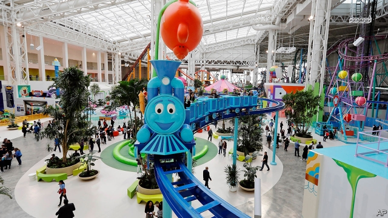

###### Dreaming of a Black Friday

# Who wants to go to a giant shopping mall? 

 

> print-edition iconPrint edition | United States | Nov 30th 2019 

THE SHELLRAISER is the world’s steepest rollercoaster. It is not to be found in a big theme park, but indoors at the new American Dream mall in New Jersey. Passengers can see out of floor-to-ceiling windows over the Meadowlands swamp across the Hudson River to the New York City skyline. After the car climbs vertically, it pauses for a few moments before plunging and spiralling in what, if the venture flops, will provide an easy metaphor for hard-pressed reporters. 

After multiple delays, a credit-crunch, a recession, new owners and a name change, the first phase of American Dream, formerly known as Xanadu, opened on October 25th. Unlike conventional malls, which have department stores, such as Macy’s, as an anchor, American Dream has a number of non-retail anchors, including the Nickelodeon amusement park, a water park, an indoor ski slope, a National Hockey League-size ice-skating rink, Legoland and a Ferris wheel as well as restaurants, a cinema and, eventually, an aquarium. Indeed, Triple Five, the company behind the mega-mall, would rather it be called an entertainment complex. 

Whatever the $5bn thing is called, it is vast: 3m square feet (279,000 square metres), second in size only to Minnesota’s Mall of America, which is also backed by Triple Five. Malls are suffering because of the shift towards online shopping. Rents and occupancy are expected to decline at all but the top 100 malls in America, according to Green Street Advisors, a real-estate research firm. Triple Five points out that only 45% of the space will be taken up by shops. Even so, it seems a strange time to open a mall, even a huge one with an indoor ski slope. 

Tyler Batory, an analyst who covers theme parks at Janney Montgomery Scott, a brokerage, is sceptical. There has not been a successful launch of a theme park in a couple of decades. Theme parks and leisure centres are struggling to compete for families’ time and dollars. “When you combine one business that’s struggling with another that has its own challenges, that doesn’t really seem like a recipe for success,” he says. The biggest problem may be an archaic local law banning shopping on Sundays. Still, proving the doubters and naysayers wrong while pursuing a buck is part of the American dream too. 

