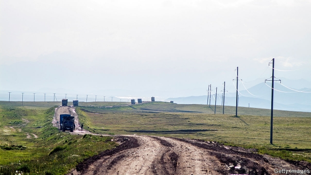

###### The bilk road

# A vast smuggling ring is exposed in Kyrgyzstan, to popular outrage 

 

> print-edition iconPrint edition | Asia | Dec 7th 2019 

THE VICTIM was a Chinese citizen. He was shot in a gangland-style killing in Istanbul, the biggest city in Turkey. But the smuggling racket on which he had just blown the whistle was centred on Kyrgyzstan, a poor Central Asian country of 6m which has been a transit point between China and Europe for centuries. 

Aierken Saimaiti said his part in the racket had been to launder the proceeds, overseeing the removal from Kyrgyzstan of at least $700m in dirty money between 2011 and 2016. Kyrgyz officials have since admitted that Saimaiti and his associates funnelled nearly $1bn to banks in a dozen countries. (Kyrgyzstan’s GDP last year was $8bn.) Before his assassination last month he told journalists from Kloop, a Kyrgyz website, Radio Free Europe, an American-funded news outlet, and the Organised Crime and Corruption Reporting Project, a charity, that he had done so with the connivance of Kyrgyz officials. Ordinary Kyrgyz are asking how such a huge scam could have occurred under two presidents who styled themselves as corruption-busters. 

The money Saimaiti laundered seems to have been made by dodging import tariffs. The gang either failed to declare goods brought to Kyrgyzstan from China or disguised them as items of little value, while bribing customs officials to look the other way. Some of the smuggled merchandise was sold in Kyrgyzstan. Much of the rest was sent on to Russia or to other countries inside the customs union of which Kyrgyzstan is a member, labelled as goods on which duty had been paid and which were therefore entitled to enter duty-free. 

The revelations have caused a furore in Kyrgyzstan. Police have belatedly begun an investigation, questioning (as a witness, rather than a suspect) Raimbek Matraimov, a former deputy head of the customs service whom Saimaiti had accused of playing a part in the scheme. He denies any wrongdoing, as does his brother, the governor of a district bordering Uzbekistan where much of the smuggling is alleged to have occurred. The customs service, meanwhile, has denied that Kyrgyz taxpayers have lost any money at all as a result of any laxity or corruption on its part. 

Nonetheless, another of Mr Matraimov’s brothers, an MP, has reluctantly stepped down from the parliamentary committee formed to investigate Saimaiti’s murder. Police have arrested on suspicion of corruption Erkin Sopokov, the consul in Istanbul when Saimaiti died, after his car was found near the scene of the shooting. 

Politicians have started blaming one another for the scandal. Sooronbay Jeyenbekov, the president, is trying to shrug off Mr Matraimov’s enthusiastic support for his election campaign in 2017. His predecessor, Almazbek Atambayev, is trying to explain how the smuggling ring became established on his watch. (Mr Matraimov once boasted of having enjoyed the ex-president’s “personal backing”, although he was dismissed from the customs service the day before Mr Atambayev left office, in 2017.) As it was, Kyrgyz politics was in uproar due to the arrest of Mr Atambayev, who is alleged to have helped a mafia boss secure early release from prison—a claim he dismisses as an effort by Mr Jeyenbekov to smear him. 

Street protests have toppled governments twice recently in Kyrgyzstan, in 2005 and 2010. Inevitably, protesters have taken to the streets again, although only in the hundreds so far. Whatever the truth of the various allegations, the feud between the two presidents and the steady flow of scandals do not make anyone in government look good. ■ 

