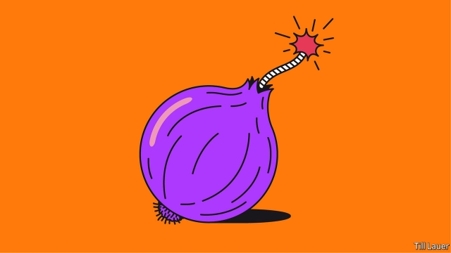

###### Banyan

# Food is a fulcrum in Indian politics 

 

> print-edition iconPrint edition | Asia | Dec 7th 2019 

IN SOUTH ASIA the ruling classes ignore the quotidian at their peril. Just ask them about onions. This autumn the humble bulb has challenged titans. 

The trouble began when unseasonably heavy rains followed drought across the onion-growing belt of north and central India. That not only all but destroyed the crop; the wet caused more than a third of onions in storage to rot. The result is a severe shortage of onions across India, as a result of which prices more than tripled. 

This hardly threatens famine—something the green revolution abolished decades ago by boosting wheat and rice yields. Yet remove the onion and you struggle to imagine Indian cuisine. It forms the base for curries and biryanis. When a poor Indian has nothing else to eat, at least she has an onion with a chapati or two. 

The onion crisis has hit both the farmers and urban consumers of north India, the political heartland of the prime minister, Narendra Modi, and his Bharatiya Janata Party (BJP). In the past, state and even national governments have fallen over onions: Indira Gandhi’s return to power in 1980 was assisted by an election campaign that equated high onion prices with economic mismanagement. Mr Modi, who faces growing economic problems, is surely aware of the perils. In late September his government slapped a ban on exports of onions. That briefly brought down prices, helping consumers. But it has angered farmers and exporters in Gujarat, Maharashtra and Karnataka, for whom onions are an essential cash crop. For the BJP these are key battleground states. And when onion prices are high another problem emerges—organised gangs of allium thieves. The government risks getting blamed for those too. 

In South Asia, a region riven by geopolitical faultlines, there are international implications. Upon hearing of Mr Modi’s export ban, Bangladesh’s strongwoman, Sheikh Hasina Wajed, admonished his government for giving no warning. Her country counts on Indian onions, whose price at one point had risen fivefold in the markets of Dhaka, Bangladesh’s capital. She had, she claimed, been forced to tell her own chef to cook without onions, no small or easy thing. 

Bangladesh immediately tendered for imports to be airlifted from Egypt, Turkey and, notably, from Pakistan. Trade between the two countries has been negligible since Bangladesh split from Pakistan in a terrible war in 1971. Relations have been especially strained over the recent convictions and executions for war crimes of pro-Pakistan Bangladeshis. So the approach to Pakistan hinted at the government’s desperation. 

Despite a long, shared land border, trade between Pakistan and India is also lamentably small. The two countries too often relish their political enmity over the huge potential benefits from trade. However, such is India’s onion crisis, it, too, is turning to Pakistan. 

Though such decisions are taken at the highest level, it is too much to think that this welcome outbreak of onion diplomacy can lay South Asia’s old antagonisms to rest. Even at home, Indian politicians are blind to some obvious conclusions from the crisis, however much their fate is tied to the markets for farm produce. Though the BJP reacts quickly to market stress, politicians have done far too little to encourage decent agricultural warehousing. A consequence is that staggering proportions of vegetables and fruit (and even pulses and grain) end up spoiled. The impediments to trade and poor storage mean that even modest changes in supply and demand lead to wild swings in prices. An onion glut last year, for instance, prompted calls for aid for farmers. 

There is perhaps karmic justice in the prospect of Mr Modi suffering politically over onions. For reasons of cynical electoral advantage, he and his closest advisers have chosen heavily to politicise one specific food choice above all: the consumption of beef, a practice shunned by most Hindus, who consider cows to be sacred. The Hindu-chauvinist BJP has turned the cow into a marker of good Indians (Hindus) and bad (Muslims, Christians and the godless). That has helped the BJP consolidate power across India—and led to lynchings of those accused of killing cows or trafficking in their meat. Vegetarianism was once, as Shikha Mukerjee, a writer based in Kolkata, puts it, a matter of culture and choice. Mr Modi and his gang have made it a centrepiece of politics. Shed only onion tears at his current discomfort. 

