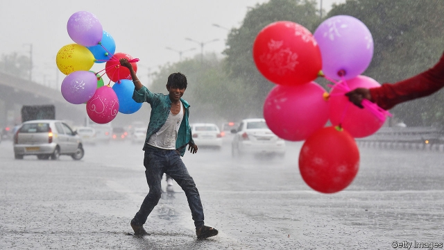
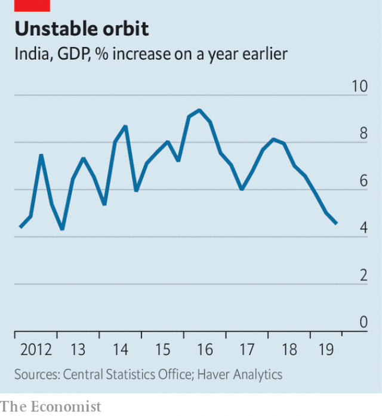

###### Searching for a landing site

# India’s economy is growing at its slowest pace since 2013 

 

> print-edition iconPrint edition | Asia | Dec 7th 2019 

GLOBAL INVESTORS once fell in love with India’s growth “story” because of people like Shanmuga Subramanian. Educated in mechanical engineering, he became a computer programmer, working with Cognizant, an outsourcing firm, and Lennox, which makes heaters and air-conditioners. But that was not enough to exhaust his technological enthusiasms. He recently devoted four days of his spare time to scrutinising images of the Moon’s surface, provided by NASA, searching for any sign of an Indian moon lander that disappeared in September. He eventually spotted an incongruously bright pixel, which NASA this week confirmed was debris from the craft’s crash-landing. 

Unfortunately, India’s growth story is in danger of repeating the lander’s ill-fated trajectory. The explanation offered by India’s space agency for the crash (“the reduction in velocity was more than the designed value”) might apply equally well to the economy. GDP grew by just 4.5% in the 12 months ending in September. That is the slowest pace since 2013 (see chart). 

 

Back then, India suffered from chronic inflation, high oil prices and an unsustainable current-account deficit, fragilities that were all cruelly exposed by a sudden deterioration in global investor sentiment known as the “taper tantrum”. The present slowdown, though similar in its gravity, is quite different in its origins. Inflation is low, external imbalances are modest and oil prices are bearable. The decline began with a loss of confidence not among foreign investors, but among the country’s own consumers. 

Their spending began slowing in early 2018, according to some measures. Matters then took a sharp turn for the worse in September 2018 with the default of Infrastructure Leasing and Financial Services (IL&FS), one of many lenders outside the traditional banking system that had become a growing source of credit. Its failure cast doubt on many similar institutions, interrupting the flow of financing for purchases of big-ticket items like homes and cars. Sales of passenger vehicles slumped by 32% in September compared with a year earlier, their 11th monthly decline in a row. 

Other consumer-facing industries have also suffered. Mobile-phone operators have faced predatory pricing from deep-pocketed conglomerates and “tax terrorism” from overzealous revenue collectors. Vodafone Idea reported a record loss of $7bn in the third quarter, prompting Nick Read, Vodafone’s boss, to complain about unsupportive regulation, excessive taxes and a Supreme Court decision that forced operators to share additional revenues with the government. 

The government dawdled in its response to the economic slowdown, perhaps because it was too convinced by its own economic boasts. Rahul Bajaj, an industrialist, has said that business people are afraid of criticising the government openly. (A day after making his complaints, Vodafone’s Mr Read felt the need to apologise.) But for several months now, the economic debris has been too conspicuous to ignore. The government has responded, haphazardly at first, but with increasing force. It has slashed corporate taxes from 30% to 22% for existing firms (and to 15% for manufacturing startups), quickened the recapitalisation of government-owned banks, reversed an unpopular tax increase for foreign investors and offered some relief to telecoms firms, among other things. 

The government has also broached a judicious reform of labour laws. Last month it introduced a bill that would consolidate three existing laws, making it easier for firms to hire workers on fixed-term contracts (rather than employing them on open-ended contracts that can be almost impossible to terminate). The new bill would still require firms with more than 100 employees to obtain government permission before laying anyone off. But it would give the government discretion to raise that threshold in future without further legislation. 

Combined with five interest-rate cuts from the Reserve Bank of India, the central bank, these efforts should help stabilise the economy. Consumption is already growing faster than it was earlier in the year. Although it will take years to unclog the financial system properly, some of the panic over India’s new breed of lenders has also dissipated. Financial institutions with good credit ratings can now borrow almost as cheaply as they did in early 2018 before the default of IL&FS. 

One side-effect, however, is that the government’s own borrowing is raising eyebrows. Last month Moody’s said the outlook for India’s credit rating was “negative” (although a downgrade would merely move Moody’s assessment of India into line with rival rating agencies). The government is almost certain to miss its deficit target of 3.3% of GDP for this fiscal year, which ends on March 31st. And if the states and government-owned enterprises are included in the total, the combined fiscal deficit could reach 8.2% of GDP, according to Goldman Sachs. 

The government’s reputation for economic management is also now in deep deficit. In response to the latest growth figures, one member of parliament for the ruling party said it was wrong to treat GDP as the truth like the “Bible, Ramayana or Mahabharat”. Unfortunately, many economists now agree with him—doubt in the veracity of the official figure has grown since a new methodology was introduced in 2015. Arvind Subramanian, who previously served as the government’s chief economic adviser, has argued that India’s growth may have been overstated by 2.5 percentage points a year over the five-year period from 2011-12 to 2016-17. If any consolation can be drawn from the latest miserable GDP number, it is only that the official data are not so flawed that they cannot register the bad news. 

India’s space agency was slow to acknowledge that its lander had been destroyed (insisting at first that it was still trying to communicate with it). After NASA confirmed Mr Subramanian’s discovery of the crash site, the Indian agency said that it had found it weeks ago. But for some reason it neglected to reveal the location to the outside world. India’s dogged and passionate professionals are one reason global investors fell in love with the country’s growth story. Its unhelpful government institutions are one reason their ardour has since dimmed. ■ 

