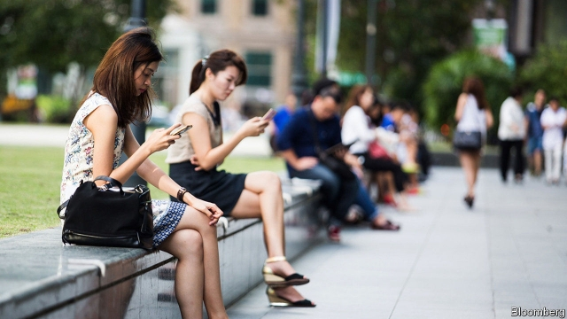

###### False alarm

# Singapore strikes its first official blows against fake news 

 

> print-edition iconPrint edition | Asia | Dec 7th 2019 

“FACEBOOK IS LEGALLY required to tell you that the Singapore government says this post has false information,” reads the message, which links to a government website. It appeared on November 30th on a post published by the States Times Review, a blog which delights in hectoring the Singaporean authorities. The post alleged that the country’s elections are rigged and that the next one could “possibly turn Singapore into a Christian state”. 

The idea that the ruling People’s Action Party is trying to turn Singapore into a theocracy is absurd—even “scurrilous”, as the government put it. (The contention that it rigs elections is more defensible, although it does so not by stuffing ballot boxes, but by making life difficult for its critics and threatening adverse consequences for areas that vote for the opposition. It has won every general election in the past 60 years.) 

The government, deeming the post false, asked its founder, who lives in Australia, to publish a correction notice under the Prevention from Online Falsehoods and Manipulation Act (POFMA), which came into effect in October. He refused, noting that the Australian authorities had not asked him to remove anything, but thanked the Singaporean government for boosting traffic to his site. Officials had more luck with Facebook, which made the notice visible to users in Singapore. States Times Review’s website is blocked in Singapore, so Facebook is its chief means of reaching people there. 

The episode was not POFMA’s only outing in recent weeks. The finance minister, Heng Swee Keat, who is widely expected to become the next prime minister, decided to invoke it against an obscure opposition politician, Brad Bowyer, who had questioned the independence and investment nous of Singapore’s sovereign-wealth funds. Mr Bowyer’s post had indeed contained errors, on which the authorities seized. But its main contention—that the government’s investments were not as well managed as they could be—is clearly a subjective matter. 

The hubbub over the two orders relates more to the display of POFMA’s powers than to the details of the posts themselves. The law aims “to prevent the electronic communication in Singapore of false statements of fact” and “to suppress support for and counteract the effects of such communication”, among other things. It allows any minister, upon declaring a particular statement to be false, to order its removal or correction. A special POFMA office advises ministers on how best to act. It also offers codes of practice to digital platforms. 

The accused can only seek recourse at the High Court after the minister in question has rejected an appeal (which costs about $150). The court can then rule on whether the original statement was indeed misleading. Individuals found guilty of ignoring correction orders or of deliberately spreading lies face criminal penalties, including prison terms of up to ten years, fines of S$100,000 ($73,000) or both. Social-media firms face fines of up to S$1m. 

Human rights groups, a UN Special Rapporteur and a cluster of tech firms have all opposed POFMA. Its vast scope—from private group messages to online videos and beyond—is a particular concern. And it joins a host of other legislation which already keeps critics in check. The country’s constitution limits free speech with “such restrictions as it considers necessary or expedient”. Contempt-of-court law has been used to target the odd journalist, cartoonist or blogger. Defamation cases trouble other outspoken figures. Singapore sits below Russia, Afghanistan and many of its own neighbours in the latest ranking of press freedom compiled by Reporters Without Borders, a watchdog. 

Sending fabricated messages was already a crime under the Telecommunications Act. But POFMA offers the government ways to respond to criticism it deems unreasonable faster and in a (slightly) less heavy-handed manner. Facebook has said that it hopes the law will not impinge on free expression. To say it already has would presumably attract a POFMA order. ■ 

