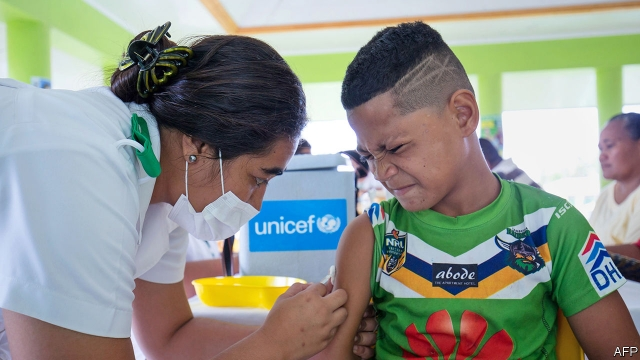

###### Red alert

# The anti-vax movement causes an epidemic in Samoa 

 

> print-edition iconPrint edition | Asia | Dec 5th 2019 

SAMOA’S STREETS are silent. The only busy spots are the country’s hospitals, where fearful families queue for vaccinations. An epidemic of the measles has so far produced 4,000 infections and 60 deaths, in a country of 200,000 people. The government has announced a state of emergency, closed all schools and banned private vehicles from the roads. People have been told to stay in their homes, and hang red cloths in front of them to indicate the presence of unvaccinated residents. Mobile vaccination units are touring the country in a mandatory mass inoculation campaign. 

Measles has spread so rapidly in Samoa because only a small proportion of children has been vaccinated. The World Health Organisation estimates that just 31% of infants received the vaccine in 2018, down from 90% in 2013. Distrust of the health system was fuelled by the death last year of two babies who had mistakenly been administered a muscle relaxant along with the vaccine. In response, the government put measles vaccinations on hold. Anti-vax activists spread false rumours that hospitals were using faulty or expired vaccines and, as in other countries, repeated the debunked claim that immunisation is linked to autism. 

Although the nurses responsible for the botched vaccinations were tried and imprisoned, many Samoans remained suspicious. Some responded to the outbreak by praying instead of seeking vaccination or treatment, or by administering traditional remedies, such as oiling the red blotchy skin that is a symptom of the disease. 

Such responses prompted the government to make vaccination mandatory. The prime minister, Tuilaepa Sailele Malielegaoi, has called on village councils, faith-based organisations and church leaders, among others, to persuade the hold-outs. The authorities say 65,000 people been vaccinated in recent days, and the government aims to bring the rate to 90% within 48 hours. 

The crisis offers clear proof of the dangers of anti-vax propaganda. Although the outbreak probably originated in New Zealand, where many Samoans live, and has spread to neighbouring Fiji, neither of those countries has suffered nearly so serious an epidemic because vaccination rates are much higher. Fiji also provides a lesson in how deadly measles can be. In 1875 an outbreak there killed a quarter of the population. 

