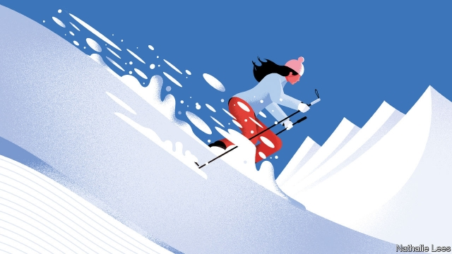

###### Word up

# Our books of the year 

 

> print-edition iconPrint edition | Books and arts | Dec 7th 2019 

Dignity: Seeking Respect in Back Row America. By Chris Arnade. Sentinel; 304 pages; $30 and £25 

Over several years the author of this book, a former Wall Street trader, conducted thoughtful interviews in neglected communities across America, and took moving photographs of his subjects. The result is a quietly revelatory portrait of what he calls the country’s “back row”. 

An American Summer: Love and Death in Chicago. By Alex Kotlowitz. Nan A. Talese; 304 pages; $27.95 

Chicago has suffered 14,000 murders in the past two decades; overwhelmingly the victims are African-American or Hispanic. This is an intimate and sympathetic depiction of several people involved in, and affected by, deadly crime. The killings seem senseless, but, says the author, the city can do more to grasp their causes. 

Winners Take All: The Elite Charade of Changing the World. By Anand Giridharadas. Knopf; 304 pages; $26.95. Allen Lane; £12.99 

A timely polemic against philanthrocapitalism, which argues that supposedly do-gooding companies merely offer sticking-plaster solutions to social problems that they have helped create. Such efforts, the author says, do little to make up for a winner-takes-all philosophy that is holding down wages and transferring the burden of risk onto employees. 

No Visible Bruises. By Rachel Louise Snyder. Bloomsbury; 320 pages; $28 

It is the dark matter of violent crime: unseen but everywhere. This investigation into domestic violence in America blends harrowing testimony with persuasive recommendations on how to help victims and perpetrators. A book that manages to be both personal and panoramic, angry and hopeful. 

Assad or We Burn the Country. By Sam Dagher. Little, Brown; 592 pages; $29 and £25 

Although the horrors of Syria’s civil war are well documented, this chronicle by a Wall Street Journal correspondent still offers new insights into a struggle that has reshaped the Middle East. Many are based on his rare access to Manaf Tlass, a one-time confidant of Bashar al-Assad, who charts the accidental president’s metamorphosis into a blood-soaked dictator. 

The Light that Failed. By Stephen Holmes and Ivan Krastev. Pegasus Books; 256 pages; $26.95. Allen Lane; £20 

When the Soviet Union collapsed and communism fell, the countries of eastern Europe set out to emulate Western democracies. But, as the authors of this perceptive book eloquently relate, their attitude to liberal democracy soured amid globalisation and the financial crisis—forces that also fed the rise of nationalism in the West. Russia, meanwhile, replaced Soviet rule with a revanchist autocracy. 

Presidential Misconduct: From George Washington to Today. Edited by James Banner junior. New Press; 512 pages; $29.99 

In 1974 the special counsel to the impeachment inquiry commissioned a survey of presidential misconduct from Washington to Lyndon Johnson. Brought up-to-date with chapters on presidents from Richard Nixon to Barack Obama, this useful study supplies the scales on which more recent wrongdoing can be weighed. 

Say Nothing. By Patrick Radden Keefe. Doubleday; 464 pages; $28.95. William Collins; £20 

Framed as an inquiry into the death of Jean McConville, a mother of ten who was abducted and murdered by the IRA in 1972, this is a masterful exploration of the motives of terrorists, the stories they tell themselves and how they make the transition to peace—or, in some cases, fail to. 

Remembering Emmett Till. By Dave Tell. University of Chicago Press; 312 pages; $25 and £19 

A fine history of racism, poverty and memory in the Mississippi Delta told through the lynching of Emmett Till, a black 14-year-old from Chicago whose murder in 1955—and his mother’s determination to display his mutilated features in an open coffin—made him an early martyr of the civil-rights movement. 

Amritsar 1919: An Empire of Fear and the Making of a Massacre. By Kim Wagner. Yale University Press; 360 pages; $32.50 and £20 

At least 379 people were killed by British soldiers in the Amritsar massacre on April 13th 1919, making that one of the darkest days in the history of the empire. On the event’s centenary, this book persuasively argues that it was less of an aberration than apologists for empire, including Winston Churchill, have chosen to believe. 

Maoism: A Global History. By Julia Lovell. Knopf; 610 pages; $37.50. Bodley Head; £30 

Mao Zedong was a despot who caused tens of millions of deaths; yet his name does not attract the same opprobrium as Hitler’s or Stalin’s. Indeed, his legend and ideas have inspired revolutionaries around the world. As the author of this book shows, his manipulated image retains a powerful allure in China and beyond. “Like a dormant virus”, she writes, “Maoism has demonstrated a tenacious, global talent for latency.” 

The Regency Years. By Robert Morrison. W.W. Norton; 416 pages; $29.95. Published in Britain as “The Regency Revolution”; Atlantic Books; £20 

“I awoke one morning and found myself famous,” Lord Byron, a Regency poet, once said. The period itself has suffered from the opposite problem—eclipsed by the more solemn and substantial Georgian and Victorian ones that preceded and followed it. Arguing that Britain truly started to become modern in the Regency era, this delightful book explains why it deserves to be better known. 

How to be a Dictator. By Frank Dikötter. Bloomsbury; 304 pages; $28 and £25 

What do Mussolini, Hitler, Stalin, Mao, Kim Il Sung, Nicolae Ceausescu, Papa Doc Duvalier and Mengistu Haile Mariam have in common? This insightful handbook for gangsters is written by a distinguished historian of 20th-century China. 

An Impeccable Spy: Richard Sorge, Stalin’s Master Agent. By Owen Matthews. Bloomsbury; 448 pages; $30 and £25 

Richard Sorge’s bravery and recklessness in the Soviet cause in Tokyo—where boozing and seduction were among his main espionage techniques—were matched by the venality and cowardice of his masters in Moscow. Despite their brutal incompetence, his intelligence helped turn the course of the second world war. A tragic, heroic story, magnificently told with an understated rage. 

The Education of an Idealist. By Samantha Power. Dey Street Books; 592 pages; $29.99. William Collins; £20 

An engaging insider’s account of foreign-policymaking in what now seems like a different era of diplomacy. It describes the efforts of its author—Barack Obama’s Irish-born ambassador to the United Nations—to juggle idealism with the realities of governing, while also juggling motherhood with the demands of representing America on the world stage. 

 

Family Papers: A Sephardic Journey Through the Twentieth Century. By Sarah Abrevaya Stein. Farrar, Straus and Giroux; 336 pages; $28 

This history of the Levy family of Salonika follows its subjects through interwar Greece to the present day. It is a painstaking feat of reconstruction that draws on correspondence in Ottoman Turkish, Hebrew, French and especially Ladino, the language of Sephardic Jewry. Much of the clan was murdered in Auschwitz in 1943; those who survive are now spread across the globe. And yet, the author says, they retain a family resemblance. 

The Last Stone. By Mark Bowden. Atlantic Monthly Press; 304 pages; $27. Grove Press; £16.99 

True-crime writers in America face a high bar, set by illustrious predecessors such as Truman Capote. The author of “Black Hawk Down” rises to the challenge in this reconstruction of how a horrific crime—the disappearance of two sisters from a mall in Maryland in 1975—was partially solved 40 years later. Dogged and ingenious interrogation of a mendacious suspect finally gets at the truth. 

Good Economics for Hard Times. By Abhijit Banerjee and Esther Duflo. PublicAffairs; 432 pages; $30. Allen Lane; £25 

The real meaning of this book by a Nobel-prizewinning duo of economists lies in its method—a patient attempt to take on tough problems through empirical evidence. Known for pioneering the use of randomised controlled trials, the pair offer insights into thorny global issues ranging from inequality to corruption, all with refreshing humility. 

Open Borders. By Bryan Caplan. Illustrated by Zach Weinersmith. First Second; 256 pages; $19.99. St. Martin’s Press; £15.99 

An enlightened polemic in cartoon format, this book—by a team comprising an economics professor and an illustrator—persuasively rebuffs the arguments against migration commonly made by politicians. At the same time it shows how an accessible and respectful case can be made on a neuralgic subject. 

Narrative Economics. By Robert Shiller. Princeton University Press; 400 pages; $27.95 and £20 

The author, another Nobel laureate, explores how the public’s subjective perceptions can shape economic trends. The result is a sensible and welcome escape from the dead hand of mathematical models of economics. 

Schism. By Paul Blustein. CIGI Press; 400 pages; $27.95. McGill-Queen’s University Press; £27.99 

A fascinating, detailed account of the history of tensions in America’s trade relationship with China. It explains the back story to today’s conflict—and reveals how difficult it will be to escape it. 

Capitalism, Alone. By Branko Milanovic. Belknap Press; 304 pages; $29.95 and £23.95 

A scholar of inequality warns that while capitalism may have seen off rival economic systems, the survival of liberal democracies is anything but assured. The amoral pursuit of profit in more liberal capitalist societies has eroded the ethical norms that help sustain openness and democracy, he argues; now that tendency threatens to push such places in the direction of more authoritarian capitalist societies, such as China. 

Furious Hours: Murder, Fraud and the Last Trial of Harper Lee. By Casey Cep. Knopf; 336 pages; $26.95. William Heinemann; £20 

An ingeniously structured, beautifully written double mystery—one concerning the Reverend Willie Maxwell, who was accused of murdering five relatives for the insurance money in Alabama in the 1970s (before being fatally shot himself); the other, Harper Lee’s abortive efforts to write a book about the case. Tom Radney, a lawyer who is the story’s third main character, defended Maxwell—and his killer. 

Kafka’s Last Trial: The Case of a Literary Legacy. By Benjamin Balint. W.W. Norton; 288 pages; $26.95. Picador; £14.99 

An account of the struggle over Kafka’s papers between competing archives in Israel and Germany—plus a woman who inherited them from a friend of his editor, Max Brod—which played out after most of the writer’s family had died in the Holocaust. A book about the provenance of art, and how much, in the end, it matters. 

Underland: A Deep Time Journey. By Robert Macfarlane. W.W. Norton; 384 pages; $27.95. Hamish Hamilton; £20 

A haunting examination of the world below the surface—a place that has always been envisioned as a zone of treasure and of dread. From the Paris catacombs to the soil of Epping Forest to caverns in remotest Norway, the author, a celebrated nature-writer, re-envisions the planet from the ground down. 

Three Women. By Lisa Taddeo. Simon & Schuster; 320 pages; $27. Bloomsbury Circus; £16.99 

Eight years of reporting went into this portrait of American sexuality from a female perspective. The author’s three subjects “stand for the whole of what longing in America looks like”; she spent time in their home towns to study their daily routines, jobs and, above all, their desires. With a novelist’s eye for detail, she captures the pain and powerlessness of sex, as well as its heady joys. 

A Month in Siena. By Hisham Matar. Random House; 126 pages; $27. Viking; £12.99 

The author’s life and writing have been shaped by his Libyan father’s kidnapping in 1990 by the regime of Muammar Qaddafi. In previous work he tried to uncover what happened; in this slim, bewitching book he finds answers, of a sort, by travelling to Siena. Meditating on art, history and the relationship between them, this is both a portrait of a city and an affirmation of life’s quiet dignities in the face of loss. 

This is Shakespeare. By Emma Smith. Pelican; 368 pages; £20 

A brilliant and accessible tour of Shakespeare’s plays that is also a radical manifesto for how to read and watch his work. Witty, irreverent and searching, this book, by a professor at Oxford University, shines dazzling new light on the oeuvre of the world’s greatest literary genius. 

Stalingrad: A Novel. By Vasily Grossman. Translated by Robert and Elizabeth Chandler. NYRB Classics; 1,088 pages; $27.95. Harvill Secker; £25 

At last, the Russian novelist-journalist’s mighty prequel to “Life and Fate”, his epic of the battle of Stalingrad and its aftermath, has received a definitive—and hugely powerful—English translation. A seething fresco of combat, domestic routine under siege and intellectual debate, it confirms that Grossman was the supreme bard of the second world war. 

Ducks, Newburyport. By Lucy Ellmann. Biblioasis; 1,040 pages; $22.95. Galley Beggar Press; £14.99 

The year’s unlikeliest literary triumph: a 1,000-page fictional monologue delivered by a worried Ohio housewife and baker, much of which is made up of a single sentence. A prize-garlanded novel that is funny, angry, erudite, profound—and full of great cake recipes. 

10 Minutes 38 Seconds in This Strange World. By Elif Shafak. Bloomsbury; 320 pages; $27. Viking; £14.99 

The protagonist of this story is dead when it begins. The body of “Tequila Leila” has been dumped in a wheelie bin on the outskirts of Istanbul; yet, somehow, her mind remains active. While it does, she scrolls back through her life—a pained childhood, stalwart friends in adulthood—in a powerful, unflinching novel that, like all of the Turkish author’s work, is political and lyrical at once. 

 

Homeland. By Fernando Aramburu. Translated by Alfred MacAdam. Pantheon; 608 pages; $29.95. Picador; £16.99 

A monumental novel—and a bestseller in Spanish—which explores how ETA’s terrorism divided families and lifelong friends in a claustrophobic Basque town. Empathetic but morally acute, this may be the definitive fictional account of the Basque troubles; it suggests that redemption is hard but not impossible. 

The Volunteer. By Salvatore Scibona. Penguin Press; 432 pages; $28. Jonathan Cape; £16.99 

This intricate novel spans decades and continents and incorporates multiple, looping stories. After being captured in Cambodia, Vollie returns to America and is dispatched to New York to conduct surveillance on a supposed renegade Nazi. This assignment will come to haunt him, too. “Who among us”, he asks, “has lived only once?” A searing yet poetic record of war and the lies people live by. 

The Far Field. By Madhuri Vijay. Grove Press; 448 pages; $27 and £14.99 

A courageous, insightful and affecting debut novel—and the winner of the prestigious JCB prize for Indian literature—which places a naive upper-class woman from southern India in the midst of far messier realities in Kashmir. Along the way, the story challenges Indian taboos ranging from sex to politics. 

Trust Exercise. By Susan Choi. Henry Holt; 272 pages; $27. Serpent’s Tail; £14.99 

The title of this tricksy, beguiling novel, winner of a National Book Award, refers to the relationship between writer and reader, as well as to the bonding exercises undertaken by the theatre students in the story—and to the trust between teenage girls and predatory men. A tale of missed connections and manipulation, and of willing surrender to the lure and peril of the unknown. 

Black Sun. By Owen Matthews. Doubleday; 320 pages; $26.95. Bantam Press; £16.99 

Based on real events—the bid by Andrei Sakharov to develop a bomb to end all bombs—this story is set in a secret Soviet city in 1961. Featuring murder and betrayals, and a flawed but principled KGB man as its hero, it unfolds in the aftermath of Stalinism, amid the scars left by the purges, denunciations and Great Patriotic War. The prolific author (see Biography), a former Moscow correspondent, knows his terrain inside out. 

The Uninhabitable Earth: Life After Warming. By David Wallace-Wells. Tim Duggan Books; 320 pages; $27. Allen Lane; £20 

One of the most persuasive of the many books that spell out the consequences of climate change—and one of the most terrifying. As Earth moves beyond the conditions that allowed people to evolve, the author warns, “the end of normal” has arrived. Yet amid the rising seas, floods, fires, droughts and hurricanes, both current and impending, he remains optimistic about humanity’s ability to deal with the havoc it has caused. 

The New Rules of War: Victory in the Age of Durable Disorder. By Sean McFate. William Morrow; 336 pages; $29.99 

A former paratrooper and mercenary makes the case that the American armed forces are ill-equipped for the conflicts of the 21st century. To keep the country safe, he contends, the top brass need to modernise their thinking, and respond to the information warfare that is now waged by their adversaries. 

Good Reasons for Bad Feelings. By Randolph Nesse. Dutton; 384 pages; $28. Allen Lane; £20 

A fascinating study of the evolutionary roots of mental illness. The author, a professor of psychiatry, argues that, in the right proportion, negative emotions may be useful for survival in a similar way to physical pain. Humans, he says, may have “minds like the legs of racehorses, fast but vulnerable to catastrophic failures”. 

Novacene: The Coming Age of Hyperintelligence. By James Lovelock with Bryan Appleyard. MIT Press; 160 pages; $22.95. Allen Lane; £14.99 

In a brief but thought-provoking book, the scientist who developed the “Gaia Theory” about the Earth’s life and climate—and who this year turned 100—predicts that cyborgs may eventually evolve to supplant carbon-based humankind. But don’t despair: the robots, he suggests, might decide to keep people around as pets. 

