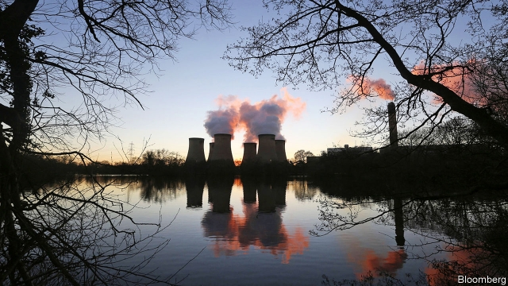
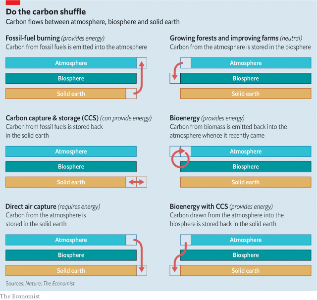
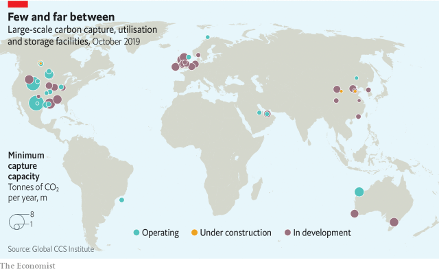
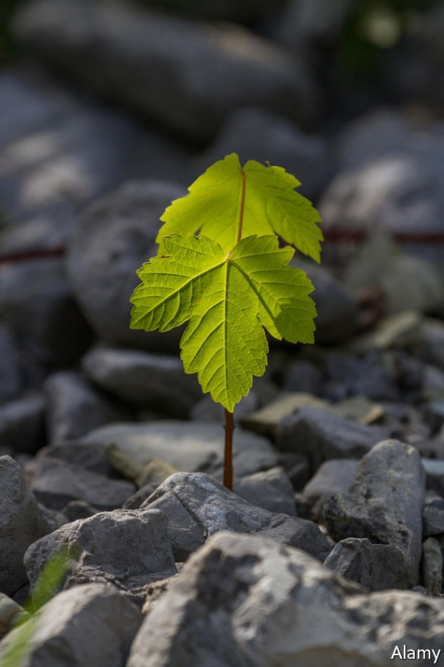

###### Clearing the air

# Climate policy needs negative carbon-dioxide emissions 

 

> print-edition iconPrint edition | Briefing | Dec 7th 2019 

ON ONE SIDE of a utility road at the edge of Drax power station in Yorkshire sits a vast pile of deep black coal. On the other side, trains loaded to the brim with compressed wood pellets. “The old and the new,” says a worker. 

Opened just under half a century ago, Drax (pictured) was not only the biggest coal-fired power station ever built in Britain: it was the last. Now only two of its six mighty boilers are still fired by coal, and at the end of November they had sat idle since March. In the first half of 2019, coal accounted for just 6% of Drax’s electricity output. The rest came from those wood pellets. Biomass burned at Drax provides 11% of Britain’s renewable electricity—roughly the same amount as all the country’s solar panels combined. 

And soon Drax—the power plant is owned by a company of the same name—hopes to be more than an electricity supplier. It hopes to be a carbon remover. By pumping the CO2 it produces from its pellets into subterranean geological storage, rather than returning it to the atmosphere, it hopes to pioneer a process which climate policymakers see as vital: so-called “negative emissions”. 

The Paris climate agreement of 2015 calls for the Earth’s temperature to increase by no more than 2°C over pre-industrial levels, and ideally by as little as 1.5°C. Already, temperatures are 1°C above the pre-industrial, and they continue to climb, driven for the most part by CO2 emissions of 43bn tonnes a year. To stand a good chance of scraping under the 2°C target, let alone the 1.5°C target, just by curtailing greenhouse-gas emissions would require cuts far more stringent than the large emitting nations are currently offering. 

Recognising this, the agreement envisages a future in which, as well as hugely reducing the amount of CO2put into the atmosphere, nations also take a fair bit out. Scenarios looked at by the Intergovernmental Panel on Climate Change (IPCC) last year required between 100bn and 1trn tonnes of CO2 to be removed from the atmosphere by the end of the century if the Paris goals were to be reached; the median value was 730bn tonnes–that is, more than ten years of global emissions. 

This is where what is going on at Drax comes in. Plants and algae have been sucking carbon out of the atmosphere and turning it into biomass for over a billion years. It is because the carbon in biomass was, until recently, in the atmosphere that burning it in a power station like Drax counts as renewable energy; it just puts back into the atmosphere what the plants took out. The emissions from procuring and transporting the biomass matter too, but if the supply chain is well managed they should be quite small in comparison. The pellets at Drax are mostly made from sawmill refuse and other by-products in America; they are then transported by rail, ship and rail to the site where they will be pulverised and burned. 

If, instead of burning the biomass, you just let it stand, the carbon stays put. So if you increase the amount of vegetation on the planet, you can suck down a certain amount of the excess CO2 from the atmosphere. Growing forests, or improving farmland, is often a good idea for other reasons, and can certainly store some carbon. But it is not a particularly reliable way of doing so. Forests can be cut back down, or burned—and they might also die off if, overall, mitigation efforts fail to keep the climate cool enough for their liking. 

But the biggest problem with using new or restored forests as carbon stores is how big they have to be to make a serious difference. The area covered by new or restored forests in some of the IPCC scenarios was the size of Russia. And even such a heroic Johnny Appleseeding would only absorb on the order of 200bn tonnes of CO2 ; less than many consider necessary. 

The sort of bioenergy with carbon capture and storage (BECCS) power station that Drax wants to turn itself into would allow more carbon to be captured on the same amount of land. The trick is to use the biomass not as a simple standing store of carbon, but as a renewable fuel. 

The original use envisaged for carbon capture and storage (CCS) technology was to take CO2 out of the chimneys of coal-fired power plants and pump it deep underground; do it right and the power station will be close to carbon-neutral. Apply the same technology to a biomass-burning plant and the CO2 you pump into the depths is not from ancient fossils, but from recently living plants—and, before them, the atmosphere. Hey presto: negative emissions. And BECCS does not just get rid of CO2: it produces power, too. The solar energy that photosynthesis stored away in the plants’ leaves and wood gets turned into electricity when that biomass is burned. It is almost as if nature were paying to get rid of the stuff. 

 

There are, as you might expect, some difficulties. Even if you regularly take some away for burning, growing biomass on the requisite scale still takes a lot of land. Also, the bog-standard CCS of which BECCS is meant to be a clever variant has never really made its mark. It has been talked about for decades; the IPCC produced a report about it in 2005. Some hoped that it might become a mainstay of carbon-free energy production. But for various reasons, technical, economic and ideological, it has not. 

The world has about 2,500 coal-fired power stations, and thousands more gas-fired stations, steel plants, cement works and other installations that produce industrial amounts of CO2. Just 19 of them offer some level of CCS, according to the Global Carbon Capture and Storage Institute (GCCSI), a CCS advocacy group. All told, roughly 40m tonnes of CO2 are being captured from industrial sources every year—around 0.1% of emissions. 

Why so little? There are no fundamental technological hurdles; but the heavy industrial kit needed to do CCS at scale costs a lot. If CO2 emitters had to pay for the privilege of emitting to the tune, say, of $100 a tonne, there would be a lot more interest in the technology, which would bring down its cost. In the absence of such a price, there are very few incentives or penalties to encourage such investment. The greens who lobby for action on the climate do not, for the most part, want to support CCS. They see it as a way for fossil-fuel companies to seem to be part of the solution while staying in business, a prospect they hate. Electricity generators have seen the remarkable drop in the price of wind and solar and invested accordingly. 

Thus Drax’s CCS facility remains, at the moment, a pair of grey shipping containers sitting in a fenced-off area outside the main boiler hall, dwarfed by the vast buildings and pipes that surround them. Inside the first container, the flue gases—which are about 10% CO2 by volume—are run through a solvent which binds avidly to CO2 molecules. The carbon-laden solvent is then pumped into the second container, where it is heated—which causes it to give up its burden, now a pure gas. 

This test rig produces just one tonne of CO2 a day. The pipe through which the flue gases enter it is perhaps 30cm across. High above it is another pipe, now unused, which in coal-burning days took all the flue gases to a system that would strip sulphur from them. It is big enough that you could drive down it in a double-decker bus with another double-decker on top. That is the pipe that Drax would like to be able to invest in using. 

In some circumstances, you do not need a subsidy, a carbon price or any other intervention to make capturing CO2 pay. Selling it will suffice. The commercial use of CO2 is nothing new. Not long after the great British chemist Joseph Priestley first made what he called “fixed air” in the 1760s, an ingenious businessman called Johann Jacob Schweppe was selling soda water in Geneva. CO2, mostly from natural sources, is still used to make drinks fizzy and for other things. Many greenhouses make use of it to stimulate the growth of plants. 

The problem with most of these markets from a negative-emissions point of view is that the CO2 gets back into the atmosphere in not much more time than it takes a drinker to belch. But there is one notable exception. For half a century oil companies have been squirting CO2 down some of their wells in order to chase recalcitrant oil out of the nooks and crannies in the rock—a process known as enhanced oil recovery, or EOR. And though the oil comes out, a lot of the CO2 stays underground. 

The oil industry goes to some inconvenience to capture the 28m tonnes of CO2 a year it uses for EOR from natural sources (some gas wells have a lot of CO2 mixed in with the good stuff). That effort is rewarded, according to the International Energy Agency, with some 500,000 barrels of oil a day, or 0.6% of global production. That seems like a market that CCS could grow into—though the irony of using CO2 produced by burning fossil fuels to chase yet more fossil fuels out of the ground is not lost on anyone. 

 

The fact that oilfields in Texas regularly use EOR has made the state a popular site for companies trying out new approaches to carbon capture. A startup called NET Power has built a new sort of gas-fired power plant on the outskirts of Houston. Most such plants burn natural gas in air to heat water to make steam to drive a turbine. The NET Power plant burns natural gas in pure oxygen to create a stream of hot CO2 which drives the turbine directly—and which, being pure, needs no further filtering in order to be used for EOR. 

Also in Texas, Occidental Petroleum is developing a plant with Carbon Engineering, a Canadian firm which seeks to pull CO2 straight out of the air, a process called direct air capture. Because CO2 is present in air only at a very low concentration (0.04%) DAC is a very demanding business. But oil recovered through EOR that uses atmospheric CO2 can earn handsome credits under California’s Low-Carbon Fuel Standards cap and trade programme. The scheme aims to be pumping 500,000 tonnes of CO2 captured from the air into Occidental’s nearly depleted wells by 2022. 

Not all the CO2 pumped into the ground by oil companies is used for EOR. Equinor, formerly Statoil, a Norwegian oil company, has long pumped CO2 into a spent field in the North Sea, both to prove the technology and to avoid the stiff carbon tax which Norway levies on emissions from the hydrocarbon industry. As a condition on its lease to develop the Gorgon natural-gas field off the coast of Australia, Chevron was required to strip the CO2 out of the gas and store it. The resultant project is, at 4m tonnes a year, bigger than any other not used for EOR, and the world’s only CCS facility that could handle emissions on the scale of those from Drax. 

In Europe, the idea has caught on that the costs of operating big CO2 reservoirs like Gorgon’s will need to be shared between many carbon sources. This is prompting a trend towards clusters that could share the storage infrastructure. Equinor, Shell and Total, two more oil companies, are proposing to turn CCS into a service industry in Norway. For a fee they will collect CO2 from its producers and ship it to Bergen before pushing it out through a pipeline to offshore injection points. In September Equinor announced that it had seven potential customers, including Air Liquide, an industrial-gas provider, and ArcelorMittal, a steelmaker. 

Similar projects for filling up the emptied gasfields of the North Sea are seeking government support in the Netherlands, where Rotterdam’s port authority is championing the idea, and in Britain, where the main movers are heavy industries in the north, including Drax. 

This is part of what the GCCSI says is a steady increase in projects to capture and store, or use, CO2. But the trend needs to be treated with caution. First and foremost, global carbon capture is still measured in the tens of millions of tonnes, not the billions of tonnes that matter to the climate. What the Gorgon project stores in a year, the world emits in an hour. 

 

Second, the public support the sector has received in the past has often proved fickle or poorly designed. In 2012, the British government promised £1bn in funding for CCS, only to pull the plug in 2015. Two projects which had been competing for the money, a Scottish one that would have trapped CO2 at an existing gas plant and one in Yorkshire which planned to build a new coal-fired power station with CCS, were both scrapped. This history makes the £800m for CCS that Boris Johnson, the prime minister, has promised as part of the current election campaign even less convincing than most such pledges. 

But there are some reasons for optimism. In 2008 America enacted a tax credit, 45Q, that was to reward the first 75m tonnes of CO2 sequestered through CCS. Unfortunately, not knowing from the outset whether a given project would end up emitting the lucrative 74th-millionth tonne or the otiose 76th-millionth tonne tempered investor enthusiasm. Last year 45Q was amended. Instead of a 75m tonne cap, there is now a time limit: all projects that are up and running before January 1st 2024 will be eligible. This has created a flurry of activity. 

The European Union has also recently announced financial support for CCS, in the form of a roughly €10bn innovation fund aimed at CCS, renewables and energy storage. The first call for projects goes out in 2020. Christian Holzleitner, head of the EU’s Directorate-General for Climate Action, emphasises that the fund’s purpose is not to decarbonise fossil-fuel energy, but rather to focus on CCS development for the difficult-to-decarbonise industries such as steel and cement. With renewables on a roll, that makes a lot of sense. 

Tax breaks, experimental capture plants, new fangled ways of producing electricity and talk of infrastructure hubs amount to an encouraging buzz, but not yet much more. A CCS industry capable of producing lots of BECCS plants remains a long way off, as does the infrastructure for gathering sustainably sourced biomass for use in them. Carbon Engineering and its rival DAC companies, such as Climeworks and Skytree, remain very expensive ways of getting pure CO2. If they can find new markets and push their costs down both by learning better tricks and through economies of scale, they may yet be part of the solution. But for now, it looks like most of the CO2 being pumped into the atmosphere will stay there for a very long time. ■ 

Sign up to our new fortnightly climate-change newsletter here 

