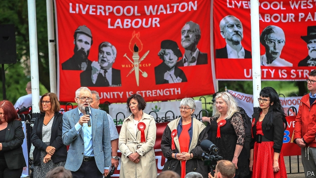

###### You’ll always walk alone

# It’s lonely being a Tory candidate in deep-red Liverpool 

 

> print-edition iconPrint edition | Britain | Dec 7th 2019 

AS ALEX PHILLIPS makes his case to a burgher of Liverpool Walton, in the city’s north, peals of laughter sound a few doors up. “You’re asking me to vote Conservative,” chortles a local resident to an activist. “Are you having a laugh?” It is a fair question. At the election in 2017 Mr Phillips’s party came second with 9% of the vote, to Labour’s 86%, making Walton the safest seat in the country. So weak are its opponents, Labour doesn’t campaign much either. “In all the years we’ve lived here you’re only the second person to come around,” says another local. 

During elections, journalists and politicians flock to constituencies that are up for grabs, creating an illusion of frenetic activity. Elsewhere the first-past-the-post electoral system, which ensures there is next to no chance of some seats changing hands, means little happens. That is especially true of Liverpool, which is home to the five safest seats in the country, all held by Labour. 

Although the Tories used to vie for control of the city, the party lost its grip in the 1970s. The next decade saw running battles between the Militant Labour local council and the Conservative government in Westminster, during which time “an anti-Conservative identity became quite ingrained in what it meant to be from Liverpool,” says David Jeffrey of the University of Liverpool. This bunching of Labour voters—in Liverpool and other urban areas—helps explain why the party will need more votes than the Tories to win a majority. 

Its dominance in Walton means the battle to be Labour’s candidate is more fiercely contested than the election. In 2017 Dan Carden, a former union wallah, went up against Joe Anderson, Liverpool’s mayor, for the nomination. Having lost, the mayor vowed never to work with Mr Carden again. Mr Phillips, the Tory candidate this year, has done his homework, but admits he is building experience, hopefully for a run at a more winnable seat. He spends one day in seven in Walton, and most of the rest with the nearby Tory campaign in Southport, which is a marginal constituency. 

There is little chance of Liverpool changing hands any time soon. Boris Johnson is known in the city for publishing a leader while editor of the Spectator which accused Liverpudlians of seeing themselves “whenever possible as victims”, and wrongly blamed drunken Liverpool fans for the Hillsborough disaster. Lib Dems are tainted by having gone into government with the Tories in 2010. Thus the city is likely to remain a training ground for Tory candidates, and a tough one at that. Voters “were horrible”, recalls one former candidate. “Someone did a big poo on my election address.” Then they sent a photograph of the act to make their displeasure known. 

Dig deeper:Our latest coverage of Britain’s election 

