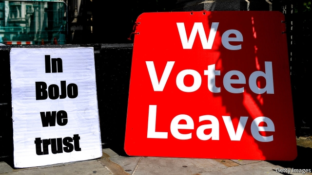

###### Capital losses

# The Tories are down but not out in London 

 

> print-edition iconPrint edition | Britain | Dec 7th 2019 

WHEN GREG HANDS, the Conservative MP for Chelsea and Fulham, stood in the general election of 2017, he had only a dozen Tory disciples helping him deliver leaflets. Back then the Conservatives were focused on scooping up the votes of northern Leavers, rather than worrying about stucco-fronted houses in central London. “There was a bit of complacency,” he admits. His majority halved in a bruising night for the Tories across the capital, where they lost four seats to Labour. This time Mr Hands has about 100 volunteers at his disposal, spreading the Tory gospel. 

The Conservatives are determinedly clinging on in London. A couple of months ago the consensus was that the Tories’ full-throated enthusiasm for Brexit would result in the party being hammered in the Remain-backing capital, making the path to a majority tricky. Yet there is little evidence of this happening. YouGov has the Conservatives on 30% in London, roughly where they were in 2017, while Labour has dipped to 47%, down from 55% at the last vote. 

There are three reasons the Tory vote is holding up. For starters, the Conservatives have a low bar to clear. Their performance in London in 2017 was the fourth-worst since 1955. By contrast Labour enjoyed its best-ever night. And so whereas it needs to repeat a record-breaking performance, the Tories simply need to avoid falling on their face again. So far, they are managing it. 

Second, the Conservatives’ most vulnerable seats have become bitter three-ways. In Kensington, where seven out of ten voters backed Remain, contradictory urges rub against each other. On paper it is a straight marginal between Labour, which won by 20 votes in 2017, and the Tories. Yet in a constituency where the average home costs £1.5m ($2m), fear of Jeremy Corbyn’s plans to tax the rich is rife. Smelling an opportunity, the Liberal Democrats are attempting to squeeze through the middle, placing Sam Gyimah, a high-profile Tory defector, in the seat. Local polls suggest they are splitting the Remainer vote down the middle. 

A third factor is that the capital may not be as hostile to the Conservatives as many assume. Tory strategists used to regard London the same way Soviet generals thought about Afghanistan. It is a difficult environment for the party, filled with people whom the Conservatives increasingly struggle to reach: the young, graduates and ethnic minorities. Inner-London seats voted overwhelmingly for Remain. Yet it is also the richest part of the country and stuffed with voters who end up with more in their wallets if they vote Tory. Once this stage of Brexit is over, the Tories’ path is clearer still. 

Relentless optimism is the modus operandi of Labour activists in the capital. Mr Hands may be able to call on 100 pairs of helping hands, but Labour recently mustered several times as many during an event in Chingford and Woodford Green, where it has launched a noisy attempt to knock out Iain Duncan Smith, a Conservative Brexiteer. Swarms of activists may swing some surprising seats. Zac Goldsmith, who lost his seat in 2016 after a self-imposed by-election before regaining it in 2017, is likely to complete his political hokey-cokey and be voted out again. But most Conservative candidates will start sweating only if the local Remain vote shows signs of coalescing around a single candidate. Until then, the predicted Tory collapse in the capital is some way off. ■ 

Dig deeper:Our latest coverage of Britain’s election 

