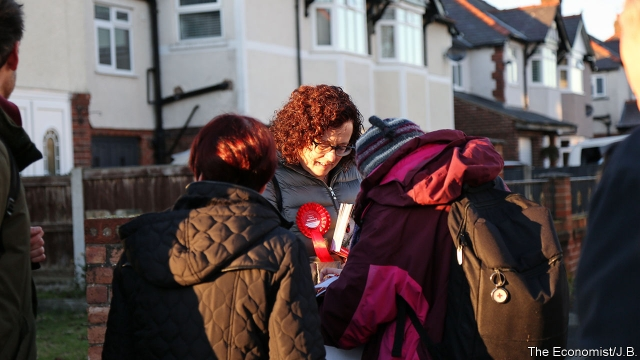
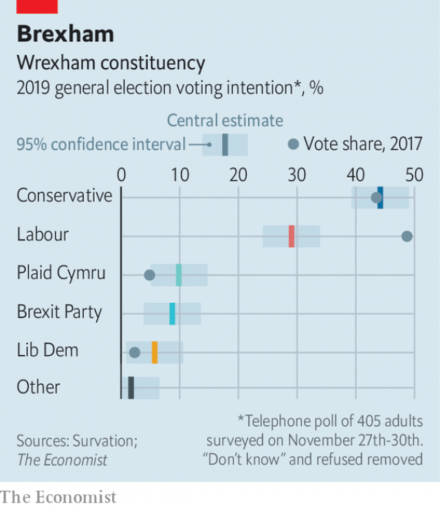

###### Swing seats

# The Tories are well ahead in Wrexham, part of Labour’s “Red Wall” 

 

> print-edition iconPrint edition | Britain | Dec 5th 2019 

CANDIDATES IN MARGINAL seats such as Wrexham find themselves inundated with endorsements from bigwigs during an election. Priti Patel, the Conservative home secretary, has paid a visit to the former mining town. For Labour Eddie Izzard, a cross-dressing comedian, turned up (“All I remember is he had better nails than me,” says Mary Wimbury, Labour’s candidate). Plaid Cymru made do with backing from Bootlegger, a Wrexham AFC fan and vlogger who describes himself as an “alcoholic Welshman, living the dream on jobseeker’s allowance” on Twitter, where he has 213,000 followers. 

Despite Bootlegger’s best efforts—and 163,000 views of his endorsement video—Wrexham remains a straight fight between Labour, which holds the seat, and the Conservatives. It is a fight the Tories are winning, according to a poll for The Economist by Survation. They stand at 44% as Labour limps along on 29%, down 20 points from the last election (see chart). Having been held by Labour since 1935, Wrexham seems ready to turn blue next week. 

 

That is ominous for Labour. Wrexham is part of the “Red Wall”, a term used by politicos in Westminster to describe an unbroken stretch of 80-odd Labour-held seats running from north Wales to Yorkshire. If the Conservatives are 15 points ahead in Wrexham, it suggests that nearby constituencies such as Clwyd South and Vale of Clwyd could also fall. 

Our poll suggests that in Wrexham the Conservatives’ vote-share has not moved since 2017, whereas Labour’s has plummeted. Labour voters have other places to go. Plaid Cymru, a leftish party which advocates Welsh independence and remaining in the EU, has doubled its share of the vote, partly thanks to a strong performance in debates by Adam Price, its new leader. Labour-supporting Leavers who cannot countenance backing the Tories have an option in the Brexit Party. About six in ten people in Wrexham voted for Brexit. “I am going to win,” repeats Ian Berkeley-Hurst, the Brexit Party candidate, whose relentless optimism belies the fact he is polling in fourth place. 

Bonds that once held the Labour vote together have been weakening for years. There has been no working mine in the area for three decades. And the constituency’s demography is changing in the Tories’ favour as Wrexham becomes a dormitory town. Well-off voters are moving in, splashing out on chunky family homes at bargain prices, points out one Labour activist. In one suburb where houses change hands for about £200,000 ($260,000), many homes have fancy cars outside that are worth almost a quarter that amount. 

Labour still hopes that a squeeze on the smaller parties may save it. On the doorstep, wavering voters are reminded that Wrexham is a two-horse race between Labour and the Conservatives. Hopes hang on the party’s manpower. Labour boasts 400 activists in the area and has been able to count on help from outsiders: one volunteer had travelled from nearby Shropshire on a sunny Tuesday afternoon; another had come from Australia. 

Yet national politics often trumps local activism, and here things are tricky for Labour. Jeremy Corbyn “comes across as such an honest, lovely man”, says one resident, who will vote Labour for the first time. More common is the view of another constituent: “Get rid of Jeremy Corbyn and I’ll vote for you.” Ms Wimbury, the Labour candidate, has the task of winning them all round, taking praise for Labour’s leader when it is occasionally offered and (more often) deftly pointing out that it is her name on the ballot and that she will stand up to him in Westminster. For now, however, Wrexham looks like one brick in the Red Wall that will come loose. ■ 

Dig deeper:Our latest coverage of Britain’s election 

