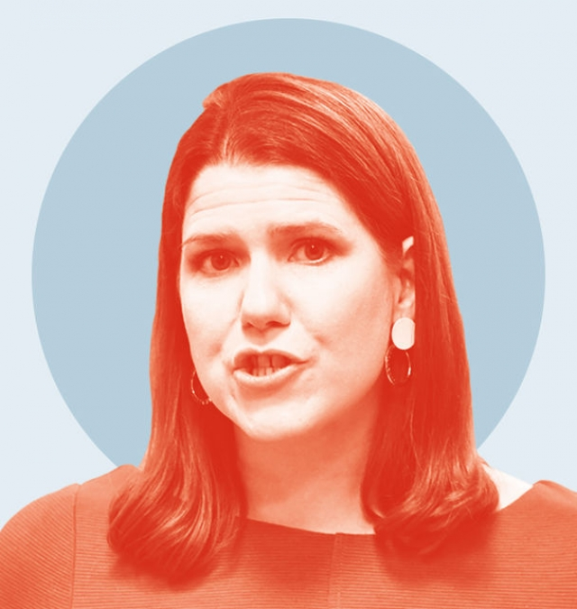

###### Speakers’ Corner

# The best quotes from the final full week of Britain’s election 

 

> print-edition iconPrint edition | Britain | Dec 7th 2019 

Would he lie to you?“I have nothing to do with it, never even thought about it…If you handed it to us on a silver platter, we’d want nothing to do with it.”Donald Trump protests, perhaps a little too much, that he has no interest in the National Health Service 

The last word“He would be seething at his death, and his life, being used to perpetuate an agenda of hate that he gave his everything fighting against.”Dave Merritt, whose son Jack was killed by a terrorist near London Bridge, criticises the politicisation of his murder. Guardian 

Change the channel“It’s on the morning, usually we have it on some of the time.”Jeremy Corbyn’s answer suggests he may not be an avid viewer of the queen’s Christmas Day speech, which is in fact broadcast in the afternoon. ITV 

Tough questions“I am sorry that I did that. It was not the right policy. And we should have stopped it. And our manifesto…makes clear that that should be scrapped.”Jo Swinson tells the BBC’s Andrew Neil she regrets the Lib Dems’ backing of austerity measures while in coalition with the Tories 

Not-so-tough questions“I sometimes succumb to flapjacks…I can drink an unlimited amount of coffee without impeding my ability to go to sleep at the end of the day.”Boris Johnson, who has so far dodged being interviewed by the fearsome Mr Neil, submits to a less searching cross-examination from the Sun 

Dig deeper:Our latest coverage of Britain’s election 

