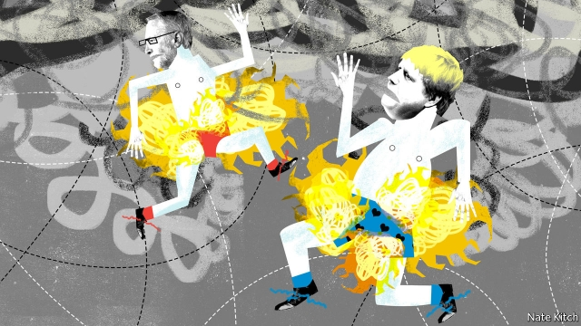

###### Bagehot

# Truth has been the first casualty of Britain’s election 

 

> print-edition iconPrint edition | Britain | Dec 7th 2019 

WINSTON CHURCHILL once said that “in wartime truth is so precious that she should always be attended by a bodyguard of lies.” If Britain’s election is anything to go by, these days lies are so precious that they need to be attended by a bodyguard of further lies. This election has been marinated in mendacity: big lies and small lies; quarter truths and pseudo-facts; distortion, dissembling and disinformation; and digital skulduggery on an industrial scale. The public is so disillusioned with the political process that, when a member of the public asked Boris Johnson during a televised debate whether he valued truth, the audience burst into laughter. Mr Johnson is the favourite by a substantial margin. 

A popular parlour game in political circles is to debate which party is the biggest liar. The answer is that the Tories are probably the worst offenders and the Liberal Democrats probably the least bad, though they have a troubling habit of producing fake local newspapers. But this misses the larger point: that both the main contenders have turned disinformation into an art. They both start with big lies—the Tories that Brexit can be delivered quickly and painlessly, and Labour that its gigantic spending plans can be funded by a handful of billionaires (who anyway got rich by stealing from the poor). They then reinforce big lies with smaller ones. The Tories claim they are building 40 new hospitals. Labour insists the Tories are planning to privatise the National Health Service. 

Of course, both big lies and small lies have always been part of politics. Anthony Eden told a barefaced lie to the House of Commons in 1956, when he claimed that Britain and France had not colluded with Israel in the Suez invasion. Edward Heath sowed the seeds of Britain’s current problems in 1972, when he insisted that entry to the Common Market would not involve any loss of sovereignty. But there is something new about what is going on in this election, and not just in terms of the sheer number of lies. It is a post-truth campaign. The parties are behaving as if truth doesn’t matter at all—they don’t regard themselves as lying, because they exist in a world of spin. They continue to repeat the same mendacious talking-points even if they have been revealed to be bogus. They accuse each other of peddling “fake news”, while peddling it themselves. Their outriders release weird rumours into the political atmosphere: one doctored newspaper article, primarily shared by Labour supporters, falsely accuses Jo Swinson, the Lib Dem leader, of slaughtering squirrels in her garden. 

Why has Britain gone through the post-truth door? Some of the blame lies with new technology. The most egregious examples of distortion have taken place online. During one leaders’ debate the Conservative Party renamed its Twitter account factcheckUK and used it to pump out partisan messages disguised as independent evaluations. The internet has changed the rules of the political game, weakening the power of gatekeepers in the old media (who are bound by professional ethics and election rules) and opening the battleground to cranks and fraudsters. It has also allowed campaign headquarters to spin different tales to voters in different parts of the country. Tory digital ads targeted at Leave-voting areas such as Rother Valley (67% Leave) emphasise the party’s hard line on Brexit, whereas those targeting places such as St Albans (62% Remain) avoid the subject. 

Some of the blame lies with the two main candidates. Jeremy Corbyn is immune to the truth because he is in the grip of an all-encompassing ideology about the evils of capitalism and imperialism, and the wonders of socialism and people power. Mr Johnson is indifferent to the truth because he is in the grip of an all-consuming ambition. He has twice been sacked for lying—once by the Times over a made-up quote and once by his party over an affair—but has nevertheless made it to the top. He is so worried about being held to account for his various claims that (so far and in contrast to other party leaders) he has dodged an interview with Andrew Neil, the BBC’s most forensic interviewer. His slipperiness has been given a sinister twist by his chief adviser, Dominic Cummings, a Machiavellian ideologue who propagated the lie that Brexit would generate £350m ($460m) a week for the NHS. 

But there is also a deeper force at work: the triumph of political tribalism. In the Blair-Cameron era, politics was primarily about policy. Politicians argued about what measure of economic openness would stimulate growth or, after the financial crash, what degree of austerity would keep the markets calm. Organisations like the Office for National Statistics spoke with authority. Today it is about tribalism as much as economics. The Tories are using Brexit to win over Labour voters, while Labour is reasserting its identity as the party of the working class. Experts have lost much of their credibility with the public in large part because they are seen primarily as members of a tribe (the London-based cosmopolitan elite) rather than objective commentators. Even before this election began its corrosive work, only 40% of voters surveyed by the Reuters Institute for the Study of Journalism said they trusted the news. That number is much lower among working-class and Brexit-supporting voters. 

The combination of an epidemic of lies and a climate of mistrust is proving noxious. It distorts the selection process. The more voters assume all politicians are liars, the more likely they are to choose a liar to represent them. Mr Johnson is in many ways the ideal politician for a post-truth age, because nobody expects him to keep his word. He exists in a world of us-versus-them and of emotion rather than reason, a world in which cheering people up is more important than depressing them with facts. Liberal democracy depends on people doing something extraordinary: choosing a handful of people to represent their interests and views in Parliament. Without the glue of trust and truth, that extraordinary process will sooner or later come unstuck. ■ 

Dig deeper:Our latest coverage of Britain’s election 

