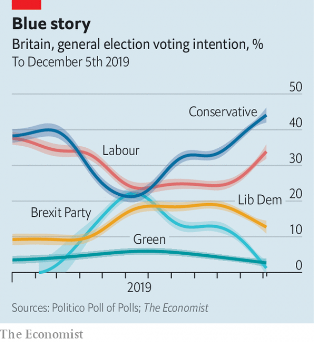

###### Corbyn the dealmaker

# What would happen in a hung parliament? 

 

> print-edition iconPrint edition | Britain | Dec 7th 2019 

IT’S ODDS-ON for a Conservative overall majority and the betting markets put the chances of Labour’s getting one at 20/1. But the Tory lead has narrowed slightly (see chart). If it drops to six percentage points Parliament would probably be hung—and, given that during November a fifth of voters changed their preferences (including to and from “don’t know”), that could happen. So it’s not all over for the Labour Party. 

As Vernon Bogdanor of King’s College London points out, this is an asymmetrical election. The Conservatives need an overall majority in order to stay in Downing Street, but Labour needs only a hung parliament. That is because Boris Johnson would find it hard to do deals with other parties. 

 

The Conservatives’ hard-Brexit policy appeals to no other party except the Northern Irish Democratic Unionists, who feel betrayed by Mr Johnson because the Brexit deal he has done with the European Union envisages treating Northern Ireland differently from the rest of the United Kingdom. Mr Johnson has ruled out another referendum on Scottish independence, and thus a deal with Scottish National Party (SNP), which is likely to be the third-biggest party in Parliament. The Liberal Democrats, who are likely to be the fourth-largest, might do a deal with the Conservatives if Mr Johnson offered another referendum on leaving the EU, but he is unlikely to. 

Mr Johnson, thus, could have the largest number of seats but be unable to form a government. If that happens, eyes turn to the second-largest party. Labour’s policy on Brexit—to put a renegotiated deal to a second referendum—appeals to the SNP. Jeremy Corbyn, Labour’s leader, has carefully left open the possibility of another Scottish independence referendum, saying only that he would not hold one in his first two years in power. 

But if Mr Corbyn needed support from the Liberal Democrats as well, things would be trickier. Jo Swinson, their leader, has said that she would not put him in Downing Street. And although there is speculation about whether Mr Corbyn might step down if he loses the election, if he were in a position to do a deal with the Lib Dems he would have done well enough to spin the election result as a victory, and therefore would cling to power. Moreover, since Mr Corbyn promises the second EU referendum that the Lib Dems want, they would be very likely to make it possible for him to form a government by at least abstaining. If the alternative were losing the chance of another referendum, they might even support him. 

A Corbyn government propped up by the SNP and the Liberal Democrats would presumably remain in office to oversee the two referendums. That might give it enough time to bed down in power and cling on after those were done; though given that there is little support for its more radical policies and minority governments tend to be unstable, another election would probably beckon. 

In such circumstances Mr Johnson’s position would not be solid, either. He is short of friends in his party, and since his appeal lay in his supposed ability to win elections, he might have outlived his usefulness. But with an instinct for power as strong as his, it would probably be wrong to bet on his ejection: he would be as hard to separate from the leadership of his party as the she-elephant from her calf. ■ 

Dig deeper:Our latest coverage of Britain’s election 

