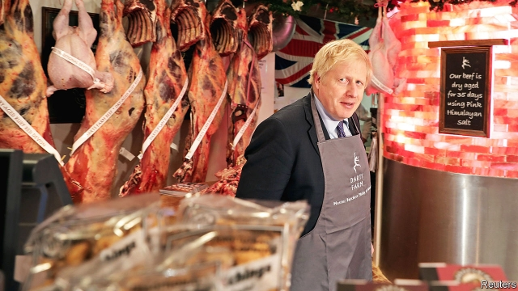

###### If the Tories win

# “Get Brexit done”? It’s not as simple as Boris Johnson claims 

 

> print-edition iconPrint edition | Britain | Dec 5th 2019 

AS IN 2017, this was meant to be a Brexit election. Also as in 2017, it has quickly morphed into one about the National Health Service, security and terrorism. Yet the pithiest slogan of the campaign is still Boris Johnson’s much-repeated promise to “get Brexit done”. And although his poll lead has narrowed, the odds are that this pledge will help bring him victory. 

The question is: what then? With a Tory majority, Parliament seems sure to ratify the Article 50 withdrawal agreement that Mr Johnson renegotiated in October in time for Britain to leave the European Union by January 31st. The European Parliament, whose consent is needed, should do the same. The psychological importance of Brexit formally happening will be profound, not least because it will kill the argument for holding a second referendum. 

Yet Brexit will still not be done. On February 1st Britain will move into a transition phase, when it must abide by all EU rules, that ends on December 31st. Mr Johnson’s plan is to negotiate and ratify a best-in-class free-trade deal during this period. There is a provision to extend the deadline by one or two years, but this has to be agreed on before July 1st. And the Tory manifesto declares in bold type that “we will not extend the implementation period beyond December 2020.” 

Both houses of Parliament must also pass a mass of other legislation to replace the EU’s laws and regulations when the transition period ends. These include bills on fisheries, agriculture, trade and customs, immigration and financial services. Several are both long and controversial, which is why they have made minimal progress in the past two years. 

More problematic will be the talks on future relations with the EU. These will be far more difficult than the Article 50 negotiations, supposedly an easy first stage. A new deal must cover trade, security, data, research, student exchanges, farming and fish, to name but a few areas. The list is so extensive that the result will be a “mixed” agreement, under Article 218, that needs unanimous approval and ratification by 27 national and several regional parliaments. The Institute for Government, a think-tank, notes that less ambitious EU trade deals with Ukraine, Canada, South Korea, Japan and Singapore have taken between four and nine years to negotiate and ratify. 

That is why many are urging Mr Johnson to seek more time. But this will be tricky, and not just because of his manifesto pledge. In transition Britain will be in a form of vassalage, obliged to apply all EU laws and regulations with no say in making them. Extending the time limit requires unanimous approval, and that may come with conditions such as access to British fisheries. It would also mean more money, as Brussels would expect a hefty contribution from Britain, probably without keeping its current budget rebate. 

Mr Johnson’s team responds to such gloom with four arguments. First, he was told that he would be unable to reopen Theresa May’s withdrawal agreement, and yet he did it. But this analogy does not work. His substantive change was to accept an original Brussels proposal to avert a hard border in Ireland by in effect leaving Northern Ireland alone in a customs union, implying border checks in the Irish Sea. Presumably Mr Johnson does not want to do a trade deal by a similar process of repeated concessions to the EU. 

The second line is that a good trade deal should be easy because Britain and Brussels start in complete alignment. Yet Mr Johnson’s explicit plan is to diverge from EU rules and regulations. He has recently even said he wants more flexibility over state aid. Brussels has reacted badly: the EU fears being undercut by a deregulated offshore competitor. Without what it calls a level playing-field, it says it must limit access to its single market. Mujtaba Rahman of the Eurasia Group consultancy says that negotiating a trade deal that erects barriers will always be harder and take longer than a normal deal that does the opposite. 

A third claim is that setting a deadline is the only way to galvanise trade talks. With enough political will, a deal can always be done. Yet Sam Lowe of the Centre for European Reform, another think-tank, says the sole practical option in such a short time would be a bare-bones deal that covered goods trade alone. Such a deal might avoid the need for parliamentary ratification. But it would do nothing for services, which make up 80% of Britain’s economy and half its trade. It would not cover security, data and much else. And the lesson from the Article 50 experience is that a tight deadline forces Britain to make concessions, which might range from fisheries to Gibraltar. 

Fourth, many Tories maintain that if no trade deal can be done in time, leaving on World Trade Organisation terms would be fine. The withdrawal agreement would still cover EU citizens, money and Northern Ireland. Yet reliance on the WTO is dodgy when the system is under threat from Donald Trump. It would imply extensive tariffs and non-tariff barriers. And it would bring back all the fears of lorry queues, shortages of medicine and food, and problems for airlines and energy supplies that led both Mrs May and then Mr Johnson not to press for a no-deal Brexit. 

The damage of no deal would be severe, cutting 8% off income per head after ten years. The Institute for Fiscal Studies, a think-tank, suggests the budget deficit would hit 4% of GDP and the public debt would rise sharply. Far from getting Brexit done, as Mr Johnson says, next year promises to repeat 2019’s experience of missed deadlines and cliff-edges to no-deal. ■ 

Britain's general election: Next week’s copy of The Economist goes to press before the results of the general election will be known. Subscribers with digital access will be able to read a special election edition on our apps on December 13th. And all subscribers will be able to read our analysis of the results free online at economist.com/2019UKelection 

