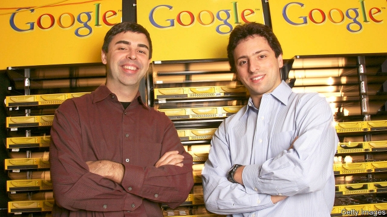
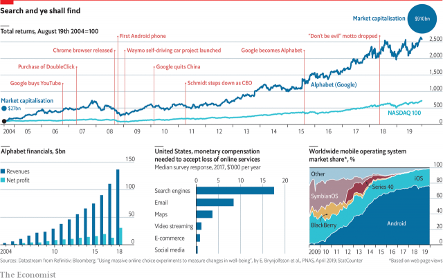

###### The future of Google

# Alphabet turns a Page and a Brin 

 

> print-edition iconPrint edition | Business | Dec 5th 2019 

“GOOGLE IS NOT a conventional company,” declared Sergey Brin and Larry Page as they took their firm public in 2004. “We do not intend to become one.” On December 3rd they bowed out as, respectively, president and chief executive of Alphabet, Google’s parent and the world’s fourth-biggest listed firm. Their creation remains unconventional in some ways, if not in others. They leave a mixed legacy for Sundar Pichai, a career Googler in charge of its core search-engine business, who assumes both roles. 

Messrs Brin and Page lived the Silicon Valley dream. Their solution to the problem of indexing the growing world wide web grew out of government-funded research at Stanford University, and was honed in a friend’s garage. Google was founded in 1998. Today it handles over 2trn search queries a year, and produces the Android operating system that powers 80% of the world’s smartphones. It has shaped the age of the internet and mobile computing in the way that Microsoft helped define the age of the desktop PC. Its revenues have grown from $3.2bn in 2004 to $136bn last year. Its market capitalisation has nearly doubled since 2015, to $910bn. 

Its internal culture is famously casual (visitors were often astonished when meetings were interrupted by volleyball games on the central lawn). It has set the tone for a generation of startups, says Karim Lakhani of Harvard Business School. Yet Google was also quick to embrace professional managers. In 2001 it hired Eric Schmidt, a veteran executive, as CEO. Mr Pichai likewise offers what Mr Brin once jokingly referred to as “parental supervision”. 

The firm has grown conventional in other ways, too. Its dominance has attracted the gaze of regulators. Like other powerful firms, it has hired legions of lobbyists to fight its corner, but with only limited success: from Brussels to the Beltway, politicians rail against its power and attitudes to user privacy. The EU has fined it $9bn. Antitrust investigations loom on both sides of the Atlantic. 

 

Its employees are growing restive; 20,000 walked out a year ago over the firm’s handling of sexual-harassment cases. Those still wedded to Google’s once-official credo, “don’t be evil” (ditched in 2018), have condemned decisions to offer a censored search engine in China (also binned) or work with America’s armed forces. It has sacked staff involved in unionisation efforts. Several said this week that they will file charges with regulators. 

Perhaps the two founders wanted to palm these problems off to someone else. Perhaps they want to focus on the pet projects—from self-driving cars to human-like artificial intelligence and life-extension technology—which Alphabet has cross-subsidised from its ad business. Mr Brin is seldom seen these days; Mr Page did not turn up for Alphabet’s annual shareholder meeting this year. Mr Pichai is seen as a safe pair of hands. However, since Messrs Brin and Page retain control via a dual-class share structure, his freedom will be circumscribed. Small wonder its share price moved little on the news. 

Although Alphabet rakes in billions, it remains a one-trick pony. Ads bring in over 80% of revenue, little changed from 2015. Its share of the online-ad market is down a bit; that of smaller rivals, such as Amazon, is up a lot. Microsoft has successfully reinvented itself as a cloud-computing firm after Bill Gates stepped down in 2000; it is now worth more than Alphabet. Page-Brin bets on futuristic technologies are intellectually thrilling, but have yet to pay off. How long will investors’ patience last? ■ 

