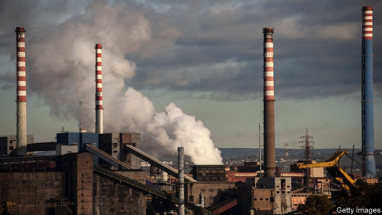

###### Trouble in Taranto

# ArcelorMittal gets its fingers burned in Italy’s Ilva steel mill 

 

> print-edition iconPrint edition | Business | Dec 7th 2019 

LAKSHMI MITTAL has grown his company, ArcelorMittal, the world’s biggest steelmaker, through a series of deals across the world. Some, like the mega-merger in 2006 with Arcelor, then Europe’s largest steel producer, were tough. Perhaps none has given Mr Mittal as much grief as the takeover of a massive steel mill in Taranto, in southern Italy. The bureaucratic and legal troubles, combined with a horrible market for steel, last month led Mr Mittal to walk away from the deal he struck with the Italian government a year ago. 

Under that lease-and-purchase agreement ArcelorMittal agreed to buy Ilva, Europe’s biggest single-site steel firm, for €1.8bn ($2bn) and to invest another €2.4bn in cleaning up and modernising a plant dogged by charges of corruption and environmental crime. It agreed to pay €45m a quarter for 18 months to lease the facility, to be deducted from the purchase price. “Mittal saw an opportunity to turn around a very badly managed plant,” says Jason Fairclough of Bank of America Merrill Lynch. The deal would make his company the strongest in south-eastern Europe. 

The timing was poor. Steelmakers everywhere face falling demand from China and a 40% increase in the price of iron ore in the past 18 months. Those in Europe additionally have to contend with reduced appetite for high-quality steel from European carmakers and a 70% rise in the price of EU emissions-trading permits since mid-2018, a big deal for a carbon-belching industry. President Donald Trump’s tariffs have also made Europe the dumping ground for steel from Russia, Turkey and other countries that would otherwise have gone to America. 

Even so, ArcelorMittal expected Ilva to break even this year. Instead, it will lose more than €1bn. The real trouble started this summer. Rumours surfaced that the Italian government might strip Ilva of legal protection from criminal prosecution over environmental liabilities. The government had introduced a legal shield, valid until the end of 2023, when it nationalised Ilva in 2013 after seizing more than €8bn in assets from the Riva family, the previous owners, amid allegations by prosecutors of financial fraud and environmental crimes. (The Rivas deny wrongdoing.) In 2012 Italian authorities ruled that emissions of dust and chemicals from the plant had caused deaths, tumours and respiratory disease. Taranto still occasionally declares a “wind day”, on which schools near the plant close to avoid exposure to dust from open-air mineral deposits. 

On November 3rd Italy’s government indeed revoked Ilva’s legal immunity through new legislation. The next day ArcelorMittal sent three state-appointed administrators a withdrawal notice stating its contractual right to walk away from the agreement if a new law were to “materially impair” its ability to operate the plant or implement its turnaround plan. “The legal protection was a prerequisite for the deal,” says Paul Weigh, a spokesman for ArcelorMittal. The company is also incensed by the government’s demand that it turn off one of three blast furnaces in Taranto in December, which will considerably reduce its output. 

The revocation was engineered by the Five-Star Movement (M5S), an anti-establishment party with strong roots in the south that governs in coalition with the centre-left. Its members had long campaigned for the closure of the plant while in opposition. Having initially backed the legal shield, they then supported ditching it. 

Giuseppe Conte, the centre-left prime minister, wants Ilva to survive. It employs 10,700 people directly, and indirectly as many as 60,000—most of them in Puglia, a poor region in Italy’s heel. The government is in talks with the Mittals to rescue the deal before a court hearing on December 20th. Mr Mittal and Mr Conte may yet come to an agreement to restore the legal shield. 

If the talks fail and the case goes to court the government will prop up Ilva with emergency loans to protect jobs. The government’s shabby treatment of someone willing to pour billions into one of its poorest regions is unlikely to encourage other bids. In the meantime, Italy’s battered reputation with foreign investors has suffered another dent. ■ 

