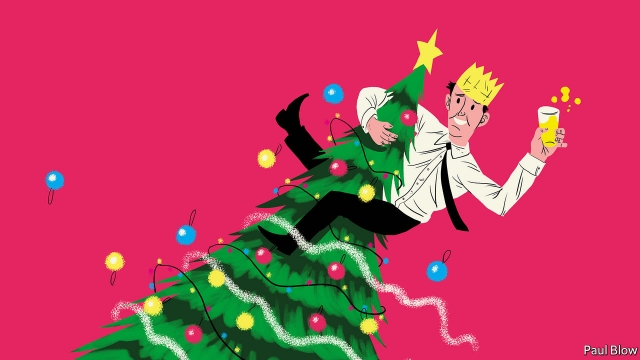

###### Bartleby

# Let them eat Christmas cake 

 

> print-edition iconPrint edition | Business | Dec 5th 2019 

EVERYONE FEELS like winding down in December. Even if you do not celebrate Christmas, the New Year is approaching and most people take a few days’ break. In many workplaces this feeling of “mission accomplished” is accompanied by an established tradition: the office party. 

In boom times these can be truly lavish affairs. Robbie Williams sang at Deutsche Bank’s global-equities party in 2001. A Bloomberg event in 2000, based on the seven deadly sins, was said to have cost £1m (then $1.5m). At the “Googlympus” in 2006, the internet group had tents named after different Greek gods while staff amused themselves at the “wine cork shooting gallery”. 

Few companies today desire the publicity that tends to follow such events. The natural question is, if you are spending that amount on a party, how much are you charging clients? Companies are rightly more sensitive than they were about the risks involved when workers lose their inhibitions after consuming too much alcohol. A survey of American companies by the suitably named Challenger Gray & Christmas, an outplacement firm, found that 59% had discussed, or planned to discuss, the dangers of “inappropriate celebrating” with staff. 

To avoid these dangers, the chief operating officer of BDO, an accountancy firm, has suggested that two chaperones attend seasonal celebrations, along with first-aiders. Other accounting firms have suggested holding daytime events rather than after-hours drinks parties. 

There is a lot to be said for daytime celebrations. First, it makes attendance easier for anyone caring for small children, or elderly relatives, and who thus finds it difficult to stay out late. Second, people are likely to be a bit more restrained in their alcohol consumption at lunchtime than in the evenings. And third, celebrating during working hours feels like a genuine break from duties; attending after work seems more like an obligation. 

Most workers don’t expect their seasonal event to turn into a Bacchanal; they are just hoping to avoid tedium. A survey of British office workers in 2014 found that only a quarter looked forward to their Christmas event and 71% would rather have a small cash bonus than a knees-up. 

In Bartleby’s experience, office parties come in three types. The first is the sit-down lunch, in which you are inevitably seated next to someone whose name you do not know, even though you have spent five years politely nodding at them when you pass in the corridor. Two hours of social awkwardness ensue. The second type of do is the evening event with excruciatingly loud music. On the plus side, no one can hear you speak so it does not matter if you have forgotten their names; on the down side, after half an hour everyone over 30 is so deafened that they wish they were at home with a nice book or a box set of “The West Wing”. 

The third sort of event is the stand-up do with drinks and nibbles, when the food is never enough to absorb the alcohol and you are permanently caught in a state of angst over whether you are boring the person you are talking to more than they are boring you. 

Naturally, there is an economic answer and it is specialisation. Think of Adam Smith’s pin factory where everyone plays their different part; let everyone have the party they want. Some may want to down the prosecco but others may be happier only to gorge on cake. 

Seasonal events at The Economist are highly segregated. The leader writers sit quietly in a corner, sipping sherry and discussing structural reform; the Keynesians borrow money off the rest of the staff to pay for their drinks; believers in central-bank independence down pints of beer in feats of “quantitative drinking”; neoclassical economists sip water, arguing that no rational person would consume alcohol, given the risks of hangovers and liver damage; while those who favour modern monetary theory guzzle vodka shots on the ground that it is impossible to get drunk if you control your own alcohol supply. 

In short, it is easier to enjoy yourself if you can do so in your own fashion. And that may include not partying at all. If managers think staff would rather spend time at home than attend, let them; the company will save money. Last, but not least, if managers must make a speech, keep it short. Something along the lines of “You’ve all done very well this year, good luck next.” Save the Churchillian rhetoric for the annual general meeting. 

