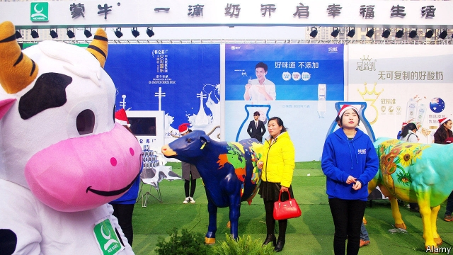

###### Cow cash

# Mengniu Dairy gulps down two Australian milk producers 

 

> print-edition iconPrint edition | Business | Dec 7th 2019 

THIS AUGUST Andrew Cohen, boss of Bellamy’s Organic, an Australian maker of infant formula, enthused to investors about having a brand “that’s loved in China”. So loved, in fact, that a few weeks later Mengniu Dairy, China’s second-biggest producer of milk products, said it wanted to buy Bellamy’s for A$1.5bn ($1bn). On December 5th its shareholders voted in favour of the deal. 

At first Bellamy’s seemed to be milking it, not Mengniu. An Australian government committee that reviews foreign acquisitions set out conditions: Mengniu must keep headquarters and most of the board Australian, and pour A$12m into local factories. Mengniu offered a 59% premium on the firm’s share price, which had shed three-fifths in the 18 months before the offer (it has rebounded a bit since). Mr Cohen blamed falling Chinese birth rates, a regulatory hold-up on imports and competition in China’s thirsty infant-formula market. 

Now Mengniu looks like the cat that got the cream. It wasted no time in making another bid on November 25th to buy Lion Dairy & Drinks, Australia’s second-largest milk processor, for A$600m. The pair of acquisitions would hand it a rich vat of organic and premium brands that China’s middle class covets, including Farmers Union yogurt and licences to the Yoplait franchise. Mengniu can tap high-quality Aussie milk. And it is one in the eye for Yili, its bigger cross-town dairy rival in Hohhot, the regional capital of Inner Mongolia. 

The two firms control about half of China’s dairy market. If it wins Lion, Mengniu stands a chance at surpassing Yili by revenue next year, reckons Song Liang, an independent dairy analyst (both want to make sales of 100bn yuan, or $14bn). They are expanding in South-East Asia, where Bellamy’s and Lion are already popular. Last year Yili acquired Thailand’s biggest ice-cream maker. In August it bought Westland Milk Products, a New Zealand co-operative. It envisions “a vast dairy bridge crossing the Pacific Ocean”. 

In a decade Chinese milk production will meet only half of domestic demand, says Terrance Liu of CLSA, a broker, down from around 70% today. And, as Mengniu and its rival move overseas and upmarket, they need better ways to keep products chilled through production and transport, which rich-world firms can teach them. At home spending on formula per infant is rising thanks to declining rates of breast-feeding in many cities. A deadly tainted-milk scandal in 2008 has put shoppers off local products. CLSA estimates that four-fifths of Bellamy’s products have ended up in China thanks to a flourishing informal trade by so-called daigou, who buy products overseas and resell them online. 

New regulations have recently crimped grey-market sales. But Mengniu is expected to work out the import-clearance delay promptly: COFCO Dairy, a state-owned giant, owns 24% of the Hong Kong-listed firm. China’s $62bn dairy market is still little more than a tenth of the world’s by value. But Euromonitor, a research firm, predicts that by 2022 it will overtake America as the globe’s biggest market for dairy. Welcome to the land of milk and money.■ 

