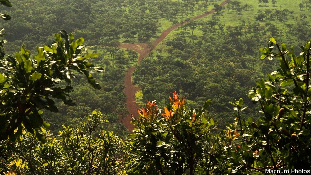

###### Galvanised

# SMB Winning pays $14bn for rights to Guinea’s iron mountain 

 

> print-edition iconPrint edition | Business | Dec 7th 2019 

WHEN PROSPECTORS discovered a gargantuan deposit of iron ore in the misty Simandou mountains 17 years ago, many Guineans hoped it would transform their impoverished country. The remote location makes its estimated 2.4bn tonnes of iron ore—valued at perhaps $230bn—hard to mine. Gyrating commodity prices scared off investment. So did lurid corruption scandals involving billionaires, government officials and mining companies. 

A new chapter has opened in the saga. An embattled Israeli diamond tycoon, Beny Steinmetz, surrendered his claims to Simandou in February, after ten years of legal battles with Guinea’s government and Rio Tinto, an Anglo-Australian mining giant. Simandou North was put up for tender. Last month the winner was announced: SMB, a joint-venture owned by a consortium which includes Winning Shipping, a Singaporean maritime firm, UMS, a Guinean-French logistics company, and Shandong Weiqiao, a big Chinese aluminium producer. The entity, in which Guinea’s government holds a 10% stake, will pay $15bn to develop the site, build a new deepwater port and a 650km railway to link the two. Guinea’s parliament is expected to wave the deal through in the coming weeks. 

The successful bid is a coup for SMB, which is barely known outside the west African nation. It is also a departure from SMB’s previous business—bauxite. The firm was founded in 2014 to meet China’s voracious demand for the ore, from which aluminium is smelted. Guinea has a quarter of the world’s proven reserves of the stuff. In 2018 SMB exported 36m tonnes of it, worth around $2.1bn, mostly to China, which imports about half its bauxite from SMB. Winning’s vessels ferry about 200 shiploads a year to Chinese ports. 

The private joint-venture keeps its finances close to its chest but Bob Adam, an expert on mining in Guinea, reckons that after taxes, royalties and operating costs SMB is making about $800m profit a year. “They are now the most significant economic enterprise in Guinea,” he says—and the only one among the world’s biggest bauxite producers with a direct link to China. 

A shift into iron ore presents challenges. Building a port and a railway through the country’s malaria-infested forest will take years and could cost much more than the estimated $10bn. SMB will have to co-ordinate with Rio Tinto and Chalco, a Hong Kong-listed company controlled by Chinalco, a Chinese state-run firm, which jointly control Simandou’s southern blocks. The Boké region (the B in the firm’s name) has been plagued by riots. Many local residents are angered by lack of access to clean water or health care. But China is keen on Simandou’s high-grade iron ore, which emits less pollution when processed, says Eric Humphery-Smith from Verisk Maplecroft, a risk consultancy. It also wants to lock in supply. And it can afford to wait. 

