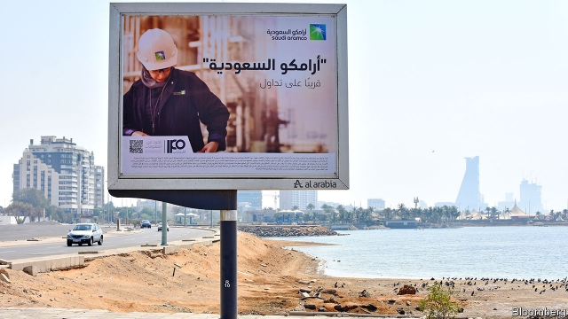
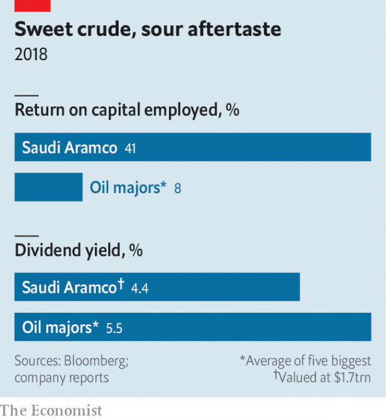

###### Listless

# Saudi Aramco’s IPO is the biggest ever 

 

> print-edition iconPrint edition | Business | Dec 7th 2019 

Editor’s note: On December 5th, soon after this article was published, Saudi Aramco said its IPO had raised $25.6bn, valuing the company at $1.7trn 

THE ASPIRATION was clear. First, list a portion of Saudi Aramco, a state-owned oil giant that is the world’s most profitable company. Then use the windfall to diversify Saudi Arabia’s economy. Muhammad bin Salman, its crown prince, expected investors to swoon over the company’s rich reserves, low costs and $111bn in annual net income. “If you want to invest in Exxon, Chevron, BP,” one banker involved in the listing told The Economist in October, “why don’t you just go and buy Aramco?” It turns out that many investors would rather not. 

As we went to press, Aramco was expected to announce its offer price, with trading to begin soon after. The result is likely to be the biggest initial public offering (IPO) in history. It will also prove to be a disappointment. 

Prince Muhammad’s initial desire—a 5% listing at a valuation of $2trn—would have raised a staggering $100bn, four times what Alibaba, the current record-holder, drummed up in 2014. Aramco’s valuation range of $1.7trn or so is lower than the princely target but still too high for many institutional investors. This weak appetite led the company to decide to float just 1.5% of its shares on Saudi Arabia’s exchange. It will probably edge past Alibaba’s $25bn. 

The reasons for listing Aramco have not changed. Saudi Arabia needs to move beyond oil, which accounts for nearly 70% of government revenues. That would be a dangerous dependence in any era, let alone one with swelling youth unemployment and doubts about long-term demand for fossil fuels in a world worried about climate change. 

If the rationale was straightforward, execution was not. Prince Muhammad first suggested an IPO in an interview with this newspaper in 2016. The years since have been filled with delays and controversy. Concerns about legal liabilities undermined plans for a listing in London, New York or on another global bourse. The murder of Jamal Khashoggi, a dissident journalist, at the Saudi consulate in Turkey last year cast a pall over Prince Muhammad’s sweeping modernisation plan. 

Aramco’s successful issuance of $12bn in bonds in April helped build confidence in the flotation. Recent months have seen a frenzy of activity to ensure its success. The kingdom hired more than two dozen big banks to shepherd it through, and appointed a new chairman for the company and a new oil minister. 

The listing was nevertheless marred by several problems. Some were (mostly) beyond Prince Muhammad’s control. Investors’ concerns about the global economy and weak demand pushed the oil price below $60 a barrel in August. President Donald Trump’s warnings of a protracted trade war with China could weaken it further. Missile and drone strikes (believed to have originated in Iran, which backs Saudi enemies in neighbouring Yemen) knocked out more than half Aramco’s oil production in September, highlighting the company’s security risks. 

He has had more sway over Aramco’s offer price and size of the float. Many investors balked at Aramco’s valuation range, which was announced in November. Bernstein, one of the few research outfits not linked to a bank collecting Aramco’s fees, reckoned $1.2trn-1.5trn was more reasonable—a range confirmed by a survey of institutional investors, who told Bernstein they would buy Aramco at a mean valuation of $1.26trn. 

Prince Muhammad’s desire for a higher offer price was understandable. On many metrics, Aramco easily outcompetes rivals such as ExxonMobil or BP. Its reserves are 15 times larger, production costs a quarter as big, debt negligible and return on capital superb. Chances are that when the world takes its last sip of oil, it will be Saudi crude. 

 

But oil investors in 2019, skittish about the commodity’s prospects, care more about cash. At a valuation of $1.7trn, Aramco’s dividend yield would be lower than the supermajors’ (see chart). Investors surveyed by Bernstein worried about Aramco’s governance. Saudi Arabia may lean on the company if national finances deteriorate—the IMF expects Saudi debt to be 23% of GDP this year, up from 17% in 2017. As important, Aramco’s sales growth is limited by Saudi Arabia’s habit of limiting output to stabilise global oil markets. 

Facing a chasm between the prince’s preferred, high price and what international investors were willing to pay, Aramco abruptly cancelled road shows in America and Europe. It is expected to secure investments from neighbours, including Abu Dhabi and Kuwait. 

But many buyers will be locals. The company and its bankers courted Saudis eagerly, through call centres and advertisements on billboards, social media, even ATMs. The Saudi central bank doubled leverage limits for retail investors buying shares in Aramco. Wealthy families in the capital, Riyadh, feel that participation in the IPO is required to maintain good standing, one local businessman explains. 

Of course, $25bn wouldn’t be nothing. Still, bankers will get a fraction of the fees they hoped for. Aramco may raise less cash than it would have at a lower price: floating the full 5% at a valuation of $1.2trn could rake in $60bn. Saudi Arabia will see capital flow mostly within the kingdom, not gush in from the outside. A reliance on local shareholders poses a political problem, if a falling oil price depresses Aramco’s share price. Prince Muhammad is keenly aware that neighbouring countries have looked fragile of late—leaders have been ousted in Algeria, Lebanon and, most recently, Iraq. 

Propping up the oil price looks as tricky as ever. Last year OPEC, an oil-producers’ club, and its allies, led by Russia, agreed to lower output by 1.2m barrels a day, or 2.3% of their production. The deal was extended to March 2020. But the cartel may need to seek deeper cuts, as supply surges in Brazil, Guyana and Norway. 

Merely encouraging OPEC members to comply with the existing deal, let alone commit to more cuts, will be tough. The group’s meeting in Vienna on December 5th-6th promises to be tense. Russia has pumped oil faster this year than before the deal. With partners overproducing Saudi Arabia has consistently had to undershoot its quota. The new oil minister wants more compliance from the others, says Helima Croft of RBC Capital Markets, an investment bank. The question is how forcefully he will seek it. Either way, the listing will leave the kingdom no less dependent on the price of crude than it is today. ■ 

