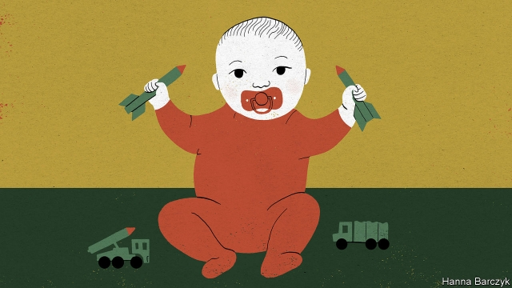

###### Mark it with “B”

# China needs people to have more children. So why punish those who do? 

 

> print-edition iconPrint edition | China | Dec 7th 2019 

TO MARK THE 70th anniversary in October of the People’s Republic of China, a giant parade trundled through Tiananmen Square filled with symbols of what President Xi Jinping, the country’s leader, calls the “great rejuvenation of the Chinese nation”. The two most important ones, Chaguan would argue, were a squadron of nuclear-missile launchers and a float showing a model family in their apartment, comprising two parents and two daughters winsomely playing pat-a-cake. 

Nearly four years after China scrapped its one-child policy, the harshly enforced system that between 1980 and 2016 limited most urban families to a single child, and many rural folk to two, Communist Party bosses are assiduously promoting two-child families as an ideal. From Liaoning to Hubei, provinces are discussing subsidies and services to support babymaking. It is not working. China’s fertility rate is among the world’s lowest, and far below what is needed to maintain a stable population. The country is greying fast: the number of working-age people began shrinking in 2012, years earlier than expected. It is a complex problem. But one cause is that officials are too stubborn and controlling to accept that tinkering with quotas is not enough. They should stop setting them at all. Enforcement is now uneven and arbitrary, but some Chinese parents are still being punished for having a third child. 

Public opinion is increasingly divided by such coercive methods. The case of Xie Zhengling, a schoolteacher from the southern city of Yunfu, made national headlines last month. According to government documents posted online by supporters, Ms Xie was urged three times by local education officials to “take measures to correct”—ie, terminate—her third pregnancy. Their last attempt came in the month before she gave birth, despite her pleas that her unborn child was “too big” to abort. Ms Xie gave birth in January. Both she and her husband, a policeman, were fired, as is the rule for civil servants who exceed birth quotas. On Weibo, a micro-blogging platform, articles tagged “A policeman was sacked because his wife had a third kid” have been read over 9m times. Some netizens express sympathy, noting that the couple were heeding government calls to have children. Others argue that public servants enjoy privileged access to many services so should expect no pity. 

This heated debate is revealing, because it is rare to hear ordinary Chinese challenge the party line that decades of harsh population controls were necessary. Cai Zhiqi, a scientist who runs a chemicals company in the coastal city of Yantai, is a striking case in point. His own life is neatly bookended by the one-child policy. Born in 1979, the year before the policy began, he recalls a cheerful rural upbringing as one of three children. “Though we were poor, the house was full of joy,” he says. When his wife, another scientist, fell pregnant with a second daughter in 2010, they resolved to keep her, applying for birth papers without mentioning a first girl born while Mr Cai was studying in America. Alas, in 2012 someone reported him to his employers, the South China University of Technology. In vain his lawyer cited official guidance suggesting that Chinese who studied overseas were allowed two children. Mr Cai was fired as an associate professor for having a second child. Just three weeks later China relaxed the one-child limit as a prelude to eventually scrapping it. 

An amiable host, Mr Cai shows Chaguan his laboratories, and points out the schools attended by his young children, amid the skyscrapers and building sites of Yantai’s Economic Development Zone. “Like in Harry Potter,” he beams, gesturing at a castle-like bilingual academy. He has three children now. In Yantai the fine for a third is about 300,000 yuan ($42,000) per rule-breaking couple, but officials have not sent Mr Cai a bill. “Among my peers now, especially private entrepreneurs, quite a few have three children,” he says. “If you want to have more children you pay some fines.” Still, he does not question why China’s founders imposed birth limits on a poor, agricultural country. Despite losing his own case, he says he understands China’s family-planning policy. 

Many scholars are less forgiving. Wang Feng of the University of California, Irvine, accuses defenders of the one-child policy of confecting a common official claim, namely that the policy “averted” 400m births. In fact, says the professor, that projection is based on sky-high fertility rates from 1970—just before a decade of precipitous fall that preceded the one-child policy. In fact, he says, most of China’s decline in fertility rates happened in the 1970s and was caused by such forces as urbanisation and women’s education, which led to very similar changes in other Asian nations like Thailand and South Korea that eschewed mandatory limits on births. What can be said is that China’s policy produced a lot of one-child families—today the country has about 150m of them—and perhaps tens of millions of abortions and sterilisations, many of them involuntary. Corrupt and brutal family-planning officials demolished the homes of some who resisted. Women had their menstrual cycles recorded on blackboards, for all to see. As birth quotas bit, gender ratios became more skewed by infanticide and sex-selective abortions of girls. China now has 30m fewer women than men. The country has ended up with roughly the population it would have had in any case, but via an exceptionally cruel route. 

Still the machine grinds on. While in Yantai, Chaguan dropped in on a population bureau unannounced. A visibly bored official, a Mr Zhao, recalled how once upon a time, an extra birth would prompt a team to race out and “knock on the door immediately to collect fines”. His office has not imposed such a penalty in “a few years”. Still, he was firm when asked about the case involving the schoolteacher in Yunfu. “According to the regulations, that is how it should be.” That bullying mindset is both deeply entrenched and disastrous for China. It is hard to have a national rejuvenation without more babies. ■ 

