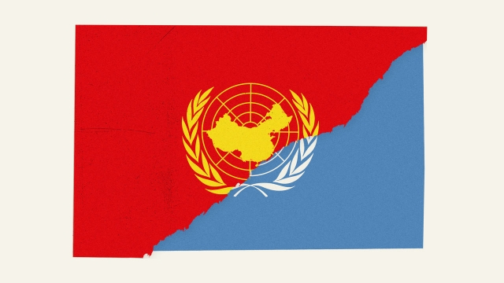

###### A new battleground

# In the UN, China uses threats and cajolery to promote its worldview 

 

> print-edition iconPrint edition | China | Dec 7th 2019 

DESPITE ITS veto-wielding power in the United Nations, China has long been reluctant to stick its neck out. It has been 20 years since it last stood alone in exercising that right. But in the UN’s backrooms, the country’s diplomats are showing greater willingness to flex muscle, and their Western counterparts to fight back. Not since the cold war has the organisation become such a battleground for competing visions of the international order. 

A struggle in October over China’s mass internment of Uighurs, a Muslim ethnic minority, suggests how intense the fight has become. It involved Britain taking an unusual leading role in condemning China’s human-rights record. The British representative at the UN, Karen Pierce, issued a statement, signed by 22 other countries including America, calling for unfettered UN access to the prison camps in China’s far-western region of Xinjiang. A diplomatic brawl ensued. Chinese diplomats persuaded dozens of authoritarian countries, including mostly Muslim ones in the Middle East, to sign a counter-statement praising China’s actions in Xinjiang as an enlightened effort to fight terrorism and eradicate religious extremism.  

There were threats and reprisals, too. Chinese diplomats are said to have told Austrian counterparts that if their country were to sign Britain’s statement, the Austrian government would not get land it wanted for a new embassy in Beijing. The Austrians signed anyway. Chinese officials cancelled a bilateral event in Beijing with Albania, another of the signatories. “A lot of countries came under a lot of pressure today,” tweeted Jonathan Allen, Britain’s deputy ambassador to the UN, on the day of his country’s statement. “But we must stand up for our values and for human rights.”  

China’s efforts span a broad range of UN activity, from human rights to matters relating to economic development. They appear to have two main aims. One is to create a safe space for the Chinese Communist Party by ensuring that other countries do not criticise its rule. The country has long bristled at any such “interference”. Its officials are now becoming tougher in their response. China’s other objective is to inject wording into UN documents that echoes the language of the country’s leader, Xi Jinping. China is trying to “make Chinese policies UN policies,” says a diplomat on the UN Security Council. 

China senses that President Donald Trump’s aversion to multilateral institutions such as the UN has given it more room to manoeuvre in them. Since Mr Xi took office in 2012 the country has dramatically increased its spending at the UN. It is now the second-largest contributor, after America, to both the general budget and the peacekeeping one. It has also secured leading roles for its diplomats in several UN bodies, including the Rome-based Food and Agriculture Organisation (beating a candidate backed by America, to many people’s surprise). Next year the country will join the three-member Board of Auditors, which keeps an eye on the UN’s accounts.  

The senior jobs being taken by China’s diplomats are mostly boring ones in institutions that few countries care much about. But each post gives China control of tiny levers of bureaucratic power as well as the ability to dispense favours. “Each one of these slots has influence with somebody somewhere,” says a European diplomat. When votes are taken on matters China regards as important, its diplomats often use a blunt transactional approach—offering financing for projects, or threatening to turn off the tap. This buys China clout, if not affection, other diplomats say. 

Mr Xi’s influence is evident. Much of the language that Chinese officials try to insert into UN documents uses his catchphrases, such as “win-win co-operation” and “a community with a shared future for mankind” (keep your hands off China, is the underlying sentiment). For three years in a row, Chinese diplomats managed to inject favourable references to Mr Xi’s Belt and Road Initiative (BRI), a “win-win” global infrastructure-building scheme, into resolutions on Afghanistan. They have persuaded senior UN officials, including the secretary-general, António Guterres, to praise the BRI in speeches as a model for global development. In 2018 China convinced the UN Human Rights Council in Geneva (from which America withdrew later that year) to endorse its preferred approach of “promoting mutually beneficial co-operation” in this field, ie, refraining from criticism. 

More than merely language is involved. In 2017 China sought successfully to cut funding for a job intended to ensure that all of the UN’S agencies and programmes promote human rights. That same year Wu Hongbo, a Chinese diplomat who was then in charge of the UN Department of Economic and Social Affairs, expelled Dolkun Isa, a Uighur activist, from a UN forum to which Mr Isa was an invited delegate, representing a German NGO (Mr Isa was eventually let back in after protests from American and German diplomats). Mr Wu, whose post required him to be non-partisan, later boasted about his actions on Chinese state television. “We have to strongly defend the motherland’s interests,” he said. 

Opposition to China’s more assertive approach may grow. “I think they are overdoing it and I think at some stage people will start to resist,” says the Security Council diplomat. But some others at the UN do not share that view. Smaller states in Africa and the Middle East, many of them dictatorships, resent America’s post-cold-war dominance of the UN. Why should China not push back, asks a diplomat from one country in that part of the world. The envoy says that countries may be subjected to pressure from China when it wants something, but that America, albeit not as blunt, can also be transactional. Some smaller countries may welcome having two great powers competing for their favour again. 

“There’s a degree of hypocrisy about it,” says Richard Gowan of the International Crisis Group, a conflict-prevention NGO. “It would be weird to imagine that China as a rising power wouldn’t want a bigger stake in the multilateral system.” Few would imagine that now. ■ 

