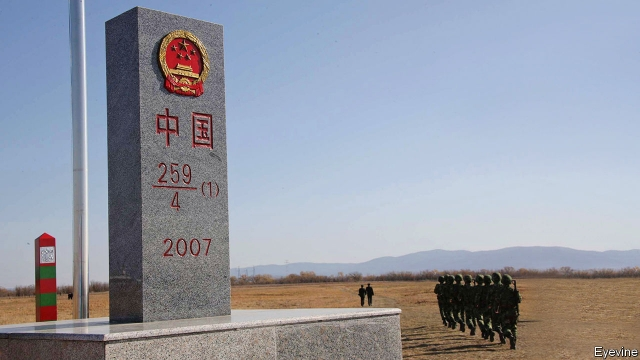

###### Tense times recalled

# On the China-Russia border, visitors reminisce about the bad old days 

 

> print-edition iconPrint edition | China | Dec 7th 2019 

EVERY YEAR an elderly retiree brings dozens of his friends to a wind-swept customs post at Mishan on China’s side of the country’s border with Russia. “There is nothing to see or do here,” says the man, who goes by the name “Old Jiang”. He is not entirely right. Not far away, the border runs through a large, picturesque lake. A disused bridge is described as the world’s smallest connecting two countries. And busloads of visitors arrive every day, many drawn by memories of a not-so-distant history and curiosity about “the very existence” of the post, as Mr Jiang puts it. 

Such a symbol of normal interaction once could not have existed. In 1969 Jixi prefecture, to which Mishan belongs, was the scene of border skirmishes between China and the Soviet Union that many observers feared could escalate into war. The little bridge was built three years later to facilitate talks, but it was not until the late 1980s that the two countries made peace. In 1991 the Soviet Union agreed to let China keep the river island known in Russian as Damansky and in Chinese as Zhenbao, over which the clashes began. Today China and Russia describe each other as best friends. 

In recent years sites that recall those nail-biting days of Sino-Soviet hostility have become tourist attractions. Zhenbao is under military administration, so tourists are sometimes barred from the island itself (foreigners all the more so). But Chinese visitors can pay to be whizzed around it on motorboats. “Fifty years ago, Zhenbao island was a global centre of attention,” says an elderly tourist from the southern city of Guangzhou. He says he wanted to visit because the fighting in 1969 was “China’s first victory over the Soviet Union”. 

China’s leader, Xi Jinping, and his Russian counterpart, Vladimir Putin, say growing tourism between the two countries is helping to strengthen their ties. In 2018 China received 2.2m Russian tourists while 1.7m Chinese went the other way. But these numbers are small compared with China’s total inbound and outbound flows, and contribute little to visitor statistics at China’s official tourist sites along the border. Chinese firms and local governments have been pouring money into developing such tourist spots, but the main targets are domestic travellers. There are plenty of Russian visitors to China’s border towns. But they do not head to the main sightseeing attractions. They usually come carrying large bags, to shop for cheap goods. 

Farther north along the Ussuri river, at its confluence with the Amur, lies Heixiazi, or Bolshoy Ussuriysky in Russian, a 350-square-kilometre island which the two countries agreed to divide between them in 2004 (marker posts are pictured). On its side, China built a nature reserve that attracts around 600,000 tourists a year, almost all Chinese. Also on the Chinese half is an abandoned tin-roofed Russian military post, preserved to demonstrate that China managed to prise back some of its territory. Plans by Russian and Chinese firms to develop the Russian side for tourism have failed to come together. In 2012 China completed a 1.6km road bridge linking its part of the island with the Chinese shore. For now, Russians can only reach their side by ferry. In reaping the dividends of peace, China faces little competition from its one-time adversary. ■ 

