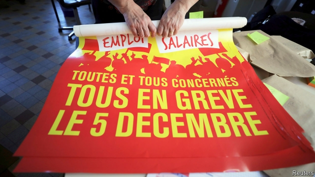

###### Brace for impact

# A new wave of strikes threatens to shut down France 

 

> print-edition iconPrint edition | Europe | Dec 7th 2019 

FRANCE WAS this week nervously awaiting the start of a rolling general strike on December 5th, which looked set to disrupt roads, railways, airports and schools. On day one the SNCF, the national railway company, said that only one in ten trains would run. Teachers, hospital workers and even lawyers promised to join in. In protest at President Emmanuel Macron’s upcoming pension reform, the strikes mark a return to the streets of France’s unions. Recently eclipsed as the face of protest by the gilets jaunes (yellow jackets), they are now keen to flex their own muscles and try to force Mr Macron to back down, just as the gilets jaunes managed last year. 

The strike was called against Mr Macron’s pension plan, an election-manifesto pledge in 2017. This is designed not to curb overall spending on pensions, which amounts to 14% of GDP in France, compared with an OECD average of 8%. Nor does it raise the legal minimum retirement age of 62 years, on the low side for the OECD. It aims, rather, to merge France’s tangle of 42 different mandatory pension regimes into a single, points-based system. The idea is to make the rules more transparent, simpler and fairer. 

The reason for the collective fury is threefold. First, unlike his predecessors, Mr Macron has decided to use this reform to end pensions with special privileges, the so-called régimes spéciaux, which he argues “belong to another era”. Indeed some such regimes, such as that covering the Paris Opera, date back to the 17th century under Louis XIV. Naturally, the beneficiaries of such schemes, such as train drivers who can retire at the age of 50 (rising thanks to earlier reforms, but only to 52 by 2024), will not give them up without a fight. Second, although France’s overall pension system is in deficit, some of these regimes are well managed and balance their books. Lawyers, for instance, fear that their virtue in maintaining a solvent, sustainable pension scheme will be punished under the merged system. They worry that they will be made to contribute more for the same rights that they enjoy today. 

Third, the government has spent so long consulting over its long-promised pension reform that it has ended up generating more anxiety about the outcome than goodwill about the discussions. Nobody knows quite what their future entitlements will be. The government, stuffed with brainy technocrats (Mr Macron himself being one of them), talks in incomprehensible jargon about “systemic” versus “parametric” reform. Mr Macron has ruled out raising the legal minimum retirement age. But many people suspect that, whatever he says now, everyone will have to retire later anyway. A poll this week showed that 57% of French people believe this. Distrust and confusion makes it easy for opponents to whip up anger. Supporters of the strikes include not just most of the big unions but such odd bedfellows as the Socialist Party and Marine Le Pen’s National Rally. 

The government is expected to announce the new pension rules before the end of the year. What it decides will depend partly on how disruptive the strikes are, and on how far the French are willing to put up with them. In a nation founded on revolt, the French tend to be sympathetic to strikes when they begin, and become less so as the weeks drag on, or things turn violent. Today 64% say that they back the pension strikes. With this sort of protest, and in contrast to the gilets jaunes, the government at least has organisations to talk to. But the president is deeply unpopular, the unions are keen to teach him a lesson and the government is on perilous ground. ■ 

