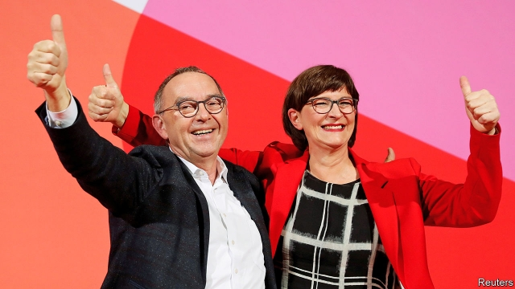

###### Under new management

# Germany’s Social Democrats pick new leaders 

 

> print-edition iconPrint edition | Europe | Dec 7th 2019 

“WALTER WHO? Saskia what?” Bild, a tabloid, posed the question many Germans will have asked on November 30th when members of the Social Democratic Party (SPD) elected Norbert Walter-Borjans and Saskia Esken as co-leaders. The obscure left-leaning duo triumphed by 53% to 45% over a rival pair led by Olaf Scholz, Germany’s finance minister and the SPD’s best-known politician. Their win instantly raised the prospect of an early end to Germany’s coalition, which has almost two years to run. 

The pair’s victory resulted from a deep mood of gloom that has settled on the SPD base. The party has spent ten of the last 14 years as junior partner to Angela Merkel’s Christian Democratic Union (CDU) and its Bavarian sister party, the Christian Social Union (CSU), and has shed piles of votes along the way. After a dismal result in the 2017 election, the SPD reluctantly signed up to another CDU/CSU-led coalition, securing a rich haul of cabinet jobs and several concessions in the coalition agreement. Yet the slump continued. Today the SPD battles for third spot in polls with the hard-right Alternative for Germany (AfD), well behind the Green Party. 

In June the malaise claimed Andrea Nahles, the SPD’s previous leader, after a string of poor election results. Mr Scholz reluctantly threw his hat in the ring, but many party members recoiled at the continuity option he represented. Neither Mr Walter-Borjans, an undistinguished former finance minister in the state of North Rhine-Westphalia, nor Ms Esken, a little-known MP specialising in digital policy, looked like charismatic agents of change. But their flirtation with the idea of bringing down the government turned them into a repository for discontent. Irritation with the high-handed manner of the party leadership also contributed to Mr Scholz’s defeat, says Wiebke Esdar, one of the few SPD MPs who backed the winning duo. 

Now frustration must be translated into results. On the campaign trail Mr Walter-Borjans and Ms Esken laid out a number of demands, including reopening a recently agreed climate-change package, raising the minimum wage to €12 ($13.30) an hour and approving a ten-year €500bn programme of public investment funded by debt. They railed against the government’s no-deficit “black zero” policy, a CDU contrivance written into the coalition agreement and faithfully executed by Mr Scholz. They said the SPD had to be ready to leave government if the CDU kept its “blockade mentality”. 

Yet the new leaders have their work cut out, for two reasons. The first is that the CDU’s own difficulties make compromise hard. Several of its politicians are jostling for the right to succeed Mrs Merkel, who is in her last term as chancellor, and kowtowing to Social Democrats does not win votes inside the CDU. Ruling out a rewrite of the coalition agreement, Annegret Kramp-Karrenbauer, the party leader, said it was not the CDU’s job to act as a therapist for the SPD. Salvation may come via a clause in the coalition agreement that allows for policy changes if “current developments” permit. Mr Walter-Borjans and Ms Esken claim this condition is met by Germany’s economic slowdown (which justifies a spending splurge) and two hot summers (which press the case to do more on climate). A possible compromise could involve a CDU concession in return for a prize of its own, such as a corporate-tax cut. Mrs Merkel, who wants to serve out her term, is open to talks. But a piecemeal deal will hardly satisfy SPD members who thought they were voting for rupture. Kevin Kühnert, the ambitious leader of Jusos, the party’s youth wing, has been notably demanding. “If the [CDU] won’t negotiate, I hope the new leadership will take us out of coalition,” says Ben Schneider, a Jusos deputy in Berlin. 

Therefore the second challenge for the SPD’s new leaders is to hold their own party together. Party brahmins, such as state premiers and MPs, overwhelmingly backed Mr Scholz for leader and do not want to rock the coalition boat. Leaving it could precipitate an early election or a CDU/CSU minority government, neither of which looks attractive to the SPD. With the whip firmly in her hand, Ms Kramp-Karrenbauer has threatened to suspend the implementation of a recent coalition compromise on state pensions, widely seen as an SPD win, while the party muses on its future. 

All this helps explain why Mr Walter-Borjans and Ms Esken quickly lowered the expectations of rupture after their surprise win. The next steps will be determined at an SPD congress in Berlin on December 6th-8th. Details were still being ironed out as The Economistwent to press, but rather than seek an immediate end to the coalition it appeared the new leadership would seek a vague set of policy concessions from the CDU/CSU on climate, pay, investment and labour regulations, with no deadline attached. Meanwhile, party unity is the watchword. Mr Scholz will remain in government and Klara Geywitz, his running mate, will run for the SPD’s vice-chairmanship along with Mr Kühnert. Surprises remain possible, but for now Germany’s government looks safe. 

Optimists argue that by setting the course for an ambitious election programme in 2021, Mr Walter-Borjans and Ms Esken could rejuvenate a despondent party without blowing up the government. Yet idealistic visions are hard to pursue alongside the compromises of coalition—Mr Scholz remains committed to the black zero, for example—and the new duo does not look ready for prime-time. As Thorsten Benner of the Global Public Policy Institute argues, it would be odd for the SPD to vacate the centre ground just as Mrs Merkel, the archetypal moderate, prepares to give way, possibly to a successor who will steer the CDU rightward. But sometimes despair has its own momentum. ■ 

