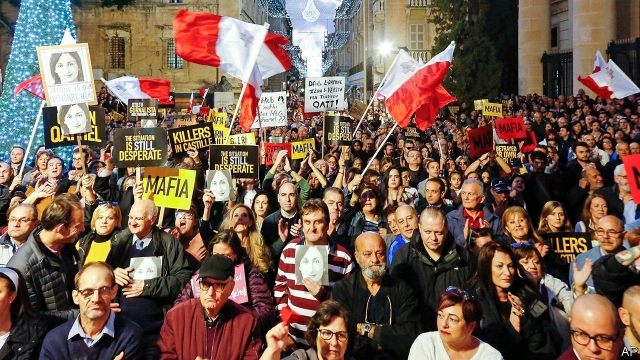

###### Revenged

# Malta’s prime minister is ousted by a murdered journalist’s work 

 

> print-edition iconPrint edition | Europe | Dec 7th 2019 

IT COST HER her life. But, in the end, Daphne Caruana Galizia, a dogged Maltese journalist, brought down from her grave the man she believed had allowed corruption to flourish as he made his island state progressively richer. 

On December 1st Joseph Muscat, the prime minister of Malta, announced he was resigning. He has long denied any wrongdoing and tried to depict his departure as natural. “I always said a prime minister should not serve for more than two legislatures,” he said in a televised address. But it came as Malta plunged deeper into a crisis with its origins in Caruana Galizia’s murder in 2017. 

Mr Muscat announced his resignation the day after a local tycoon, Yorgen Fenech, was charged with complicity in the killing. Mr Fenech pleaded not guilty. According to Caruana Galizia’s son, Paul, before her death his mother was investigating links between Mr Fenech, a gas deal with Azerbaijan and two senior figures in Mr Muscat’s government: his chief of staff, Keith Schembri, and the former energy minister, Konrad Mizzi. A report by the Council of Europe found that a Dubai-registered company owned by Mr Fenech was due to make large payments to Panamanian-registered companies belonging to the two politicians. Both deny any wrongdoing. 

Mr Muscat delayed his departure. He said his party would start choosing a new leader on January 12th. He would step down as prime minister “in the days after”. That announcement sparked heated clashes in Parliament, a demonstration on the streets of the capital, Valletta, and claims that Mr Muscat intended to hobble the investigation before he left office. Mr Muscat rejected this. “Justice is being done. And I will see that justice is for everyone,” he said. 

Caruana Galizia died when a bomb planted in her car exploded as she left her home. Three men charged with her murder are yet to be tried. Last month a fourth man offered information on the killing in return for immunity from prosecution. He testified in court on December 4th that he had paid the alleged killers on behalf of Mr Fenech, who was the sole organiser of the murder. But he added that, after the men were arrested, he was asked by a member of the prime minister’s entourage to tell them they would get bail and €1m ($1.1m) each. Bail was not granted and the money apparently was not paid. 

Ministers (including Mr Muscat) have been pelted with eggs, MPs from rival parties have almost come to blows, and on December 2nd the opposition boycotted Parliament as Mr Muscat gave a farewell speech. He leaves a country that is far richer (growth has averaged 7.2% on his watch), but one that is as troubled as it is troubling. 

