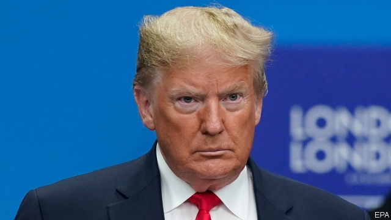

###### Stormy weather

# NATO marks its 70th anniversary in typically chaotic fashion 

 

> print-edition iconPrint edition | Europe | Dec 5th 2019 

WOULD DONALD TRUMP defend a NATO ally that was, as he put it, “delinquent” in meeting its military spending targets? “I’ll be discussing that today,” replied the president menacingly, in an interview on December 3rd. “It’s a very interesting question, isn’t it?” And so began a tumultuous two days in suburban London, where NATO leaders had gathered to mark the alliance’s 70th anniversary. 

Things only got worse. In a press conference with Jens Stoltenberg, NATO’s secretary-general, Mr Trump remarked that he could envisage France “breaking off” from the alliance and observed, with something of the air of a mafia boss, that France “needs protection more than anybody”. At a reception at Buckingham Palace later that evening, Justin Trudeau, Canada’s prime minister, was overheard mocking Mr Trump to his British, French and Dutch counterparts. When he heard about that, Mr Trump cancelled a closing press conference and left early. But although the American president was, predictably, the butt of much merriment among commentators, his words did not cause as much disquiet as those of France’s president, Emmanuel Macron. 

In an interview with The Economist published on November 7th, the French president said that he was not sure whether America would uphold NATO’s mutual-defence clause, Article 5, and that the alliance was experiencing “brain death” for want of co-ordinated decision-making in places like Syria. He also urged NATO to reassess its very purpose: “The unarticulated assumption is that the enemy is still Russia.” In subsequent weeks Mr Macron has doubled down on his comments. On November 28th, two days after 13 French soldiers were killed in a helicopter crash in Mali, he insisted that terrorism, not Russia, was NATO’s “common enemy”. On December 4th Mr Macron tweeted that Russia was a “threat” but “no longer an enemy”, and “also a partner on certain topics”. 

Such talk alarms eastern European leaders, who believe that Mr Macron is undermining a consensus that was painstakingly forged in the years since Russia’s annexation of Crimea and invasion of Ukraine in 2014. Many European officials are also unnerved by Mr Macron’s openness to a Russian proposal for a moratorium on medium-range missiles; Russia’s deployment of such missiles in violation of a cold-war treaty prompted America to walk out of the pact on August 2nd. 

Although some southern European members are privately sympathetic to the idea of detente with Russia, they were not willing to fall in behind Mr Macron in public. The official declaration from the leaders’ meeting included prominent mentions of terrorism and, in an apparent sop to Mr Macron, promise of a “reflection process” on NATO’s “political dimension”. But it also excoriated Russia’s “aggressive actions” and insisted that improved relations would only occur “when Russia’s actions make that possible.” 

Mr Macron was also at the centre of a separate quarrel. Recep Tayyip Erdogan, Turkey’s president, urged Mr Macron to “have your own brain death checked out first” after the French president rebuked Turkey’s incursion into northern Syria. That offensive targeted Kurdish militants who, backed by America, France and Britain, were serving as foot-soldiers against the Islamic State group. 

On December 3rd Mr Macron further accused Turkey of working with IS “proxies” in Syria and castigated Mr Erdogan for his purchase of Russia’s advanced S-400 air-defence system. The animus is mutual: in the weeks before the meeting, Turkey said it was blocking NATO plans for the defence of Poland and the Baltic states until the alliance recognised the YPG, a Syrian Kurdish militia, as a terrorist group. 

Yet for all the awful political optics, the alliance is in rude military health. This year nine countries will hit the alliance’s target of spending 2% of GDP on defence, up from just three a few years ago. By the end of 2020 Canada and European allies will have collectively invested $130bn over what they spent in 2016. 

In June the alliance agreed its first-ever space policy, building on the creation of new space units in America, France and Britain over the past year. And to the Pentagon’s further delight, the declaration from the leaders acknowledged that “China’s growing influence and international policies present both opportunities and challenges” for the alliance. 

On December 3rd one European leader could be heard joking with another that Mr Macron had inadvertently employed the sort of reverse psychology used by parents against toddlers. Mr Macron’s sharp criticism of NATO seemed to have persuaded Mr Trump that the alliance was a good idea after all. “What I’m liking about NATO is that a lot of countries have stepped up, I think at my behest.” ■ 

Dig deeper:How NATO is shaping up at 70Assessing Emmanuel Macron’s apocalyptic visionThe French president on Europe’s fragile place in a hostile worldRead the transcript: Emmanuel Macron in his own words 

