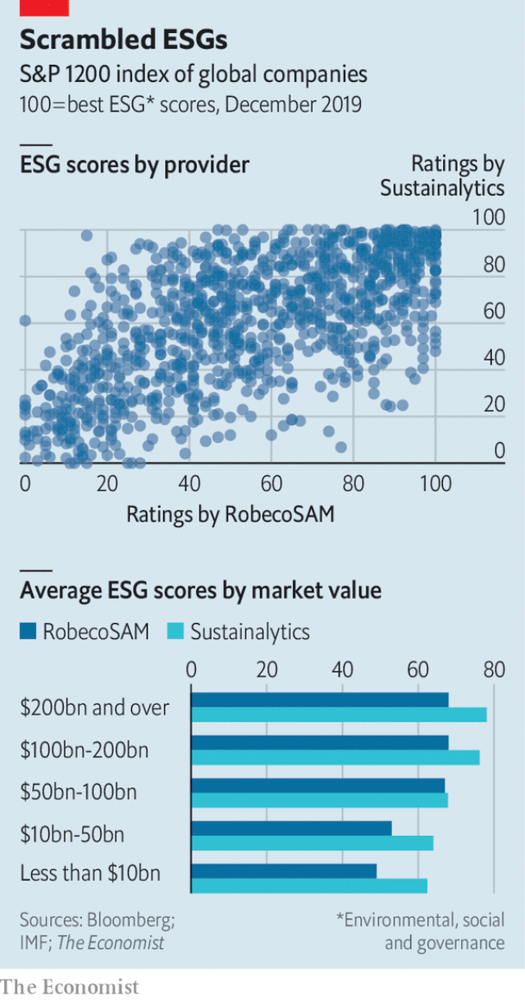

###### Poor scores

# Climate change has made ESG a force in investing 

 

> print-edition iconPrint edition | Finance and economics | Dec 7th 2019 

“LABELLING BASED on incomplete information, public shaming, and shunning wrapped in moral rhetoric,” said Hester Peirce, a straight-talking commissioner at America’s main financial regulator, the Securities and Exchange Commission, in June. She was taking aim at the scoring systems that purport to assess firms’ performance based on environmental, social and governance (ESG) factors. Yet love them or hate them, ESG scores are becoming ever more important in the world of investing and capital markets. At least $3trn of institutional assets now track ESG scores, and the share is rising quickly. 

In America and Europe some politicians, bosses and investors want to shift away from measuring corporate performance based mainly on shareholder returns. Climate change is another catalyst. Christine Lagarde, the new head of the European Central Bank, thinks the institution should consider using monetary policy and bank supervision to fight climate change—a shift that would involve assessing which firms are dirtier than others. Mark Carney, the governor of the Bank of England, has championed better disclosures by firms on climate change. Chris Hohn, the head of TCI, a London-based hedge fund famous for its hard-headed approach, has outlined plans to vote against the directors of companies that fail to reveal their carbon emissions. 

All this is fuelling demand for ESG ratings, which create a single score from disparate non-financial indicators, such as a firm’s carbon emissions or the share of its board members who are female. Using teams of analysts, whizzy software and data from companies, ratings firms collect ESG information and convert it into a single score. Some customers of ESG ratings are seeking to gain an investment edge; others want their money to benefit society as well as themselves. But as Ms Peirce’s criticisms suggest, the ratings are not yet ready for the weight they are being asked to bear. 

 

The most obvious sign of this is that, unlike credit ratings, ESG scores are poorly correlated with each other. ESG-rating firms disagree about which companies are good or bad. The Economist has compared the scores of two big ESG-rating systems, updating an analysis done by the IMF earlier this year (see chart). It shows at best a loose link between the two measurement systems. The same lack of correlation holds even when the E, S and G scores are considered separately, according to the IMF. Small wonder, then, that it found no consistent difference between the performance of ESG funds and that of conventional ones. 

Moreover, ratings are often based on business models rather than businesses themselves. It does not matter what firms are selling, as long as it is done sustainably. Tobacco and alcohol companies feature near the top of many ESG rankings. And many funds marketed on their green credentials invest in Big Oil. 

The scoring systems sometimes measure the wrong things and rely on patchy, out-of-date figures. Only half the 1,700-odd companies in the MSCI world index reveal their carbon emissions. Some ratings penalise non-disclosure—with strange results. In FTSE Russell’s ESG rating Tesla, an electric-vehicle maker, does worse than firms that make gas-guzzlers. (FTSE Russell says it rates the sustainability of a firm’s output with another score.) And because bigger firms are better able to afford disclosure, they tend to get better ESG scores. ESG raters say they are tweaking their methods to remove such biases. But even when figures are disclosed, they may be too out-of-date to be useful. 

One hope is that the boom raises standards. Bigger firms are getting involved, which could help. On November 21st S&P Global, a credit-rating agency, bought the ESG arm of RobecoSAM, an asset manager. Moody’s, a competitor, purchased Vigeo Eiris, an ESG data outfit, in April. In 2017 Morningstar, a research firm, acquired a 40% stake in Sustainalytics, another ESG rater. MSCI, an index provider, has been building up its ESG-scoring expertise. Simon MacMahon of Sustainalytics expects scoring systems to converge over time. The definition of ESG is so broad, he says, that raters may be trying to capture different things. 

For now investors who use ESG indices often look past the headline scores—and even, in some cases, create their own ESG ratings. Issues that they find particularly relevant, such as the flood risks faced by an insurer’s corporate clients, may be buried because ESG ratings average many disparate data points, says Jessica Alsford of Morgan Stanley, a bank. 

If ESG data do eventually become more accurate and consistent it will become harder for bosses and fund managers to engage in “greenwashing”—massaging indicators without truly changing hue. And investors will be able to pursue more varied and sophisticated ESG targets, says Maria Elena Drew of T. Rowe Price, an asset manager. Big insurers, for example, which are heavily exposed to extreme weather events, will be able to invest their capital in a way that hedges against climate risks. But for now the ESG rating industry is still in its infancy and Ms Peirce’s criticisms, though blunt, ring true.■ 

Sign up to our new fortnightly climate-change newsletter here 

