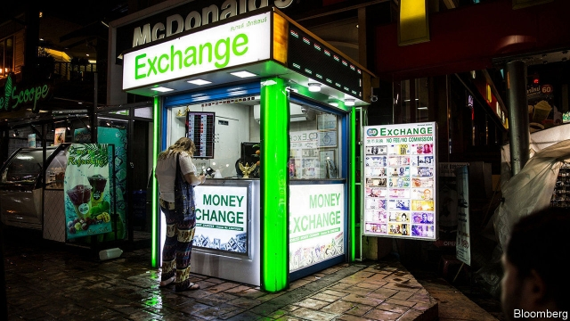
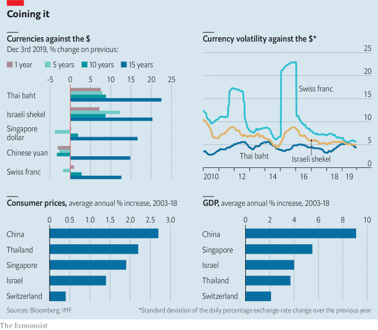

###### One-way baht

# For 15 years two currencies have outperformed all others 

 

> print-edition iconPrint edition | Finance and economics | Dec 7th 2019 

THE PAST decade and a half has seen boom and bust, inflation and deflation, globalisation and trade tensions. Through such economic and political cycles you might expect currencies to go in and out of fashion. In fact the two that have strengthened the most against the dollar over this period—Thailand’s baht and Israel’s shekel—have done so consistently. They have outshone other currencies over one, five and ten years, too. What explains their popularity? 

Inflation is part of the answer. Exchange rates partly reflect relative purchasing power, so a country with low inflation should see its currency strengthen against that of a country where prices are rising fast. Both Israel and Thailand have had low annual inflation: 1.4% and 2.2% respectively, on average, over the past 15 years. 

 

Another factor that causes exchange rates to move is one country becoming relatively more productive than another. Economic growth is a reasonable proxy of productivity, and Israel and Thailand have had fast growth. (China has also grown quickly, but the yuan has been hit hard by the trade war.) 

One curiosity is why both currencies have performed well over each of the four time horizons. The answer may reflect policy. Both Israel and Thailand intervene in markets to limit upward pressure on their currencies. If they are very strict, currency regimes can end abruptly, as when Switzerland abandoned its peg in January 2015. But Israel and Thailand have been more flexible, which has strung out their appreciations over time. 

