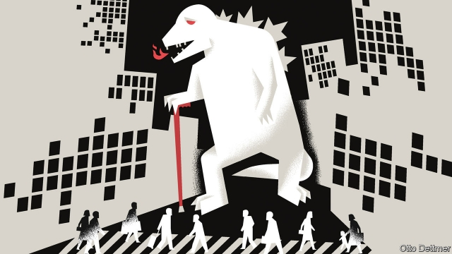

###### Free exchange

# Japan’s economic troubles offer a glimpse of a sobering future 

 

> print-edition iconPrint edition | Finance and economics | Dec 7th 2019 

JAPAN ONCE offered a cautionary tale of how macroeconomic mismanagement could transform a juggernaut into a laggard. As weak growth and low interest rates have spread to the rest of the world, however, it looks more like a window into the future. The view it reveals is less bleak than it used to be; “Abenomics”—the growth-boosting policies of the government of Shinzo Abe since 2012—have restored some vim. But as economic growth once again sags towards zero, it is worth asking whether Mr Abe’s programme, bold as it has been, is radical enough. 

Japan earned its reputation as an economy adrift in the 1990s, when a popped financial bubble was followed by slow growth, deflation and low interest rates. As the government struggled to pry the economy from its rut, it pioneered policies like quantitative easing (QE; printing money to buy assets such as government bonds) that were used around the world after the global financial crisis. Economists debated how much Japan’s slump owed to weak demand rather than economic rigidities, for example an insufficiently limber corporate sector. Some doubted that, after years of easy money and bulging deficits, there was room left for stimulus to boost growth. Others reckoned that Japan could escape its rut if only its leaders were bold enough. 

Abenomics showed that Japan’s economy was indeed suffering from weak demand. Fiscal and monetary stimulus were two of the “three arrows” of Mr Abe’s agenda (the other being structural reform). His government increased public investment and lit a fire under the Bank of Japan, which set an inflation target of 2% (stretching, for a country so deflation-stricken) and engaged in large-scale QE to meet it. The economy quickly responded. The yen tumbled, giving exporters a lift. Stock prices soared, and in 2013 economic growth hit a respectable 2%. Japan has since built on these successes. The economy has grown every year, just about. The unemployment rate has fallen to 2.4%. 

But the slump never quite ended. Perhaps it might have, had the government not raised the rate of consumption tax from 5% to 8% in 2014 in an effort to cut its mammoth gross debt pile, which reached 230% of GDP in 2012. Private consumption, which helped power growth in 2013, shrank in 2014 as the economy slowed to a stall. The government postponed a second planned increase for fear of starting a recession. Yet even now, five years on, the economy remains too weak to stomach fiscal tightening. In October the consumption tax was raised once more, to 10%. The increase landed harder than expected, hurting retail sales and squeezing an economy already battered by a slowdown in global trade. The government is now preparing a round of stimulus, hoping to tide Japan through this bout of weakness. 

It has become clear, however, that Japan’s demand woes are not simply an after-effect of financial crisis. Rather they are chronic, reflecting a profound demographic shift which depresses both demand and supply—and which is creeping its way across the rich world. Over the past 20 years Japan’s working-age population declined by more than 10m workers, or about 14%. It is projected to fall by even more over the next 20. Having fewer workers means lower growth and less need of investment. Although Abenomics reversed a long decline in investment, spending has been too low to prevent a steady increase in corporate hoarding: idle cash, draining demand from the economy. With unemployment so low, you might expect cash to flow to workers, whose spending could then energise growth. But incomes have risen surprisingly slowly—partly, the government reckons, because firms are choosing to automate rather than compete for ever scarcer workers by raising wages. When firms do invest, some spend on robots. 

Limp private-sector spending has in turn kept the government from cutting its debt. Were the state to begin saving in earnest, demand in the economy would collapse. Japan has long defied predictions of imminent fiscal crisis. Even so, demography could eventually break the public purse. At 46% in 2018, Japan’s old-age dependency ratio—the number of elderly people compared with the number of working age—is the world’s highest. It is projected to rise by nearly 20 percentage points over the next 20 years. Shifting the burden of tax away from consumers might reinvigorate household spending. But economists prefer consumption-tax rises to higher levies on income or profits, which they fear would further depress growth. Pressing firms to raise pay, perhaps with faster increases in the minimum wage, could help in the short run but accelerate automation over the medium to long term. 

Abenomics may yet fulfil its promise. A short burst of stimulus could see the economy through the current headwinds. Given a bit more reform and some luck, growth could rebound—sufficiently, perhaps, to stabilise government debt even as social spending grows. But it would not take much bad luck to spark a recession and reverse the past few years’ hard-won gains. To safeguard Japan’s economic future, more radical policies may be needed. Large-scale immigration might do the job. But Japan remains a closed society by rich-world standards. Just 2% of its population is foreign-born, compared with 13% in Britain and 22% in Canada. 

Instead, Japan may continue to blaze macroeconomic trails. The Bank of Japan, through QE, has spent trillions in newly created yen on stocks and bonds. It might instead try distributing new money to households. That would either raise inflation, prying Japan from the trap that has held it since the early 1990s, or demonstrate how best to manage the macroeconomic challenges posed by ageing and automation. Or it could simply call bond markets’ bluff, and borrow and spend as lavishly on public investment as circumstances require. Other countries may boggle at such strategies. Soon enough, they will learn for themselves just how tricky Japan’s position is. ■ 

