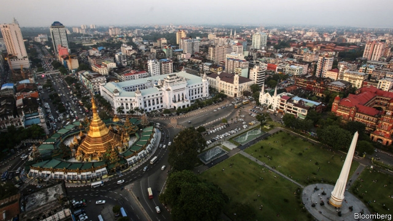

###### Meant to be

# Myanmar admits foreign life insurers 

 

> print-edition iconPrint edition | Finance and economics | Dec 7th 2019 

KO PHOE THAR is a cheery 22-year-old liquor-store clerk from Mandalay, a city in central Myanmar. Death, and other less-certain future misfortunes, are far from his mind. A host of insurance companies newly arrived in the country would like to change that. Last week the finance ministry issued licences to foreign life insurers for the first time. Five—AIA, Chubb, Dai-Ichi Life, Manulife and Prudential PLC—have been permitted to operate as wholly owned subsidiaries. Others are required to find local partners. 

Foreign insurers have long licked their lips at the prospect of moving into Myanmar. South-East Asia’s largest mainland country, it is home to 54m people, more than half of whom are under 30. Less than 4% of the population has insurance of any sort. But under military dictatorship, which ended in 2011, the market was monopolised by a state firm. 

Not until the country made the transition to democracy, and the government loosened its grip on the economy, were local private insurers allowed to operate. Even after Aung San Suu Kyi, whose ruling party was elected in 2015, promised to allow foreign investment in the sector, there were delays. Fed up with the government’s sluggishness, Samsung Life Insurance, a South Korean firm, closed its Yangon office last year.  

Other insurers are betting their patience will pay off. IKBZ, a local firm, thinks the insurance market may be worth $2.6bn in annual premiums in a decade’s time. But there are bumps on the road to growth. In 2015 just 0.01% of the population had a life policy, a smaller share than in Laos, Cambodia or Vietnam. Some people in Myanmar don’t know what insurance is, or think it a waste of money—or even unlucky, because it circumvents karma. 

Aung Si Thu Kyaw, a fruit trader in Yangon, has motor but not life insurance because he doesn’t understand how this “new concept” works. A freelance agent based in Yangon told a local magazine in February that, while fire and vehicle insurance were popular, life policies were a much harder sell. The only people he could persuade to buy one were his relatives. 

Anil Mancham, the boss of IKBZ, also attributes anaemic growth to a lack of trained sales agents—and of attractive products. Until last week the industry regulator required all insurers to sell the same plans at the same price. The need to avoid adverse selection meant products were limited. But he is optimistic that things will pick up. When insurers opened for business in other South-East Asian countries ten to 20 years ago, they encountered, and surmounted, similar obstacles. In Vietnam, for instance, the industry is now growing at 10-20% annually. 

Both Mr Mancham and Son Nguyen, the president of Chubb Myanmar, see their industry’s future in modern technology. Just 26% of Myanmar’s adult population have a bank account, but there are more phones than people. Chubb and IKBZ are experimenting with selling insurance via e-wallets; AIA plans to sell its products via Facebook. Perhaps in time Mr Thar will come to rely less on karma, and arrange a safer future with a tap on his phone. ■ 

