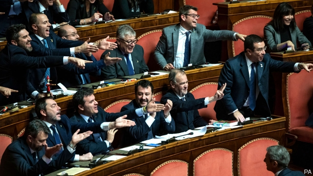

###### Looking wobbly

# Splits in Italy threaten to derail euro-zone reforms 

 

> print-edition iconPrint edition | Finance and economics | Dec 7th 2019 

AFTER REPAIR work during the sovereign-debt crisis in 2009-15, further fixes to the euro zone’s architecture have been few and slow. Northern countries have been unwilling to assume cross-border risks, as long as debts and non-performing loans in southern ones were high. Now quarrels within one of those southern countries, Italy, threaten what little progress has been made. 

Three reforms are on the table: beefing up the European Stability Mechanism (ESM), the euro zone’s sovereign-bail-out fund; setting up a common deposit-insurance scheme for banks; and creating a common euro-zone budget. On December 4th finance ministers discussed plans for further work on these “pillars”, which are supposed to be agreed by heads of state on December 13th. The meeting failed to clear up much. Among the plans to be signed off was a revisedESM treaty, but eleventh-hour opposition from Italy seemingly delayed that until early next year. 

Planned reforms to the ESM include measures to boost support for both troubled banks and sovereigns. It will become the backstop for the zone’s bank-resolution fund. The rules for its precautionary credit lines, to which troubled countries can turn even before they lose access to financial markets, have been clarified. And to help countries with unsustainable borrowing to recover, new government-bond contracts will contain clauses that make it harder for investors to block debt restructuring. 

All this had been nodded through by members in June—including Italy, which, with its huge public debt and sluggish economy, looks the most likely customer for a future bail-out. But populists from the Northern League and the Five Star Movement (M5S)—the very parties that were governing in June—have begun campaigning against the plans. Matteo Salvini, the League’s leader, and deputy prime minister until he quit the government in September, says he did not see them, implying that the prime minister had acted in secret. 

Critics claim the reforms would force Italy to restructure its debt in any future crisis. New clauses in debt contracts, they say, would make its bonds less attractive to investors. But the complaints ring hollow. Though some countries had wanted bail-outs to require restructuring, says Lorenzo Codogno, a former chief economist of the Italian treasury, Italy successfully lobbied against that condition. Silvia Merler of Algebris Policy & Research Forum, an advisory group, says that previous steps to make restructuring easier made Italy’s bonds look less risky to investors, not more. 

By describing the reform as a danger to Italy, Mr Salvini may spy a chance to score political points. For its part, M5S might want to shore up its ebbing support. But by doing so it has created a rift with its current partner in government, the EU-friendly Democratic Party. 

The populists want either to reopen talks on the ESM or to gain something in return for acquiescence. But meaningful concessions look unlikely. Reopening talks at such a late stage might even provoke the northerners to walk away. 

Nor has much progress been made on the second and third pillars. Politicians have only just agreed to begin talking about deposit insurance. Germany had long dragged its feet, but in November Olaf Scholz, its finance minister, said he would be amenable—if a host of other fixes, some unappealing to other members, were made. The euro-zone budget is a stripped-down version of that first envisioned by Emmanuel Macron, France’s president, in 2017. Fiscally hawkish northerners insisted that it must not be used to support economies in downturns, and that it should be funded using the European Union’s seven-year budget, not new spending. 

The EU budget has itself been the subject of tortuous negotiations for nearly two years. The latest proposal allocates €13bn ($14.4bn) to the euro-zone fund—a paltry €98m per country per year. Once in place, say optimists, it can be beefed up. Yet another fix to be done in a frantic hurry when the next crisis hits. ■ 

