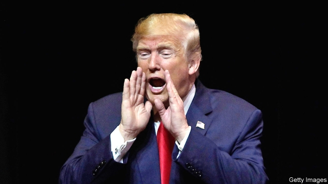

###### Sound and fury

# The Trump administration’s trade policies clash with each other 

 

> print-edition iconPrint edition | Finance and economics | Dec 7th 2019 

PRESIDENT DONALD TRUMP’S attempts to orchestrate America’s trade relations are causing a cacophony. On December 2nd he trumpeted new tariffs on Brazilian and Argentine steel and aluminium. Hours later the United States Trade Representative (USTR) chimed in with two sets of tariffs on European products. Over the following days noise grew louder in Congress about a bargain that would secure the Democrats’ approval for the USMCA, a trade deal with Mexico and Canada. And all this against the drumbeat of trade war with China. 

The theme, American unilateralism, is consistent. But the various voices are not, with Trumpian trumpetings vying for airtime with the USTR’s measured pace. Start with the week’s first announcement, when Mr Trump tweeted that Argentine and Brazilian steel would face American tariffs, “effective immediately”. American farmers, he said, were suffering from the two countries’ “massive” devaluations. But his response made no sense. Argentina and Brazil have not been trying to take advantage of American farmers by manipulating the peso and real downwards. Rather, as their economies have flailed, they have struggled to prop their currencies up. 

Moreover, though Mr Trump surely intended to restrict imports, for some products tariffs could mean they rise. An annual quota for Brazilian slab, billets and blooms (semi-processed steel products) is already full, for example, so switching from quotas to tariffs now would grant American importers greater flexibility. And the new tariffs are unlikely to survive any legal challenge, since relevant deadlines passed months ago. The law Mr Trump has invoked allows tariffs in the service of America’s national security. Claiming that it covers propping up farm incomes would be a stretch. 

The president’s tariffs-by-tweet stood in contrast to the day’s other big announcements, which followed much deliberation. One related to a long-running dispute at the World Trade Organisation (WTO) over European subsidies for Airbus, which America won. In October the WTO had said that the Trump administration could penalise the EU by placing tariffs on $7.5bn of its exports. The EU argued that the offending subsidies had been withdrawn. On December 2nd the WTO dismissed that claim, and the USTR started the process for raising new tariffs on European exports. 

The other was accompanied by a 93-page report, stuffed with footnotes and legalese. The USTR had spent months investigating a French tax on digital services, which will fall heavily on American tech giants (see article). “If they’re going to be taxed, it’s going to be the United States [that] will tax them. Okay?” said Mr Trump on December 3rd. The USTR concluded that the tax was “unusually burdensome” for affected American companies, and is preparing to hit $2.4bn of French products with tariffs in response, including $800m of cosmetics, $800m of champagne and $400m of handbags. 

Inconsistent trade policy is nothing new from the Trump administration. The tariffs on steel and aluminium imposed in spring 2018 were justified on dubious national-security grounds; by contrast the first round of tariffs on China, in mid-2018, were imposed after a detailed report by the USTR on America’s many, and in some cases legitimate, grievances. 

Overall, though, some aspects of America’s trade policy are making others harder to achieve. Its trade partners can point to Mr Trump picking on Argentina and Brazil, and paint their resistance to American attempts to recast its trade relations with them as standing up to a bully. Implausible claims of harm to national security also go down badly elsewhere. 

All this may be part of the reason Mr Trump has so far failed to secure the “substantial” deal with China that he boasted was imminent in October. On December 3rd he teased that he might postpone talks until after the 2020 election, saying that “the China trade deal is dependent on one thing: do I want to make it?” But the more the president predicates success on his mood rather than substantive problems laid out by bureaucrats working on his behalf, the less it makes sense for China to offer meaningful concessions. 

Tariffs can be announced by tweet, but crafting deals to remove them is slower and harder. Mr Trump is lucky, then, that the USTR is in charge of delivering his other trade-policy objective: passing the USMCA. Robert Lighthizer, the USTR’s top official, has been negotiating with Democratic lawmakers to recast it in a form that they can support. If a deal is done, it will be because politicians and officials have managed to tune the president out. ■ 

