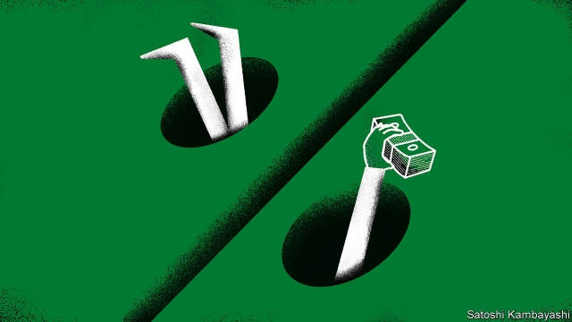

###### Buttonwood

# The perils and rewards of economies in rehab 

 

> print-edition iconPrint edition | Finance and economics | Dec 7th 2019 

A RECENT EDITION of “The Joe Rogan Experience”, a popular podcast, features the comedian Artie Lange. Mr Lange is an engaging personality who, as he candidly admits, has battled with drugs and gambling. Not long out of his umpteenth period in rehab, he is working in stand-up again. “This business keeps taking me back,” he says with something like amazement. 

Forgiveness for recidivists is found outside show business, too. In July the IMF approved a $6bn bail-out for Pakistan. As the fund acknowledged at the time, with something like weariness, Pakistan is back in rehab less than three years after completing its previous programme. But the fund has not abandoned it. And nor have investors. Pakistan is enjoying a flood of foreign capital on the promise of reform. The Karachi stock index is up 25% since the start of October. 

This may seem hard to fathom. The IMF regards the chance that its programme will fail as “particularly high”. Yet a band of investors are prepared to bet on success. A rehab economy such as Pakistan offers a rare opportunity. It is one of the few places where investors can find high interest rates, a devalued currency and cheap-looking stocks. True, things could go very wrong. Look at Argentina, which was embraced by investors after Mauricio Macri was elected in 2015 on a platform of orthodox economics, only to be abandoned when his reforms failed. But if things go right, the returns can be substantial. 

Rehab economies follow a familiar pattern. The cycle begins when the economy bumps up against a budgetary or balance-of-payments constraint. The trigger may be external: an oil-price shock, say, or a shift in policy by the Federal Reserve. Funding dries up. Then comes capital flight. Foreign-exchange reserves are run down so that the government can sustain the illusion that the local currency is worth more than it really is. Hard currency is then rationed. That leads to shortages of essential imports, which further hamper the economy. 

With luck, at this point the authorities recognise the hole they are in. To get out of it, they must embrace more orthodox economics. In practice, this means letting the currency fall, getting rid of subsidies in order to cut the budget deficit, and starting to use monetary policy as a way to tame inflation rather than finance the government. Sometimes (but not always) the IMF is brought in to lend hard currency and give policy advice. 

This, more or less, describes events in Pakistan leading up to mid-2019. It also describes the cycle in Egypt up to the start of 2016 when it entered its (successful) IMF programme. And, for that matter, it is the same pattern seen in Pakistan in 2012-13. 

At this stage of the rehab cycle, if things are to go well, the fund’s money needs to act as a catalyst for other sources of capital. This is needed as a kind of bridge finance—to pay for essential imports and allow the rebuilding of foreign-exchange reserves, until exports pick up in response to a cheaper currency. That might seem a big task. Economies in rehab are typically unstable places (Ireland in 2010 was a rare exception). Pakistan is unlikely to threaten Denmark’s place at the top of global rankings of security, governance and development. But investors are not betting that a rehab economy will become a paragon, only that it will improve, at least a bit. 

A first task is to lure back capital shifted offshore by rich locals when they saw the crisis coming. The twin attractions are the high interest rates needed to curb inflation and a cheaper currency, which acts as reassurance against a further devaluation. Once the locals come back, yield-hungry foreigners will follow. And before long, so will stockmarket investors. Like Egypt, Pakistan has a wide range of listed companies for investors to buy—from industrial firms to banks to consumer stocks, says Andrew Brudenell of Ashmore, a fund manager. It may take a while for firms to see the benefits of improved economic stability. But investors are tempted to buy when stocks are trading at attractive price-to-earnings multiples. 

Such bets can pay off handsomely. Reforms to improve macroeconomic stability have led to bountiful investment returns in surprising places. An obvious danger is that hardship and social unrest derail the reform process. Another is that reformed characters have a tendency to fall from grace again. But progress is never in a straight line. When the potential is great and the price is right, there will always be people willing to bet that next time will be different. 

